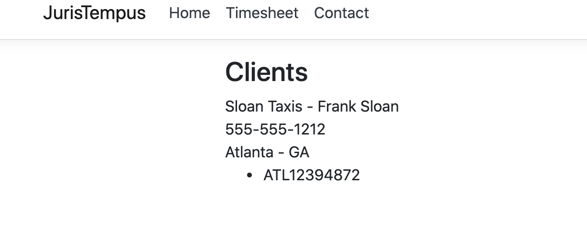

# 03 `AutoMapper`


## `Mapping`

Pour éviter la réplication de code, on va utiliser `Auto Mapper`.

On utilise la version pour l'injection de dépendances :

```bash
dotnet add package AutoMapper.Extensions.Microsoft.DependencyInjection --version 8.1.1
```

On ajoute `services.AddAutoMapper` dans `Startup.cs`

```cs
public void ConfigureServices(IServiceCollection services)
{
  services.AddDbContext<BillingContext>(cfg =>
                                        {
                                          cfg.UseSqlServer(Configuration.GetConnectionString("JurisDb"));
                                        });

  services.AddAutoMapper(Assembly.GetExecutingAssembly());
  // ...
```

`AutoMapper` a besoin d'un `profiles`, on lui dit de chercher dans l'`Assembly` qui est entrain de s'exécuter (`GetExecutingAssembly`).

Alors le `service` regarde dans toutes les classes s'il y'en a une qui dérive de `AutoMapperProfile`.


## `Profiles`

On crée un dossier `Profiles` et dedans une classe `JurisProfiles`.

```cs
public class JurisProfile : Profile
{
  public JurisProfile()
  {
    CreateMap<Client, ClientViewModel>();
  }
	
}
```

Cette classe hérite de `Profile` et dans son constructeur définit les `Map`.


## Injecter le `Mapper` dans le contrôleur

On va l'injecter dans le constructeur du `HomeController` :

```cs
using AutoMapper;
```

```cs
private readonly IMapper _mapper;

public HomeController(ILogger<HomeController> logger, BillingContext context, IMapper mapper)
{
  _mapper = mapper;
  // ...
```


## Modification de `Index()` avec `mapper`

Avant :

```cs
public IActionResult Index()
{
  var result = _context.Clients
    // .Include(c => c.Address)
    .Select(c => new ClientViewModel
            {
              Id = c.Id,
              Name = c.Name,
              ContactName = c.Contact,
              Phone = c.Phone
            })
    .ToArray();

  return View(result);
}
```

Le `mapping` est fait à la main en créant une projection grâce à `Select`.

Après :

```cs
public IActionResult Index()
{
  var result = _context.Clients
    // .Include(c => c.Address)
    .ToArray();

  var vm = _mapper.Map<Client[], ClientViewModel[]>(result);

  return View(vm);
}
```

On peut simplifier car `_mapper` infère le type en entrée grâce à `result` :

```cs
var vm = _mapper.Map<ClientViewModel[]>(result);

return View(vm);
```

Dans l'application avant l'utilisation de `AutoMapper` :


Maintenant :


Le `Contact` n'apparaît plu car dans client on a une propriété `Contact` et dans `ClientViewModel` la propriété s'appelle `ContactName`.

## `Fluent` Syntax

> Une `Fluent API` est un style en Orienté Objet qui permet d'appeler des méthodes en cascade 
>
> =>`method chaining`.
>
> Le `context` est transmis par chaque méthode à la prochaine (le `context` est ici tout simplement `this`)


Pour corriger ce problème on va utiliser la `Fluent syntax` d'`AutoMapper` :

```cs
CreateMap<Client, ClientViewModel>()
  .ForMember(vm => vm.ContactName, o => o.MapFrom(s => s.Contact))
  .ReverseMap();
```

Résultat :


## Complex `Mapping`

On va applatir (`flatten`) les donnée de l'adresse dans `ClientViewModel` afin que ce soit plus facile à utiliser pour l'utilisateur.

```cs
public class ClientViewModel
{
  public int Id { get; set; }
  public string Name { get; set; }
  public string ContactName { get; set; }
  public string Phone { get; set; }
  public string Address1 { get; set; }
  public string Address2 { get; set; }
  public string Address3 { get; set; }
  public string CityTown { get; set; }
  public string StateProvince { get; set; }
  public string PostalCode { get; set; }
  public string Country { get; set; }
}
```

On va ajouter l'adresse dans notre contrôleur :

```cs
public IActionResult Index()
{
  var result = _context.Clients
    .Include(c => c.Address) // ici
    .ToArray();

  var vm = _mapper.Map<ClientViewModel[]>(result);

  return View(vm);
}
```

et modifier notre vue  `index.cshtml`:

```cs
<div class="col-8 offset-2">
  <h3>Clients</h3>
  @foreach (var c in Model)
  {
      <div>@c.Name - @c.ContactName</div>
      <div>@c.Phone</div>
      <div>@c.CityTown - @c.StateProvince</div>
  }
</div>
```

Bien sûr à ce stade cela n'affiche rien car `Address` n'est pas *mappé* dans `ClientViewModel`.

### 1ère méthode : Par convention

On pourrait *mapper* chaque propriété comme précédemment, mais `AutoMapper` propose une convention pour ça.

Il suffit de préfixer le nom de chaque propriété de la `ViewModel` par le nom de la propriété de l'entité de base à applatir :

```cs
public class ClientViewModel
{
  public int Id { get; set; }
  public string Name { get; set; }
  public string ContactName { get; set; }
  public string Phone { get; set; }
  public string AddressAddress1 { get; set; }
  public string AddressAddress2 { get; set; }
  public string AddressAddress3 { get; set; }
  public string AddressCityTown { get; set; }
  public string AddressStateProvince { get; set; }
  public string AddressPostalCode { get; set; }
  public string AddressCountry { get; set; }
}
```

Il faut bien sûr répercuter le changement dans la vue `index.cshtml` :

```cs
<div>@c.AddressCityTown - @c.AddressStateProvince</div>
```


Et voila cela fonctionne.


### 2ème méthode : Par `Fluent Mapping`

Il peut être plus judicieux de ne pas *salir* son code avec des préfixes compliqués.

On va donc tout simplement ajouter le `mapping` à la main dans `JurisProfile` :

```cs
public class JurisProfile : Profile
{
  public JurisProfile()
  {
    CreateMap<Client, ClientViewModel>()
      .ForMember(vm => vm.ContactName, o => o.MapFrom(s => s.Contact))
      .ForMember(vm => vm.Address1, o => o.MapFrom(s => s.Address.Address1))
      .ForMember(vm => vm.Address2, o => o.MapFrom(s => s.Address.Address2))
      .ForMember(vm => vm.Address3, o => o.MapFrom(s => s.Address.Address3))
      .ForMember(vm => vm.CityTown, o => o.MapFrom(s => s.Address.CityTown))
      .ForMember(vm => vm.StateProvince, o => o.MapFrom(s => s.Address.StateProvince))
      .ForMember(vm => vm.PostalCode, o => o.MapFrom(s => s.Address.PostalCode))
      .ForMember(vm => vm.Country, o => o.MapFrom(s => s.Address.Country))
      .ReverseMap();
  }
}
```

Et tout fonctionne sans ajouter de préfixe.


## `Mapping` collections

Notre `Client` comporte des collections :

```cs
public ICollection<Case> Cases { get; set; }
public ICollection<Invoice> Invoices { get; set; }
```

On voudrait aussi pouvoir les *mapper* mais aussi avec des `ViewModel`.

`ClientViewModel`

```cs
public class ClientViewModel
{
  public int Id { get; set; }
  public string Name { get; set; }
  public string ContactName { get; set; }
  public string Phone { get; set; }
  public string Address1 { get; set; }
  public string Address2 { get; set; }
  public string Address3 { get; set; }
  public string CityTown { get; set; }
  public string StateProvince { get; set; }
  public string PostalCode { get; set; }
  public string Country { get; set; }

  public ICollection<CaseViewModel> Cases { get; set; }
}
```


On va donc créer `CaseViewModel` :

On a pas besoin pour la vue de la propriété de navigation `Client` qui crée une référence circulaire.

```cs
public class CaseViewModel
{
  public int Id { get; set; }
  public string FileNumber { get; set; }
  public CaseStatus Status { get; set; }
}
```


### Modification du contrôleur

On va inclure `Cases` avec `Client` :

```cs
public IActionResult Index()
{
  var result = _context.Clients
    .Include(c => c.Address)
    .Include(c => c.Cases)
    .ToArray();

  var vm = _mapper.Map<ClientViewModel[]>(result);

  return View(vm);
}
```

On doit maintenant créer un `Map` pour `Case` et `CaseViewModel` :

```cs
CreateMap<Case, CaseViewModel>().ReverseMap();
```



