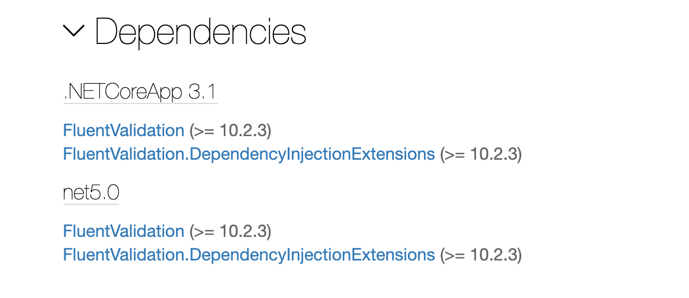

# 06 Fluent Validation

## Installation de `FluentValidation`

On va utiliser le package `FluentValidation.AspNetCore`



On voit qu'on installe aussi `FluentValidation` et `FluentValidation.DependencyInjectionExtensions`.

```bash
dotnet add package FluentValidation.AspNetCore --version 10.2.3
```

```
info : Installing Microsoft.Extensions.DependencyInjection.Abstractions 2.1.0.
info : Installing FluentValidation.DependencyInjectionExtensions 10.2.3.
info : Installing FluentValidation 10.2.3.
info : Installing FluentValidation.AspNetCore 10.2.3.
```


## Création de `CaseViewModelValidator.cs`

On crée un dossier `Validators` dans le projet `JurisTempus` et le fichier `CaseViewModelValidator.cs`

```cs
public class CaseViewModelValidator : Abstracvalidator<CaseViewModel>
{
	public CaseViewModelValidator()
  {
    RuleFor(c => c.FileNumber)
      .NotEmpty()
      .Matches(@"^\d{10}$")
      .WithMessage("File number must be ten digits")
      .MinimumLength(5);
    
    RuleFor(c => c.Status)
      .IsInEnum()
      .NotEqual(CaseStatus.Invalid)
      .WithName("CaseStatus");
  }
}
```

On crée des règles à l'intérieur du constructeur.

`Matches` permet d'utiliser des expressions régulières.

`WithMessage` spécifie le message d'erreur de la validation.

`WithName` remplace le nom naturel de la propriété dans les messages d'erreur.


### `ClientViewModelValidator`

```cs
public class ClientViewModelValidator : AbstarctValidator<ClientViewModel>
{
  public ClientViewModelValidator()
  {
		RuleFor(c => c.Name)
      .NotEmpty()
      .MinimumLength(5)
      .MaximumLength(100);
    
    RuleFor(c => c.ContactName)
      .MaximumLength(50);
      
  }
}
```


## Tester les valeurs en entrée : `ModelState.IsValid`

On a mit des `validations` sur `ClientViewModel`, on doit pouvoir tester la validité des données reçues avant de les enregistrer :

`HomeController`

```cs
[HttpPost("editor/{id:int}")]
public async Task<IActionResult> ClientEditor(int id, ClientViewModel model)
{
  if (ModelState.IsValid)
  {
    // save change to database
    var oldClient = await _context.Clients
      .Include(c => c.Address)
      .Where(c => c.Id == id)
      .FirstOrDefaultAsync();

    if (oldClient is not null)
    {
      // update database
      _mapper.Map(model, oldClient); // copy changes

      if (await _context.SaveChangesAsync() > 0)
      {
        return RedirectToAction("Index");
      }
    } else {
      // Create a new client
      var newClient = _mapper.Map<Client>(model);
      
      _context.Add(newClient);
      
      if (await _context.SaveChangesAsync() > 0)
      {
        return RedirectToAction("Index");
      }
    }
  }

  return View();
}
```

`ModelState` c'est un dictionnaire qui contient toutes les erreurs issues de la validation.