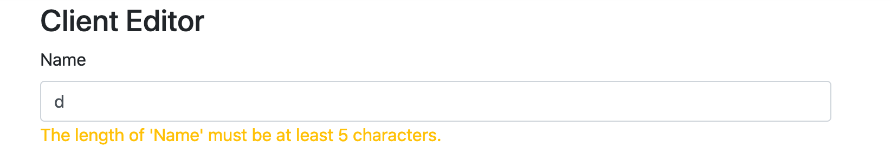

# 07 Form `Validation`

`CleintEditor.cs`

```html
<div class="form-group">
  <label asp-for="Name"></label>
  <input asp-for="Name" class="form-control" />
  <span asp-validation-for="Name" class="text-warning"></span>
</div>
<div class="form-group">
  <label asp-for="ContactName"></label>
  <input asp-for="ContactName" class="form-control" />
  <span asp-validation-for="ContactName" class="text-warning"></span>
</div>
```

On utilise `asp-validation-for`  pour *binder* la validation.

Pour que la vue soit au courant de `FluentValidation` on doit configurer l'injection de dépendence dans `Startup.cs`

```cs
services.AddControllersWithViews()
              .AddNewtonsoftJson(cfg => cfg.SerializerSettings.ReferenceLoopHandling = ReferenceLoopHandling.Ignore)
								.AddFluentValidation(cfg => cfg.RegisterValidatorsFromAssemblyContaining<CaseViewModelValidator>());
```

`RegisterValidatorsFromAssemblyContaining` on recherche les validators de l'`assembly` contenant `CaseViewModelValidator`.



