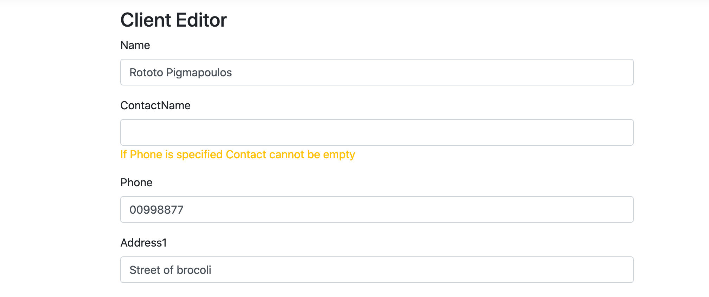
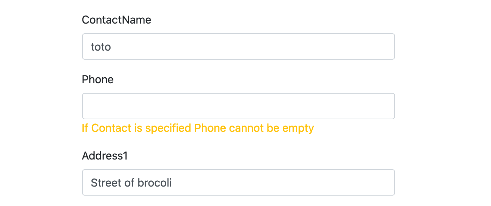

# 08 Model `Binding`

## Ajout d'erreur au `Model`

On peut se servir du `ModelState` pour ajouter des erreurs :

```cs
if(!string.IsNullOrEmpty(model.ContactName) && string.IsNullOrEmpty(model.Phone))
{
  ModelState.AddModelError("", "If contact is created, must have phone too");
}
```

Le premier paramètre est la propriété associée à l'erreur.

Si on ne met rien `""`, l'erreur est associé à l'entiéreté de l'objet.

#### C'est préférable de réunir toutes les règles dans le `Validator` :

```cs
public class ClientViewModelValidator : AbstractValidator<ClientViewModel>
    {
        public ClientViewModelValidator()
        {
            RuleFor(c => c.Name)
                .NotEmpty()
                .MinimumLength(5)
                .MaximumLength(100);

            RuleFor(c => c.ContactName)
                .MaximumLength(50);
          
          	When(c => !string.IsNullOrEmpty(c.Phone) ||
                 !string.IsNullOrEmpty(c.ContactName),
                ()=> {
                  RuleFor(c => c.phone)
                    .NotEmpty()
                    .WithMessage("Phone cannot be empty if contact is specified");
                  RuleFor(c => c.ContactName)
                    .NotEmpty()
                    .WithMessage("Contact Name cannot be empty if phone is specified")
                    
                })
        }
    }
```

`When` permet d'ajouter des règle de manière conditionnelle.

le premier paramètre est une `lambda` qui renvoie un `boolean` et le deuxième paramètre est une `lambda` qui est exécutés si et seulement si la première `lambda` renvoie `true`.





