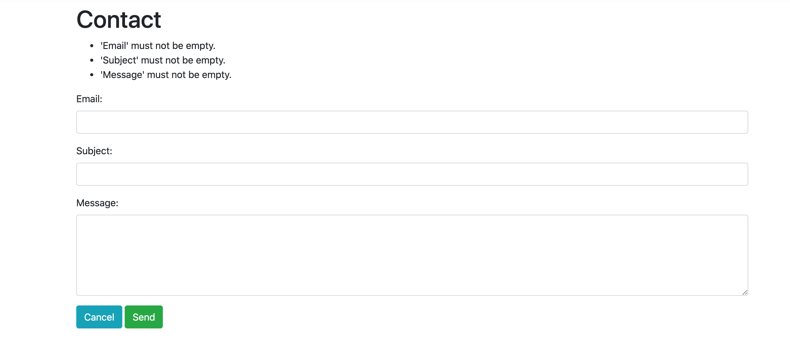

# 10 Razor Pages `Validation`

Pour utiliser la `validation` avec les `Razor Pages` il faut ajouter dans `Startup.cs` :

```cs
services
  .AddRazorPages()
  .AddFluentValidation(cfg => cfg.RegisterValidatorsFromAssemblyContaining<CaseViewModelValidator>());
```

Mais comme `FluentValidation` est déjà ajouté à `services.AddControllersWithViews` ce n'est pas la peine de le rajouter deux fois.


## Création de `ContactViewModel`

```cs
public class ContactViewModel
{
	public string Email { get; set; }
  public string Subject { get; set; }
  public string Message { get; set; }
}
```


## Ajout d'un `Validator` : `ContactViewModelValidator`

```cs
public class ContactViewModelValidator : AbstractValidator<ContactViewModel>
{
  public ContactViewModelValidator()
  {
		RuleFor(c => c.Email)
      .NotEmpty()
      .EmailAddress();
    
    RuleFor(c => c.Subject)
      .NotEmpty()
      .MaximumLength(100);
    
    RuleFor(c => c.Message)
      .NotEmpty()
      .MaximumLength(4000);
  }
}
```


`Contact.cshtml.cs`

```cs
public class ContactModel : PageModel
{
  public void OnGet()
  {

  }
  
  [BindProperty]
  public ContactViewModel ViewModel { get; set; }
}
```


## Utilisation dans la vue `Contact.cshtml`

```html
@page
@model JurisTempus.ContactModel
@section Scripts {
<script src="~/lib/jquery-validation/dist/jquery.validate.min.js"></script>
<script src="~/lib/jquery-validation-unobtrusive/jquery.validate.unobtrusive.min.js"></script>
}
@{
    ViewData["Title"] = "Contact";
}
<h1>Contact</h1>
<form method="post">
  <div asp-validation-summary="All"></div>
      
  </div>
    <div class="form-group">
        <label asp-for="ViewModel.Email">Email:</label>
        <input asp-for="ViewModel.Email" class="form-control" />
    </div>
    <div class="form-group">
        <label asp-for="ViewModel.Subject">Subject: </label>
        <input asp-for="ViewModel.Subject" class="form-control" />
    </div>
    <div class="form-group">
        <label asp-for="ViewModel.Message">Message:</label>
        <textarea asp-for="ViewModel.Message" class="form-control" rows="5"></textarea>
    </div>
    <div class="form-group">
        <a href="/" class="btn btn-info">Cancel</a>
        <input type="submit" class="btn btn-success" value="Send" />
    </div>
</form>

```

`<div asp-validation-summary="All"></div>` affiche toutes les erreurs de validation plutôt que pour chaque champs. Attention doit se trouver dans la balise `form`.




## Reception sur le serveur

On doit créer un `handler` `post` dans `Contact.cshtml.cs`

```cs
public class ContactModel : PageModel
{
  public void OnGet()
  {

  }

  [BindProperty]
  public ContactViewModel ViewModel { get; set; }
  
  public void OnPost()
  {
    if(ModelState.IsValid)
    {
      return;
    }
  }
}
```

cela exécute la validation côté serveur.


