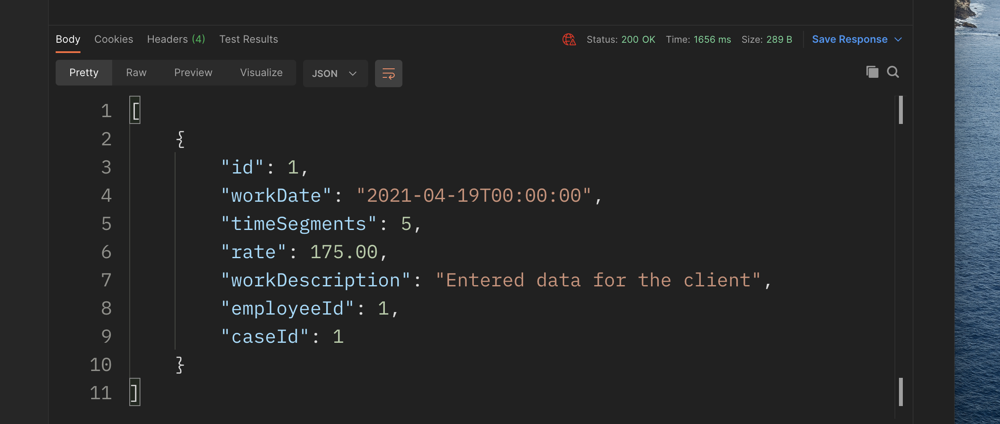
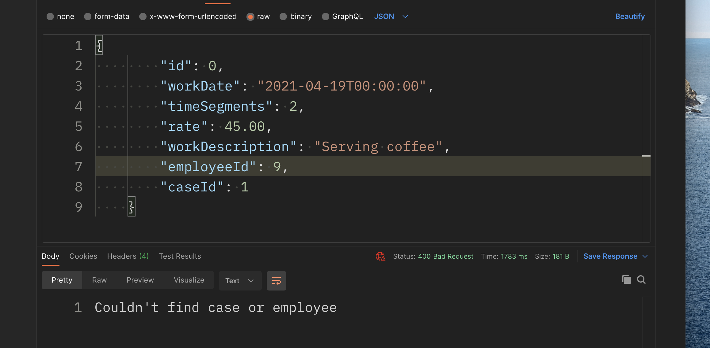

# 11 `ViewModel` dans une `API`

## `ViewModel` avec `GET`

On va s'intéresser au contrôleur `TimeBillsController.cs`.

On va créer un nouveau `ViewModel` dans `ViewModels` :

`TimeBillsViewModel.cs`

```cs
public class TimeBillsViewModel
{
  public int Id { get; set; }
  public DateTime WorkDate { get; set; }
  public int TimeSegments { get; set; }
  public decimal Rate { get; set; }
  public string WorkDescription { get; set; }

  // public Employee Employee { get; set; }
  // public Case Case { get; set; }
  public int EmployeeId { get; set; }
  public int CaseId { get; set; }
}
```

Il peut être intérressant de ne passer que les `ID` pour `Employee` et `Case`

On doit maintenant ajouter un `Map` au fichier de `profile` `JurisTempusProfile` :

```cs
CreateMap<TimeBill, TimeBillViewModel>()
  .ForMember(d => d.CaseId, opt => opt.MapFrom(s => s.Case.Id))
  .ForMember(d => d.EmployeeId, opt => opt.MapFrom(s => s.Employee.Id))
  .ReverseMap();
```


## Utilisation dans le contrôleur

On injecte le `mapper` dans le constructeur :

```cs
// ...
private readonly IMapper _mapper;

public TimeBillsController(ILogger<TimeBillsController> logger,
                           BillingContext ctx, IMapper mapper)
{
  _mapper = mapper;
  _logger = logger;
  _ctx = ctx;
}
```

On change le type de retour de la méthode `Get` ains que la valeur :

```cs
[HttpGet]
public async Task<ActionResult<TimeBillViewModel[]>> Get()
{
  var result = await _ctx.TimeBills
    .Include(t => t.Case)
    .Include(t => t.Employee)
    .ToArrayAsync();

  return Ok(_mapper.Map<TimeBillViewModel[]>(result));
}

[HttpGet("{id:int}")]
public async Task<ActionResult<TimeBillViewModel>> Get(int id)
{
  var result = await _ctx.TimeBills
    .Include(t => t.Case)
    .Include(t => t.Employee)
    .Where(t => t.Id == id)
    .FirstOrDefaultAsync();

  return Ok(_mapper.Map<TimeBillViewModel>(result));
}
```

#### ! on renvoie un tableau `[]` pour la première méthode `Get`




## `ViewModel` avec `POST`

```cs
[HttpPost]
public async Task<ActionResult<TimeBillViewModel>> Post([FromBody] TimeBillViewModel model)
{
  var bill = _mapper.Map<TimeBill>(model);

  var theCase = await _ctx.Cases
    .Where(c => c.Id == model.CaseId)
    .FirstOrDefaultAsync();

  var theEmployee = await _ctx.Employees
    .Where(e => e.Id == model.EmployeeId)
    .FirstOrDefaultAsync();

  if(theCase == null || theEmployee == null)
  {
    return BadRequest("Couldn't find case or employee");
  }

  bill.Case = theCase;
  bill.Employee = theEmployee;

  _ctx.Add(bill);
  if (await _ctx.SaveChangesAsync() > 0)
  {
    return CreatedAtAction("Get", new { id = bill.Id }, _mapper.Map<TimeBillViewModel>(bill));
  }

  return BadRequest("Failed to save new timebill");
}
```

Utilisation des réponses `BadRequest` (status `400 bad request`) et `CreatedAtAction` (status `201 created`).




