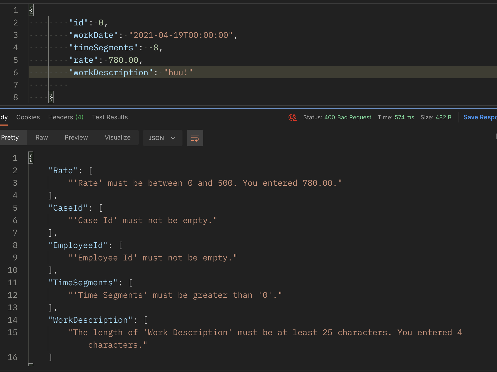
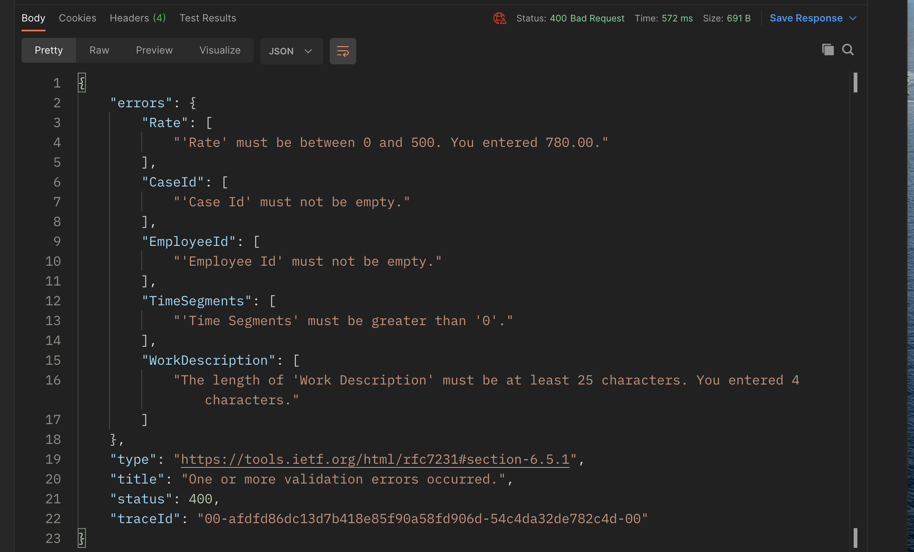

# 12 `API` Validation


## Validating `ModelState`

Il faut crée un nouveau validateur : `TimeBillViewModelValidator` dans le dossier `Validators` :

```cs
public class TimeBillViewModelValidator : AbstractValidator<TimeBillViewModel>
{
  public TimeBillViewModelValidator()
  {
    RuleFor(b => b.Rate)
      .InclusiveBetween(0m, 500m);
    RuleFor(b => b.TimeSegments)
      .GreaterThan(0);
    RuleFor(b => b.WorkDescription)
      .MinimumLength(25);
    RuleFor(b => b.CaseId)
      .NotEmpty();
    RuleFor(b => b.EmployeeId)
      .NotEmpty();
  }
}
```

Le suffixe `m` dans `0m` est pour désigner un `decimal`.

> **Doc Microsoft**
>
> - Le littéral sans suffixe ou avec le suffixe `d` ou `D` est de type `double`
> - Le littéral avec le suffixe `f` ou `F` est de type `float`.
> - Le littéral avec le suffixe `m` ou `M` est de type `decimal`.

Nouveau validateur :

`GreaterThan`

`InclusiveBetween`


## Ajouter la `validation` dans le `controller`

Il suffit de tester `!ModelState.IsValid` :

```cs
[HttpPost]
public async Task<ActionResult<TimeBillViewModel>> Post([FromBody] TimeBillViewModel model)
{
  if (!ModelState.IsValid)
  {
    return BadRequest(ModelState);
  }
  // ...
```



On voit ici le dictionnaire `ModelState` avec toutes les erreurs enregistrées.


### Simplification pour un `[ApiController]`

En enlevant la validation à l'intérieur de la méthode :

```cs
[HttpPost]
public async Task<ActionResult<TimeBillViewModel>> Post([FromBody] TimeBillViewModel model)
{
  // if (!ModelState.IsValid)
  // {
  //   return BadRequest(ModelState);
  // }
```

Et en ajoutant l'annotation `[ApiController]` sur le `controller` :

```cs
[ApiController]
[Route("api/timebills")]
public class TimeBillsController : ControllerBase
{
  // ...
```

On a maintenant une validation automatique pour toutes les méthodes :




