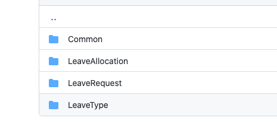

# 01 Application `Core`

 

## Différentes architectures

### `All-In-One`

Plus l'application grandit, plus elle est dure à maintenir (évolution, testabilité).


### `Layered Architecture`

Application plus couplée.

 Ne tire pas avantage de l'injection de dépendance.

La logique peut ne plus être centralisée.

Dédié à une seule application.


### `Onions Architecture`

Elle procure une meilleur testabilité, car on peut tester chacune des couches.

Facilite les changement sans forcement affecter une autre couche / module.

Promeut le découplage.


## `Clean Architecture`

C'est une architecture en oignon, elle permet d'avoir une base agnostique à l'utilisation finale.

En pratique avec la même base on pourrait avoir un client mobile, une application desktop, une interface web.


## Set Up


### Solution

```bash
dotnet new sln -n HRLeaveManagement
```


## `Domain`

### Class Library

```bash
dotnet add new classlib -o Domain
```

Dedans on crée une classe `LeaveType`

```cs
public class LeaveType
{
    public int Id { get; set; }
    public string Name { get; set; }
    public int DefaultDays { get; set; }
    public DateTime DateCreated { get; set; }
}
```

`LeaveRequest`

```cs
public class LaeveRequest
{
    public int Id { get; set; }
    public DateTime StartDate { get; set; }
    public DateTime EndDate { get; set; }
    public LeaveType LeaveType { get; set; }
    public int LeaveTypeId { get; set; }
    public DateTime DateRequested { get; set; }
    public string RequestComments { get; set; }
    public DateTime DateActioned { get; set; }
    public bool? Approved { get; set; }
    public bool Cancelled { get; set; }

}
```

`LeaveAllocation`

```cs
public class LeaveAllocation
{
    public int Id { get; set; }    
    public int NumberOfDays { get; set; }
    public DateTime DateCreated { get; set; }
    public LeaveType LeaveType { get; set; }
    public int LeaveTypeId { get; set; }
    public int Period { get; set; }
}
```


### Propriétés communes

Il y a souvent des propriétés en commun pour la plupart des classes.

Pour éviter les répétitions de code, on peut créer une classe d'`audit` regroupant ces propriétés communes.

On crée d'abord un dossier `Common` et dedans une classe  `AuditableEntity` ( `BaseDomainEntity` dans le cours).

`AuditableEntity`

```cs
public abstract class AuditableEntity
{
    public int Id { get; set; }
    public DateTime DateCreated { get; set; }
    public string CreatedBy { get; set; }
    public DateTime LastModifiedDate { get; set; }
    public string LastModifiedBy { get; set; }
}
```

On peut simplifier nos classes du `Domain` en les faisant hériter de `AuditableEntity` :

```cs
public class LeaveType : AuditableEntity
{
    public string Name { get; set; }
    public int DefaultDays { get; set; }
}
```


## `Application`

```bash
dotnet new classlib -o Application
dotnet sln add **/*.csproj
```

On crée un dossier `Persistence` et dedans un dossier `Contracts`.

C'est ici que l'on va définir les interfaces de nos `repository` :

### Le `repository` générique

`IGenericRepository`

```cs
public interface IGenericRepository<T> where T : class
{
    Task<T> Get(int id);
    
    Task<IReadOnlyList<T>> GetAll();
    
    Task<T> Add(T entity);
    
    Task<T> Update(T entity);
    
    Task<T> Delete(T entity);
}
```

`IReadOnlyList<T>` garanti que la liste renvoyée ne pourra être modifiée.

On pourrait ajouter le mot `Async` à la fin du nom des méthodes : `AddAsync`.

C'est une convention à suivre ou pas.

**Jason Taylor** n'utilise pas de `repository` dans sa solution estimant que `EF Core` implémente déjà ce `pattern`.


### Les `repository` plus spécifique

Ils héritent alors de `IGenericRepository`.

`ILeaveRequestRepository`

```cs
public interface ILeaveRequestRepository : IGenericRepository<LeaveRequest>
{
	// specific methods
}
```

`Application` doit avoir une référence vers `Domain` :

```bash
dotnet add Application reference Domain
```

De même avec `ILeaveAllocationRepository` et `ILeaveTypeRepository`.


## `Automapper`

Pour communiquer avec l'extérieur l'application ne va pas exposer ses classes du `Domain` mais plutôt des abstractions nommées `DTO` Data Transfert Object (`ViewModel` étant plutôt utilisé pour une architecture `MVC`, mais c'est le même concept).

`Autommaper` va faire le lien automatiquement entre les classes du `Domain` et les classes `DTO` => mapper les classes.

`Automapper` utilise des `profiles` qui sont des fichiers de configuration pour dire quelle classe on convertit en quelle autre.

On crée donc un dossier `Profiles` et dedans une classe `MappingProfile`.

On ajoute le nuget `Automapper` pour `Dependency Injection` :

```bash
dotnet add package AutoMapper.Extensions.Microsoft.DependencyInjection --version 8.1.1
```

Dans le projet `Application` bien sûr.

`MappingProfile`

```cs
public class MappingProfile : Profile
{
	
}
```

On va créer un dossier `DTOs` et dedans de nouveau un dossier `Common`.

On écrit la classe `BaseDto`

```cs
namespace Application.DTOs.Common
{
    public class BaseDto
    {
        public int Id { get; set; }
    }
}
```

On veut que tous les objets envoyés à l'extérieur est au moins un `Id`.

On va maintenant créer un `DTO ` pour `LeaveType` :

`LeaveTypeDto`

```cs
public class LeaveTypeDto : BaseDto
{
    public string Name { get; set; }
    public int DefaultDays { get; set; }
}
```

`LeaveRequestDto`

```cs
public class LeaveRequestDto : BaseDto
{
    public DateTime StartDate { get; set; }
    public DateTime EndDate { get; set; }
    public LeaveTypeDto LeaveType { get; set; }
    public int LeaveTypeId { get; set; }
    public DateTime DateRequested { get; set; }
    public string RequestComments { get; set; }
    public DateTime DateActioned { get; set; }
    public bool? Approved { get; set; }
    public bool Cancelled { get; set; }
}
```

`LeaveAllocationDto`

```cs
public class LeaveAllocationDto : BaseDto
{
    public int NumberOfDays { get; set; }
    public LeaveTypeDto LeaveType { get; set; }
    public int LeaveTypeId { get; set; }
    public int Period { get; set; }
}
```

#### ! Un `DTO` ne contient que des types `DTO` pour les types créé.

Exemple `LeaveRequest` contient un `LeaveTypeDto` pas un `LeaveType`.


## `CreateMap<Source, Destination>`

On va maintenant dans le constructeur de `MappingProfile` créer les *mappages* avec la méthode `CreateMap` :

```cs
public class MappingProfile : Profile
{
    public MappingProfile()
    {
        CreateMap<LeaveRequest, LeaveRequestDto>().ReverseMap();
        CreateMap<LeaveAllocation, LeaveAllocationDto>().ReverseMap();
        CreateMap<LeaveType, LeaveTypeDto>().ReverseMap();
    }
}
```


## Organiser les `DTO`

On peut avoir besoin de plusieurs `DTO` pour une même ressource suivant le context dans lequel on jutilise cette ressource.

Pour cela on peut créer un dossier par entité du `Domain` dans lequel sera réuni tous les `DTO` associés à cette entité.



On va créer un `LeaveRequestListDto`

```cs
public class LeaveRequestListDto : BaseDto
{
	public LeaveTypeDto LeaveType { get; set; }
    public DateTime DateRequested { get; set; }
    public bool? Approved { get; set; }
}
```

On doit ajouter ce nouveau `DTO` à notre fichier `MappinfProfile` :

```cs
public MappingProfile()
{
    CreateMap<LeaveRequest, LeaveRequestDto>().ReverseMap();
    CreateMap<LeaveRequest, LeaveRequestListDto>().ReverseMap(); // <=
    CreateMap<LeaveAllocation, LeaveAllocationDto>().ReverseMap();
    CreateMap<LeaveType, LeaveTypeDto>().ReverseMap();
}
```


## Set Up de l'injection de dépendance

On va utiliser les `extension method` pour faire cela.

À la racine du projet `Application` on va créer la classe `ApplicationServicesRegistration` :

> Jason Taylor appelle cette classe `DependencyInjection`.

```cs
public static class ApplicationServicesRegistration
{
    public static IServiceCollection AddApplicationService(this IServiceCollection services)
    {
        services.AddAutoMapper(Assembly.GetExecutingAssembly());
        
        return services;
    }
}
```

