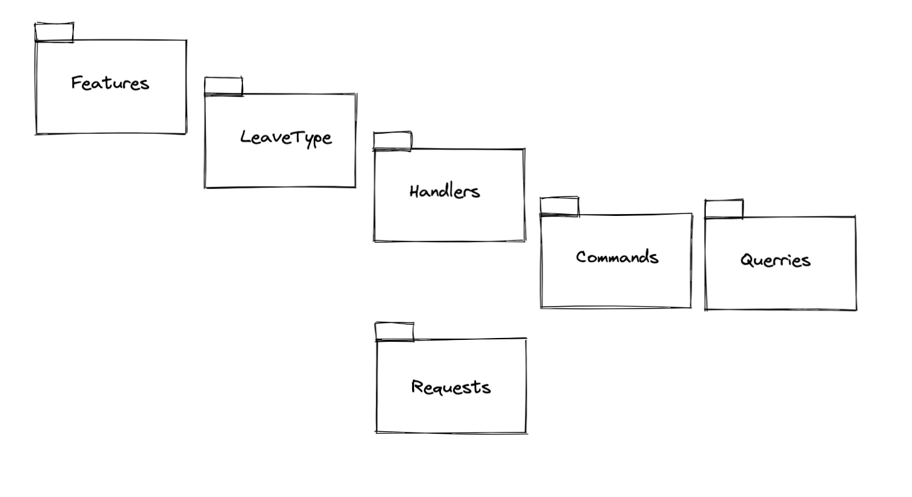
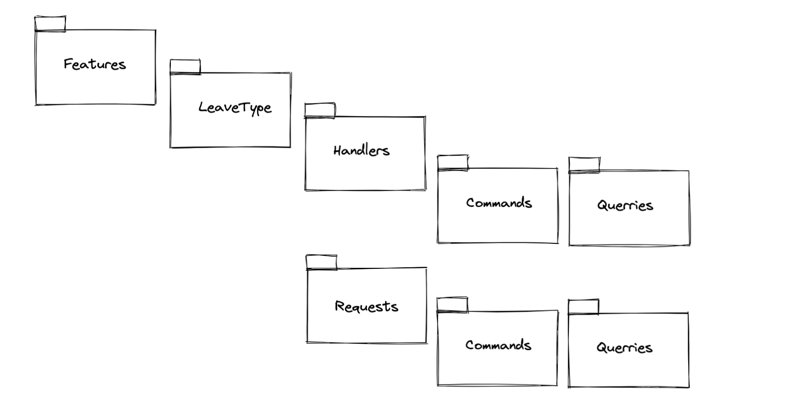
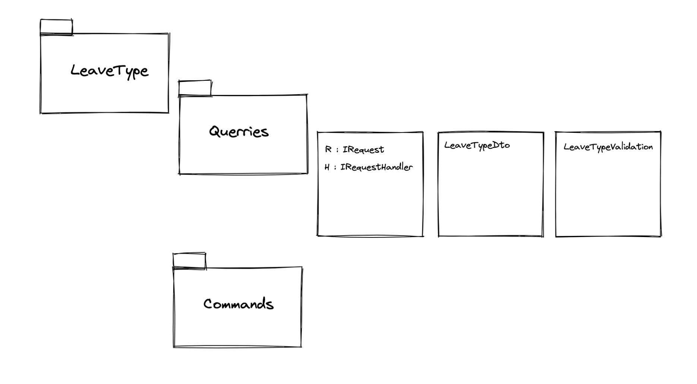

# 02 Core : implémentation de `mediatR` et `CQRS` : Les `Queries`

## Partie 1

`CQRS` Command and Query Responsability Segregation

`Command` tout ce qui modifie les données : Création, modification, suppression

`Query` tout ce qui lit les données (`get`).

On va ajouter le package `MediatR` à notre projet  (toujours la version pour `dependency injection`:

```bash
dotnet add package MediatR.Extensions.Microsoft.DependencyInjection --version 9.0.0
```

Et on l'ajoute à `ApplicationServicesRegistration`  :

```cs
public static IServiceCollection AddApplicationService(this IServiceCollection services)
{
    services.AddAutoMapper(Assembly.GetExecutingAssembly());
    services.AddMediatR(Assembly.GetExecutingAssembly());

    return services;
}
```


## Organisation des `Commands` et `Queries`

On crée un dossier `Features` et dedans un dossier par `table` que l'on veut utiliser.

C'est organisé par rapport aux `tables` de la `BDD`.

Dans le cours on a l'arborescence :



```bash
mkdir -p ./{LeaveAllocation,LeaveRequest,LeaveType}/{Handlers/{Commands,Queries},Requets}
```

## Première `Request`

On crée la classe `GetLeaveTypeListRequest` dans `Features/LeaveType/Requests` :

```cs
namespace Application.Features.LeaveType.Requets
{
    public class GetLeaveTypeListRequest : IRequest<List<LeaveTypeDto>>
    {
        
    }
}
```

### `IRequest<ReturnType>`

Cette requête demande une `Query` (`GetSomething`), on va donc maintenant définir le `Handler` dans `Handlers/Queries` :

`GetLeaveTypeListRequestHandler`

```cs
namespace Application.Features.LeaveType.Handlers.Queries
{
  public class GetLeaveTypeListRequestHandler : IRequestHandler<GetLeaveTypeListRequest, List<LeaveTypeDto>>
  {
    public Task<List<LeaveTypeDto>> Handle(GetLeaveTypeListRequest request, CancellationToken cancellationToken)
    {
      throw new System.NotImplementedException();
    }
  }
}
```

### `IRequestHandler<MessageType, ReturnType>`

L'interface contient une seule méthode : `Handle`.

On injecte le `Mapper`.

On injecte dans le constructeur le `repository` souhaité pour cette `Query` :

```cs
public class GetLeaveTypeListRequestHandler : IRequestHandler<GetLeaveTypeListRequest, List<LeaveTypeDto>>
{
  private readonly ILeaveTypeRepository _leaveTypeRepository;
  private readonly IMapper _mapper;
  public GetLeaveTypeListRequestHandler(ILeaveTypeRepository leaveTypeRepository, IMapper mapper)
  {
    _mapper = mapper;
    _leaveTypeRepository = leaveTypeRepository;

  }

  public async Task<List<LeaveTypeDto>> Handle(GetLeaveTypeListRequest request, CancellationToken cancellationToken)
  {
    var leaveTypes = await _leaveTypeRepository.GetAll();
    return _mapper.Map<List<LeaveTypeDto>>(leaveTypes);

  }
```


## `GetLeaveTypeDetail`

On va maintenant implémenter la lecture d'un seul `LeaveType`.

Le message (`Request`) devra cette fois contenir l'`Id` du `LeaveType` demandé.

Dans `LeaveType/Requests` : `GetLeaveTypeDetailRequest`

```cs
using Application.DTOs.LeaveType;
using MediatR;

namespace Application.Features.LeaveType.Requets
{
    public class GetLeaveTypeDetailRequest : IRequest<LeaveTypeDto>
    {
        public int Id { get; set; }
    }
}
```

On va maintenant créer le `Handler` (dans `LeaveType/Handlers/Queries`)

`GetLeaveTypeListRequestHandler`

```cs
public class GetLeaveTypeDetailRequestHandler : IRequestHandler<GetLeaveTypeDetailRequest, LeaveTypeDto>
{
  private readonly ILeaveTypeRepository _leaveTypeRepository;
  private readonly IMapper _mapper;
  public GetLeaveTypeDetailRequestHandler(ILeaveTypeRepository leaveTypeRepository, IMapper mapper)
  {
    _mapper = mapper;
    _leaveTypeRepository = leaveTypeRepository;

  }

  public async Task<LeaveTypeDto> Handle(GetLeaveTypeDetailRequest request, CancellationToken cancellationToken)
  {
    var leaveType = await _leaveTypeRepository.Get(request.Id);

    return _mapper.Map<LeaveTypeDto>(leaveType);
  }
}
```

La méthode `Handle` reçoit en paramètre `request` qui est le message de type `IRequest`.

Grâce à ce `request` il est facile de récupérer l'`Id` : `request.Id`.

On va organiser `Requests` comme `Handlers` :



> On pourrait organiser autrement en groupant les `Request` et les `Handler` dans le même fichier avec les `DTO` et la validation dans le même dossier.
>
> 


## `LeaveAllocation`

On peut vouloir inclure (`Include`) les données de la propriété de navigation `LeaveType`.

Pour cela on peut ajouter des méthodes à l'interface du `repository` spécifique `ILeaveAllocationRepository` :

```cs
public interface ILeaveAllocationRepository : IGenericRepository<LeaveAllocation>
{
  Task<LeaveAllocation> GetLeaveAllocationWithDetail(int id);
  Task<List<LeaveAllocation>> GetLeaveAllocationsWithDetail();
}
```

Du coup dans les `Handlers` associés on aura :

```cs
public async Task<LeaveAllocationDto> Handle(GetLeaveAllocationDetailRequest request, CancellationToken cancellationToken)
{
  var leaveAllocation = await _leaveAllocationRepository.GetLeaveAllocationWithDetail(request.Id);
  return _mapper.Map<LeaveAllocationDto>(leaveAllocation);
}
```

et 

```cs
public async Task<List<LeaveAllocationDto>> Handle(GetLeaveAllocationListRequest request, CancellationToken cancellationToken)
{
  var leaveAllocations = await _leaveAllocationRepository.GetLeaveAllocationsWithDetail();
  return _mapper.Map<List<LeaveAllocationDto>>(leaveAllocations);
}
```

plutôt que d'utiliser les méthodes génériques `Get` et `GetAll`.

> On pourrait se passer des `repository` en injectant directement le `context` de `EF Core` dans les `Handlers`. La logique métier serait couplé avec chaque `Handler` et il pourrait y avoir duplication de code.
>
> **Jason Taylor** utilise directement le `context` dans ses `handlers` :
>
> ```cs
> public async Task<int> Handle(CreateTodoItemCommand request, CancellationToken cancellationToken)
> {
>   var entity = new TodoItem
>   {
>     ListId = request.ListId,
>     Title = request.Title,
>     Done = false
>   };
> 
>   entity.DomainEvents.Add(new TodoItemCreatedEvent(entity));
> 
>   _context.TodoItems.Add(entity);
> 
>   await _context.SaveChangesAsync(cancellationToken);
> 
>   return entity.Id;
> }
> ```
>
> 
>
> Les repository permettent de découpler la logique et de centraliser son implémentation (potentiellement moins de dupplication de code).
