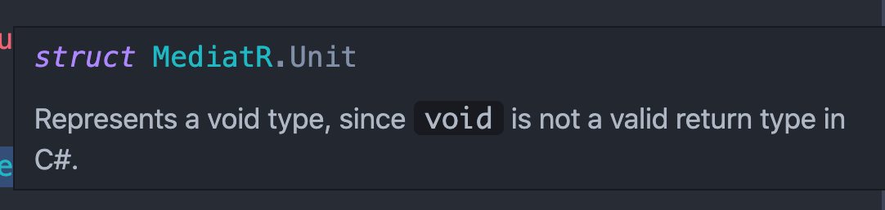

# 03 Les `commands`


## La commande `Create`

On va ajouter pour `LeaveRequest` et `LeaveAllocation` des `DTOs` spécifique pour `Create` :

`DTOs/LeaveAllocation` => `CreateLeaveAllocationDto`

```cs
public class CreateLeaveAllocationDto
{
  public int NumberOfDays { get; set; }
  public int LeaveTypeId { get; set; }
  public int Period { get; set; }
}
```


`DTOs/LeaveRequest` => `CreateLeaveRequestDto`

```cs
public class CreateLeaveRequestDto
{
  public DateTime StartDate { get; set; }
  public DateTime EndDate { get; set; }
  public int LeaveTypeId { get; set; }
  public string RequestComments { get; set; }
}
```

> Mettre certain type à `nullable` : `?` dans les `DTO` ou dans le `Domain` permet de ne pas avoir d'erreur à l'enregistrement des données en `BDD`.

Les `DTO` de création permettent de ne pas récupérer trop de données du client et de préserver l'intégrité des données.

Par example il est inutile que le client envoie un `LeaveType` complet, en faisant peut-être des fautes d'encodage, il suffit de récupérer l'`Id` du `LeaveType`.


## `CreateLeaveTypeCommand`

Dans le dossier `LeaveType/Requests/Commands` on va créer la `command` (le message) nécéssaire :

`CreateLeaveTypeC`ommand

```cs
namespace Application.Features.LeaveType.Requests.Commands
{
    public class CreateLeaveTypeCommand : IRequest<int>
    {
        public LeaveTypeDto LeaveTypeDto { get; set; }
    }
}
```

`LeaveTypeDto` étant déjà très simple, il n'y a pas de `CreateLeaveTypeDto`.

Le retour est un `int` qui est l'`Id` du `LeaveType` qui vient d'être créé.

Maintenant le `Handler` pour `CreateLeaveTypeRequest` :

`CreateLeaveTypeRequestHandler`

```cs
namespace Application.Features.LeaveType.Handlers.Commands
{
  public class CreateLeaveTypeCommandHandler : IRequestHandler<CreateLeaveTypeCommand, int>
  {
    private readonly ILeaveTypeRepository _leaveTypeRepository;
    private readonly IMapper _mapper;
    public CreateLeaveTypeCommandHandler(ILeaveTypeRepository leaveTypeRepository, IMapper mapper)
    {
      _mapper = mapper;
      _leaveTypeRepository = leaveTypeRepository;
    }

    public async Task<int> Handle(CreateLeaveTypeCommand request, CancellationToken cancellationToken)
    {
      var leaveType = _mapper.Map<LeaveType>(request.LeaveTypeDto);
      leaveType = await _leaveTypeRepository.Add(leaveType);
      
      return leaveType.Id;
    }
  }
}
```

Cette fois on `Map` d'un type `DTO` vers un type du `Domain`.


## Correction et ajout de `CreateLeaveTypeDto`

Si on utilise pour la création `LeaveTypeDto`, celui-ci hérite de `BaseDto` et possède donc un `Id`.

On ne veut justement pas que l'utilisateur puisse attribuer un `Id`.

On va donc créer un `CreateLeaveTypeDto`

```cs
public class CreateLeaveTypeDto
{
  public string Name { get; set; }
  public int DefaultDays { get; set; }
}
```

La seule différence avec `LeaveTypeDto`, c'est qu'il n'herite pas de `BaseDto`.

De la même manière aucun des `DTO` de création ne doit hérité de `BaseDto`.


## `Update`

Par contre les `DTO` en `Update` ont besoin de connaître l'`Id` :

```cs
public class UpdateLeaveAllocationDto : BaseDto
{
  public int NumberOfDays { get; set; }
  public int LeaveTypeId { get; set; }
  public int Period { get; set; }
}
```

 pour `LeaveRequest`, il y a deux nouveaux `DTO` :

`ChangeLeaveRequestApprovalDto` 

```cs
public class ChangeLeaveRequestApprovalDto : BaseDto
{
	public bool? Approved { get; set; }
}
```

et `UpdateLeaveRequestDto`.

```cs
public class UpdateLeaveRequestDto : BaseDto
{
  public DateTime StartDate { get; set; }
  public DateTime EndDate { get; set; }
  public int LeaveTypeId { get; set; }
  public string RequestComments { get; set; }
  public bool Cancelled { get; set; }
}
```

Cette granularité permet de ne transmettre que les données nécéssaire.

Un `Update` ne contient pas le `flag : Approved`, il est important de créer un `DTO` par action du client.


## La `Command` `Update`

### `UpdateLeaveTypeCommand`

```cs
public class UpdateLeaveTypeCommand : IRequest<Unit>
{
  public LeaveTypeDto LeaveTypeDto { get; set; }
}
```

`Unit` est un type fournit par `MediatR` qui représente `void` :




### `UpdateLeaveTypeCommandHandler`

Pour mettre à jour un `LeaveType` on a trois étapes :

1. Retrouver l'élément
2. Le mettre à jour
3. L'enregistrer

```cs
public async Task<Unit> Handle(UpdateLeaveTypeCommand request, CancellationToken cancellationToken)
{
  var leaveType = await _leaveTypeRepository.Get(request.LeaveTypeDto.Id);
  
  -mapper.Map(request.LeaveTypeDto, leaveType)
    
  await _leaveTypeRepository.Update(leaveType);

  return Unit.Value;
}
```

`-mapper.Map(Source, Destination)` fait correspondre le contenu de la source vers la destination.

### Ma version

```cs
public async Task<Unit> Handle(UpdateLeaveTypeCommand request, CancellationToken cancellationToken)
{
  var leaveType = _mapper.Map<Domain.LeaveType>(request.LeaveTypeDto);
  await _leaveTypeRepository.Update(leaveType);

  return new Unit();
}
```

Je ne fait pas le `Get`, je me demande si cela change quelque chose ? à tester.

Cela a du sens si on utilise `EF Core` directement dans le `Handler`.

### Exemple de Jason Taylor

```cs
public class UpdateTodoItemCommand : IRequest
{
  public int Id { get; set; }

  public string Title { get; set; }

  public bool Done { get; set; }
}

public class UpdateTodoItemCommandHandler : IRequestHandler<UpdateTodoItemCommand>
{
  private readonly IApplicationDbContext _context;

  public UpdateTodoItemCommandHandler(IApplicationDbContext context)
  {
    _context = context;
  }

  public async Task<Unit> Handle(UpdateTodoItemCommand request, CancellationToken cancellationToken)
  {
    var entity = await _context.TodoItems.FindAsync(request.Id);

    if (entity == null)
    {
      throw new NotFoundException(nameof(TodoItem), request.Id);
    }

    entity.Title = request.Title;
    entity.Done = request.Done;

    await _context.SaveChangesAsync(cancellationToken);

    return Unit.Value;
  }
}
```

Dans ce cas il n'utilise même pas `mediatR` ni de `DTO` non plus.

Pour quelques propriété le `mapping` à la main est plus simple.

On fait la même chose pour `UpdateLeaveAllocation` et `UpdateLeaveRequest`.


## `ChangeLeaveRequestApproval`

On peut utiliser une seule `Command` et un seul `Handler` pour gérer les deux cas de figure.

Il faut aussi ajouter une méthode au `ILeaveRequestRepository` pour gérer la modification de `Approval` :

```cs
public interface ILeaveRequestRepository : IGenericRepository<LeaveRequest>
{
  Task<LeaveRequest> GetLeaveRequestWithDetaisl(int id);
  Task<List<LeaveRequest>> GetLeaveRequestsWithDetails();
  Task ChangeApprovalStatus(LeaveRequest leaveRequest, bool? approvalStatus);
}
```


### `UpdateLeaveRequestCommand`

```cs
public class UpdateLeaveRequestCommand : IRequest<Unit>
{
  public int Id { get; set; }
  public UpdateLeaveRequestDto UpdateLeaveRequestDto { get; set; }
  public ChangeLeaveRequestApprovalDto ChangeLeaveRequestApprovalDto { get; set; }
}
```

Par commodité on ajoute l'`Id` à la commande.


### `UpdateLeaveRequestCommandHandler`

On va pouvoir tester quel `DTO` on reçoit pour adapter le traitement.

```cs
public async Task<Unit> Handle(UpdateLeaveRequestCommand request, CancellationToken cancellationToken)
{
  // D'abord retrouver notre leaveRequest grâce à l'Id de la Command
  var leaveRequest = await -leaveRequestRepository.Get(requestId);
  
  // Ensuite on peut tester quel DTO on a reçu
  if(request.UpdateLeaveRequestDto != null)
  {
    // ...
  }
  else if(request.ChangeLeaveRequestApprovalDto != null)
  {
    // ...
  }
  
  return Unit.Value
}
```

Implémentation totale :

```cs
public async Task<Unit> Handle(UpdateLeaveRequestCommand request, CancellationToken cancellationToken)
{
  var leaveRequest = await _leaveRequestRepository.Get(request.Id);
  
  if(request.UpdateLeaveRequestDto != null)
  {
    _mapper.Map(request.UpdateLeaveRequestDto, leaveRequest);
    
    await _leaveRequestRepository.Update(leaveRequest);
  }
  else if(request.ChangeLeaveRequestApprovalDto != null)
  {
    await _leaveRequestRepository.ChangeApprovalStatus(leaveRequest, request.ChangeLeaveRequestApprovalDto.Approved);
  }
  
  return Unit.Value;
}
```


## La `Command` `Delete`

### `DeleteLeaveTypeCommand`

```cs
public class DeleteLeaveTypeCommand : IRequest
{
  public int Id { get; set; }
}
```

`IRequest` peut simplement s'écrire sans type si on ne renvoie rien (identique à `IRequest<Unit>`).


### `DeleteLeaveTypeCommandHandler`

```cs
public class DeleteLeaveTypeCommandHandler : IRequestHandler<DeleteLeaveTypeCommand, Unit>
{
  private readonly ILeaveTypeRepository _leaveTypeRepository;
  private readonly IMapper _mapper;
  public DeleteLeaveTypeCommandHandler(ILeaveTypeRepository leaveTypeRepository, IMapper mapper)
  {
    _mapper = mapper;
    _leaveTypeRepository = leaveTypeRepository;
  }

  public async Task<Unit> Handle(DeleteLeaveTypeCommand request, CancellationToken cancellationToken)
  {
    var leaveType = await _leaveTypeRepository.Get(request.Id);
    await _leaveTypeRepository.Delete(leaveType);

    return Unit.Value;
  }
}
```

1. On retrouve l'élément
2. On le `Delete`


