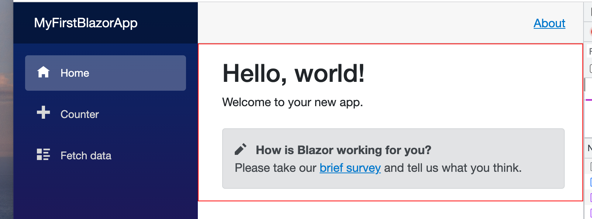
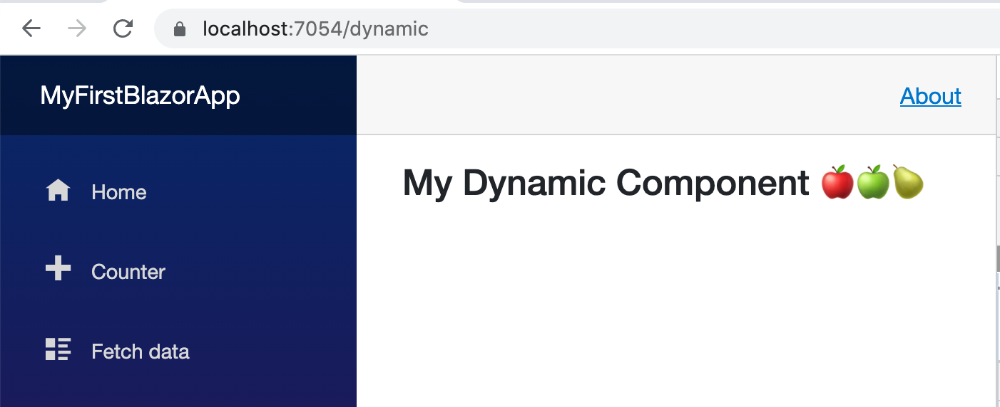
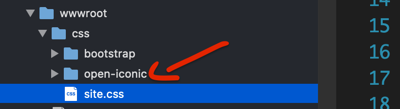
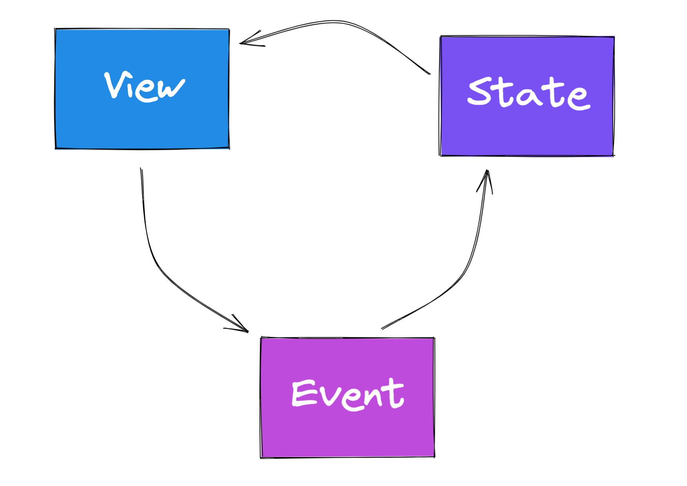

# 01 Introduction

## Server Side Blazor

On va créer une application `MyFirstBlazorApp`.

Celle-ci utilise `SignalR` pour communiquer avec le client.

On a deux phases dans `Program.cs` :

- La première injecte les services utilisés par les `middleware`.
  `builder.Services.Add...`

  `Services` étant le conteneur de `services`.

- la deuxième définit le `pipeline` de `middleware`
  `app.Use...`


## `_Host`

```cs
app.MapFallbackToPage("/_Host");
```

Toutes les requêtes sont renvoyées vers `Pages/_Host.cshtml` car `Blazor` est une `single page application`.

Cette page appelle simplement le `_Layout` :

`_Host.cshtml`

```cs
@page "/"
@namespace MyFirstBlazorApp.Pages
@addTagHelper *, Microsoft.AspNetCore.Mvc.TagHelpers
@{
    Layout = "_Layout";
}

<component type="typeof(App)" render-mode="ServerPrerendered" />
```

Dans `_Layout.cshtml` le `component App` sera rendu à la place de :

```cs
@RenderBody()
```

`_Layout.cshtml`

```cs
@using Microsoft.AspNetCore.Components.Web
@namespace MyFirstBlazorApp.Pages
@addTagHelper *, Microsoft.AspNetCore.Mvc.TagHelpers

<!DOCTYPE html>
<html lang="en">
<head>
    <meta charset="utf-8" />
    <meta name="viewport" content="width=device-width, initial-scale=1.0" />
    <base href="~/" />
    <link rel="stylesheet" href="css/bootstrap/bootstrap.min.css" />
    <link href="css/site.css" rel="stylesheet" />
    <link href="MyFirstBlazorApp.styles.css" rel="stylesheet" />
    <component type="typeof(HeadOutlet)" render-mode="ServerPrerendered" />
</head>
<body>
    @RenderBody()

    <div id="blazor-error-ui">
        <environment include="Staging,Production">
            An error has occurred. This application may no longer respond until reloaded.
        </environment>
        <environment include="Development">
            An unhandled exception has occurred. See browser dev tools for details.
        </environment>
        <a href="" class="reload">Reload</a>
        <a class="dismiss">🗙</a>
    </div>

    <script src="_framework/blazor.server.js"></script>
</body>
</html>
```

On voit un `component type Head Outlet` qui va nous permettre de changer le `Title` dynamiquement par exemple.

On voit aussi tout en bas un appel à `blasor.server.js` qui permet le fonctionnement de `SignalR`.


## `App Component`

Le composant `App` déclaré dans `_Host.cshtml` est en fait un routeur qui va appeler le `MainLayout` :

`App.razor`

```cs
<Router AppAssembly="@typeof(App).Assembly">
    <Found Context="routeData">
        <RouteView RouteData="@routeData" DefaultLayout="@typeof(MainLayout)" />
        <FocusOnNavigate RouteData="@routeData" Selector="h1" />
    </Found>
    <NotFound>
        <PageTitle>Not found</PageTitle>
        <LayoutView Layout="@typeof(MainLayout)">
            <p role="alert">Sorry, there's nothing at this address.</p>
        </LayoutView>
    </NotFound>
</Router>
```


## `Main Layout`

C'est le `layout` appelé par le routeur.

`@Body`sera remplacé par le contenu des différentes pages.

`MainLayout.razor`

```cs
@inherits LayoutComponentBase

<PageTitle>MyFirstBlazorApp</PageTitle>

<div class="page">
    <div class="sidebar">
        <NavMenu />
    </div>

    <main>
        <div class="top-row px-4">
            <a href="https://docs.microsoft.com/aspnet/" target="_blank">About</a>
        </div>

        <article class="content px-4" style="border: red 1px solid">
            @Body
        </article>
    </main>
</div>
```

J'ajoute un `border red` pour bien voire où s'affiche les `pages` dans le `layout` :




## `Bootstrap` résumé

### `Program.cs`

Le fichier `Program.cs` va chercher le fichier `Pages/_Host.cshtml`

```cs
app.MapFallbackToPage("/_Host");
```


### `_Host.cshtml`

`_Host.cshtml` va définir le `layout` avec :

```cs
@{
    Layout = "_Layout";
}
```

Ce qui charge le fichier `Pages/_Layout.cshtml`.

Et appeler le composent `App` :

```cs
<component type="typeof(App)" render-mode="ServerPrerendered" />
```


### `_Layout.cshtml`

Est en fait le squellette générale de la page `HTML`.

Il appèle un composant dans le `head` :

```cs
<component type="typeof(HeadOutlet)" render-mode="ServerPrerendered" />
```

Et rend la page avec la directive `@RenderBody()`.

Il référence aussi le script nécessaire à `SignalR` : `blasor.server.js`

```cs
<script src="_framework/blazor.server.js"></script>
```


### `App.razor`

Est en fait le routeur chargé de rendre les composants de page :

```cs
<Router AppAssembly="@typeof(App).Assembly">
  <RouteView RouteData="@routeData" DefaultLayout="@typeof(MainLayout)" />
  <FocusOnNavigate RouteData="@routeData" Selector="h1" />
  <!-- ... -->
</Router>
```

Il va charger le `layout` de page : `MainLayout`.


### `Shared/MainLayout.razor`

Le `layout` de page (squellette des pages) vi va intégrer les pages grâce à la directive `@Body`.

Les pages sont ensuites créée dans le dossier `Pages`.


## Créer une page

Pour une application `Blazor` on utilise les `razor component` qui on une extension `.razor`.

On crée dans le dossier `Pages` un `DynamicComponent.razor` :

```cs
<h3>My Dynamic Component 👹</h3>

@code {

}
```

Pour fonctionner avec le routeur (`App.razor`) on doit utiliser la directive `@page` :

```cs
@page "/dynamic"
```




## Créer un lien de navigation

> Les icônes par défaut proviennent de https://iconify.design/
>
> Pour changer avec un autre fournisseur d'icône, il faut aller dans `wwwroot/css/site.css`
>
> ```css
> @import url('open-iconic/font/css/open-iconic-bootstrap.min.css');
> ```
>
> 
>
> Je vais ajouter les `bootstrap icons` avec un `import cdn` plutôt que directement :
>
> ```css
> /*@import url('open-iconic/font/css/open-iconic-bootstrap.min.css');*/
> @import url("https://cdn.jsdelivr.net/npm/bootstrap-icons@1.6.1/font/bootstrap-icons.css");
> ```

```cs
<NavLink class="nav-link" href="dynamic">
  <span class="oi oi-star" aria-hidden="true"></span> Dynamic Component
</NavLink>
```

### `<NavLink href="my-route">My Route</NavLink>`


## Contenu Dynamique

```cs
@page "/dynamic"

<h3>My Dynamic Component 🍎🍏🍐</h3>

<button @onclick="HandleServerClick">Blazor server</button>
<button @onclick="HandleWasmClick">Blazor Assembly</button>

<h3>@title</h3>

<div>
    @content
</div>

@code {
    private string title = "my Title";
    private string content ="";

    public void HandleServerClick()
    {
        title =  "Server Title";
        content = "Content for Server";
    }

    public void HandleWasmClick()
    {
        title = "Wasm Title";
        content = "Content for Wasm";
    }
}
```

`@onclick` pour lié l'événement `click` à une fonction `c#`.

`@myVariable` lie une variable au code `c#`.

`@code { ... }` endroit où écrire le code `c#`.



On a un `flow` circulaire la `view` déclenche un `event`, l'`event` modifie le `state`, le `state` génére la `view`.


