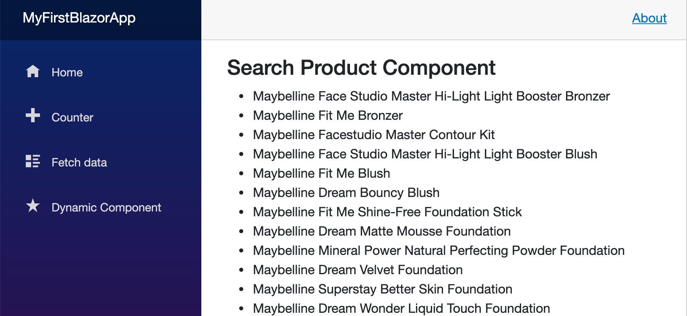

# 02 Les basiques

Séparation des `uses cases` par page :

## `Search product page`

Deux `use case` :

- Checher un produit
- Voire un produit


## `View Product Page`

- Naviguer en arrière


## `CoreBusiness Library`

On va ajouter un `project` contenant la logique métier de l'application : `eShop.CoreBusiness`.

On va créer dedans deux dossier

- `Models`
- `Services`

Dans `Models` on crée une classe `Product` : 

```cs
namespace eShop.CoreBusiness.Models;

public class Product
{
    public int Id { get; set; }
    public string Brand { get; set; } = "";
    public string Name { get; set; } = "";
    public double Price { get; set; }
    public string ImageLink { get; set; } = "";
}
```


## Encapsuler les `Uses case`

On va créer un nouveau projet `eShop.UseCases` qui est l'équivalent de la couche `Application`, mais peut-être avec un nom plus "métier".

On y crée deux dossier en rapposrt avec les écrans de l'application :

- `SearchProductScreen`
- `ViewProductScreen`

C'est ici qu'on pourrait utiliser le pattern `CQRS` avec le package `MediatR`.

Dans `SearchProductScreen` on va créer une classe par `use case` :

- `SearchProduct.cs`
- `ViewProduct.cs`


### `SearchProduct`

```cs
public class ViewProduct
{
  public IEnumerable<Product> Execute()
  {
    return null;
  }       
}
```


### `ViewProduct`

```cs
public class ViewProduct
{
    public IEnumerable<Product> Execute()
    {
        return null;
    }
}
```


## Le `DataStore`

Le `DataStore` doit être considéré comme un `plugin` de l'application.

Il ne fait pas partie de la couche `UseCases`, mais y est représenté par une abstraction.

Dans `eShop.UseCases` on va donc créer un dossier `PluginInterfaces` et dans ce dosseir un autre répertoire `DataStore`.

On va définir l'interface `IProductRepository`

```cs
public interface IProductRepository
{
    IEnumerable<Product> GetProducts(string filter);
    Product GetProduct(int id);
}
```


## Injection de dépendances

On va utiliser l'`Injection de dépendances` pour fournir le `repository` aux `Use Cases` :

```cs
public class SearchProduct
{
    private readonly IProductRepository productRepository;

    public SearchProduct(IProductRepository productRepository)
    {
        this.productRepository = productRepository;
    }


    public IEnumerable<Product> Execute(string filter)
    {
        return productRepository.GetProducts(filter);
    }
}
```

```cs
public class ViewProduct
{
    private readonly IProductRepository productRepository;

    public ViewProduct(IProductRepository productRepository)
    {
        this.productRepository = productRepository;
    }

    public Product Execute(int id)
    {
        return productRepository.GetProduct(id);
    }
}
```


## Implémentation d'un `Data Store` en mémoire 

Les `Data Store` sont considérés comme des `IO` (entrés-sorties) et les `IO` doivent toujours être implémentés comme des `plugin`.

La logique de l'application est ainsi séparée des choix techniques pour les `IO`.

On va créer un nouveau projet `eShop.DataStore.HardCoded`.

Dedans on va créer une classe `ProductRepository` implémentant `IProductRepository`.

```cs
public class ProductRepository : IProductRepository
{
    public List<Product> products;

    public ProductRepository()
    {
        products = new List<Product>
        { ... }
    }

    public Product? GetProduct(int id)
    {
        return products.FirstOrDefault(p => p.Id == id);
    }

    public IEnumerable<Product> GetProducts(string? filter = null)
    {
        if (filter is null) return products;

        return products.Where(p => p.Name.ToLower().Contains(filter.ToLower()));
    }
}
```


## Relier les `services` à l'application

Tout se passe dans `Program.cs`.

Il faut pour les `use cases` définir aussi une interface :

- `ISearchProduct`

  ```cs
  public interface ISearchProduct
  {
    IEnumerable<Product> Execute(string filter);
  }
  ```

- `IViewProduct`

  ```cs
  public interface IViewProduct
  {
      Product? Execute(int id);
  }
  ```

Ensuite on injecte les différents `services` dans `Program.cs` :

```cs
// my services
builder.Services.AddTransient<IProductRepository, ProductRepository>();
builder.Services.AddTransient<ISearchProduct, SearchProduct>();
builder.Services.AddTransient<IViewProduct, ViewProduct>();
```


## Création de la `page` : `SearchProducts`

On va utiliser un `life cycle event` : `OnInitialized`

Il suffit de taper `override`.

```cs
@page "/products"
  
@inject ISearchProduct searchProduct

<h3>Search Products Component</h3>

@code {
    protected override void OnInitialized()
    {
        base.OnInitialized();
      
      var products = searchProduct.Execute();
    }
}
```

On va injecter `ISearchProduct` avec la directive `@inject` :

```cs
@inject ISearchProduct searchProduct
```

Pour cela il faut renseigner le `namespace` dans `_imports.razor`

```cs
// ...
@using MyFirstBlazorApp.Shared

// my imports
@using eShop.UseCases.SearchProductScreen;
```


## Implémenation de l'écran

On doit créer un `state` :

```cs
@code {
  private List<Product> products;
  
  protected override void OnInitialized()
  {
    base.OnInitialized();
    products = searchProduct.Execute("");
  }
}
```

On va réaliser l'affichage grâce à `@foreach` :

```cs
ul>
    @foreach (var prod in products)
    {
        <li>
            @prod.Name
        </li>
    }

</ul>
```



### `Search Box`

```html
<div>
  Search: 
  <input type="text" />
  <button>
    search
  </button>
</div>
```


## Création du composant : `SearchBarComponent`

Il faut découper l'application en petits composants pour rendre le code plus lisible.

On crée un dossier `Controls` on on va mettre tous nos composant réutilisables.

Dans ce dossier on va créer le `component` : `SearchBarComponent.rasor`