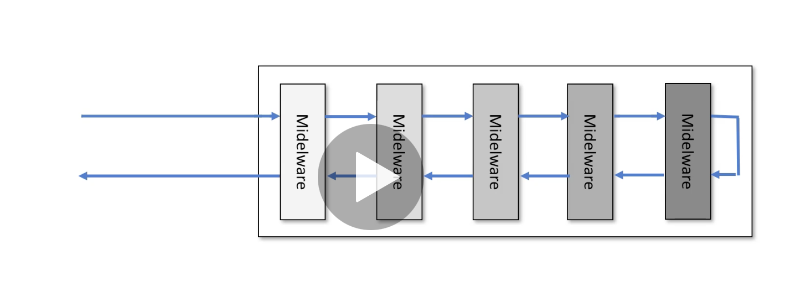

# 02 `ASP.NET Core` les basiques

`.net core` est conçu comme un `pipeline` où chaque `middleware` a sa spécialisation et agit sur la requête.

Cette action est entreprise dans les deux sens pour la `requête` entrante tout comme pour la `réponse` sortante.



## Architecture des `middleware`

Avant d'utiliser un `middleware`, il faut que ses objets soit disponibles.

C'est pourquoi on injecte les objets nécessaie **puis** on ajoute un `middleware` dans notre `pipeline`.

Il peut aussi être nécessaire de configurer un `middleware` avant de l'utiliser.

1. Ajouter les dépendances
2. Ajouter des `middleware`
3. Configurer le comportement des `middleware`


```
app.AddDependencies<IClass1, Class1>();
app.AddDependencies<IClass2, Class2>();

app.ConfigureAuth(...);

app.UseAuth();
app.UseMiddle1();
app.useMiddle2();
```


## Créer une application

```bash
dotnet new webapi -o PlatformDemo
```

Pour être cross-platform `.net core` produit des application console.

Ainsi elle peuvent être lancée depuis n'importe quel terminal de n'importe quel plateforme.

### `Program.cs`

```cs
public class Program
{
    public static void Main(string[] args)
    {
        CreateHostBuilder(args).Build().Run();
    }

    public static IHostBuilder CreateHostBuilder(string[] args) =>
        Host.CreateDefaultBuilder(args)
        .ConfigureWebHostDefaults(webBuilder =>
                                  {
                                      webBuilder.UseStartup<Startup>();
                                  });
}
```

dans `Program.cs` on a le point d'entrée de l'application.

Le programme crée un `Host` responsable d'écouter un certain `port` et de recevoir la requête.

On peut configurer cet `host` dans `ConfigureWenHostDefaults`.

C'est là où on lui dit d'aller chercher ce qui lui faut dans `Startup`.


### `Startup.cs`

```cs
// ...

public void ConfigureServices(IServiceCollection services)
{
    services.AddControllers();
}


public void Configure(IApplicationBuilder app, IWebHostEnvironment env)
{
    app.UseHttpsRedirection();

    app.UseRouting();

    app.UseAuthorization();

    app.UseEndpoints(endpoints =>
                     {
                         endpoints.MapControllers();
                     });
}
```

Il y a deux méthodes :

`ConfigureServices` où on va ajouter les dépendances et configurer le comportement des `middleware`.

`Configure` où on va construire le `pipeline`.

Dans `.net core 3` on avait :

```cs
app.UseEndpoints(endpoints => 
   endpoints.MapGet("/my-url", async context => {
       await context.Response.WriteAsync("Hello Hukar World");
   }));
```

Test :


On a ici une façon simple de mapper une route sur une réponse.

Le `context` contient la requête et la réponse.


