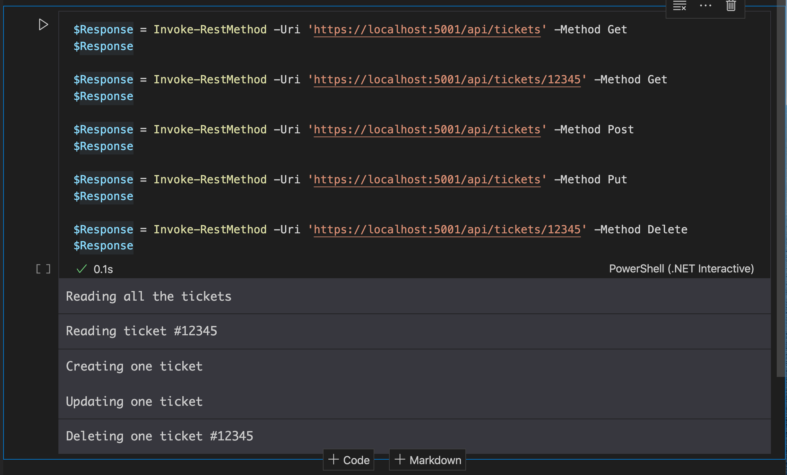

# 03 `Routing`

## `MapController`

Pour que les `endpoint` soit *mappé* sur les contrôleurs, il faut ajouter dans `services` les classes nécessaires :

```cs
public void ConfigureServices(IServiceCollection services)
{
    services.AddControllers();
    // ...
}
```

Puis ajouter `MapController` au pipeline des `middleware` :

```cs

public void Configure(IApplicationBuilder app, IWebHostEnvironment env)
{
    // ...

    app.UseEndpoints(endpoints =>
                     {
                         endpoints.MapControllers();
                     });
}
```


## Ajouter un contrôleur

Le nom des contrôleurs est au pluriel pour correspondre à la route qui utilise le pluriel.

`TicketsController.cs`

```cs
using Microsoft.AspNetCore.Mvc;

namespace Controllers
{
    [ApiController]
    public class TicketsController : ControllerBase
    {
        
    }
}
```

`AspNetCore.Mvc` est un framework `.net`.

`webapi` est basé sur `AspNetCore.Mvc`.

## Implémenté les `endpoints`

`IActionResult` est un type de retour générique, car on peut retourné n'importe quel type de données.

On doit utiliser les `attribut` de routing : `[HttpVerb], [Route("<template_url>")]`.

```cs
[HttpGet]
[Route("api/tickets")]
public IActionResult Get()
{
    return Ok("Reading all the tickets");
}

[HttpGet]
[Route("api/tickets/{id}")]
public IActionResult GetById(int id)
{
    return Ok($"Reading ticket #{id}");
}

[HttpPost]
[Route("api/tickets")]
public IActionResult Post()
{
    return Ok("Creating one ticket");
}

[HttpPut]
[Route("api/tickets")]
public IActionResult Put()
{
    return Ok("Updating one ticket");
}

[HttpDelete]
[Route("api/tickets/{id}")]
public IActionResult Delete(int id)
{
    return Ok($"Deleting one ticket #{id}");
}
```

Dans le contrôleur les méthodes sont appelées `Action`.


## Validation

Par défaut, notre contrôleur effectue une validation des template d'`url` :


## Interface Uniforme

On est censé avoir une interface uniformisée, il vaut mieux alors regrouper l'`url` au niveau du contrôleur :

```cs
[ApiController]
[Route("api/[controller]")]
public class TicketsController : ControllerBase
{
    // ...
}
```

Cela simplifie aussi les `action` du contrôleur :

```cs
[HttpGet]
public IActionResult Get() { ... } 

[HttpGet("{id}")]
public IActionResult GetById(int id) { ... }

// ...
```


## Tester son `api` avec `.NET Interactive` sur `VSCode`

Dans `.net interactive` on peut utiliser du `powershell` :

```powershell
$Response = Invoke-RestMethod -Uri 'https://localhost:5001/api/tickets' -Method Get
$Response

$Response = Invoke-RestMethod -Uri 'https://localhost:5001/api/tickets/12345' -Method Get
$Response

$Response = Invoke-RestMethod -Uri 'https://localhost:5001/api/tickets' -Method Post
$Response

$Response = Invoke-RestMethod -Uri 'https://localhost:5001/api/tickets' -Method Put
$Response

$Response = Invoke-RestMethod -Uri 'https://localhost:5001/api/tickets/12345' -Method Delete
$Response
```



