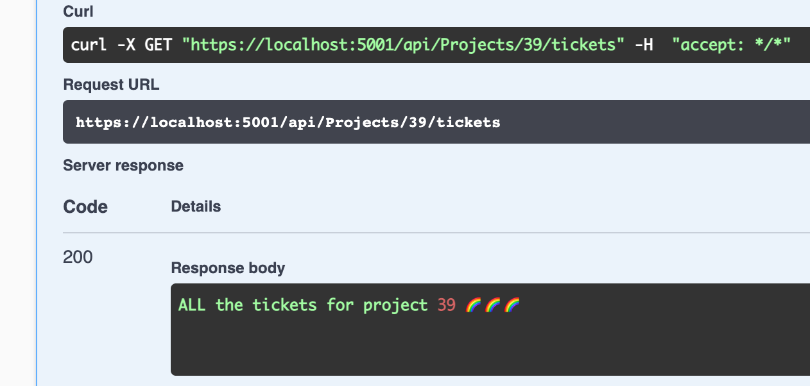
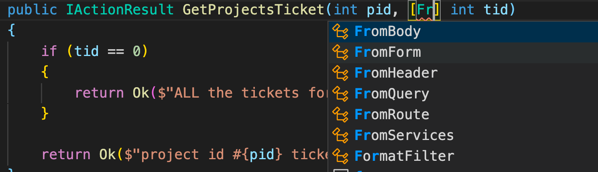

# 04 `Model` binding

Combine des informations contenues dans la requête `HTTP` avec les paramètres des méthodes d'un contrôleur.

```cs
[HttpDelete("{id}")] // <= id dans la requête
public IActionResult Delete(int id) // <= id en paramètre
```


## Fonctionnement

Dans le `pipeline` principal on utilise `UseEndpoints` qui lui même utilise `MapController`.

En fait dans `MapController` il y a un autre `pipeline`, celui de `MVC Framework`.

C'est un `pipeline` non plus de `middleware`, mais de `filters`.


## Sources pour la liaison de données

1. Champs de formulaire
2. `body` de la requête
3. Données de la route
4. les paramètres `Query string` (après un `?`)
5. Fichiers téléchargé

Pour spécifier une liaison on peut utiliser des attributs associés :

```cs
[FromQuery(Name = "Note")]
public string NoteFromQueryString { get; set; }
```


## `Query String` : `?name=toto&color=blue`

On va récupérer les données du `Query string` grâce au `Model Binding` automatique.

```cs
// api/projects/{pid}/tickets?tid={tid}
[HttpGet("{pid}/tickets")]
public IActionResult GetProjectsTicket(int pid, int tid)
{
    return Ok($"project id #{pid} ticket id #{tid}");
}
```

Automatiquement un `Query String` `tid` est créé, il est facultatif :


En passant `45` en `pid` et `67` en `tid` on obtient :


Le paramètre de la méthode ne correspondant pas à un template d'`URL` est directement compris par `.net` comme un `Query String`.

```
https://localhost:5001/api/Projects/22/tickets?tid=33
```

Le `query string` étant optionnel, si on ne le renseigne pas, `.net` fournit une valeur par défaut, pour un `int`, c'est `0`.

```
Response body

project id #22 ticket id #0
```

### Personnaliser le traitement

```cs
// api/projects/{pid}/tickets?tid={tid}
[HttpGet("{pid}/tickets")]
public IActionResult GetProjectsTicket(int pid, int tid)
{
    if (tid == 0)
    {
        return Ok($"ALL the tickets for project {pid} 🌈🌈🌈");
    }

    return Ok($"project id #{pid} ticket id #{tid}");
}
```



Cela peut permettre d'avoir soit tous les tickets d'un projet donné, soit un seul ticket si `tid` est renseigné.

### Explicitement lier un paramètre

On peut lier explicitement un paramètre d'une `action` grâce aux attributs :

- `[FromQuery]`
- `[FromRoute]`
- `[FromForm]`
- `[FromBody]`
- `[FromHeader]`

```cs
[HttpGet("{pid}/tickets")]
public IActionResult GetProjectsTicket(int pid, [FromQuery] int tid)
```



