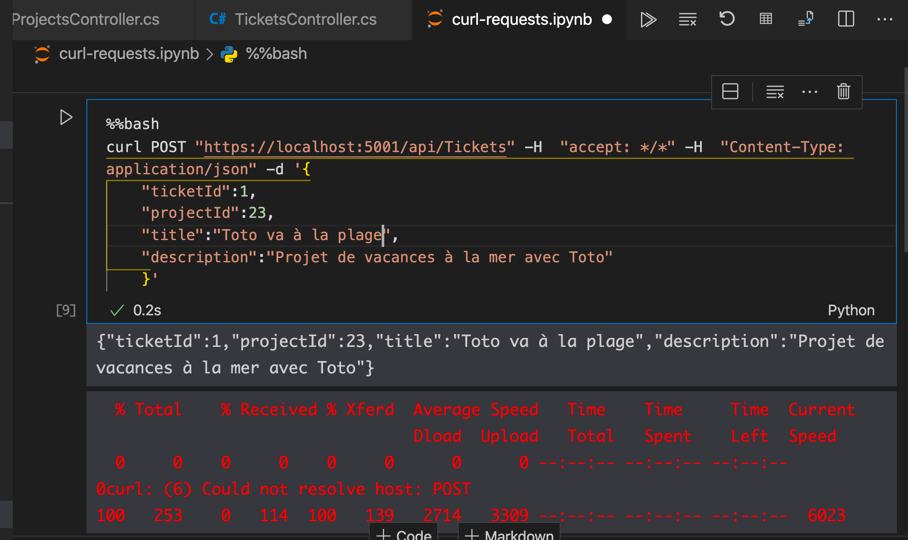

# 06 `Model Binding` depuis le `Body` de la requête


## Modification de l'`action` `Post()`

```cs
// TicketsController.cs

[HttpPost]
public IActionResult Post(Ticket ticket)
{
    return Ok(ticket);
}
```

`Ok(ticket)` sérialize automatiquement vers du `JSON`.

On peut spécifier un `attribut` de liaison de données : `Post([FromBody] Ticket ticket)`, mais c'est le comportement par défaut.


## Test avec `Jupyter Notebook` dans `VSCode`

On peut tester grâce à la commande `curl` directement dans `VSCode` :



Il suffit d'encadrer avec des guillemets simple son `JSON`.

`%%bash` est nécessaire pour que cela fonctionne.

### exemple pour échapper un guillemet simple :

```bash
curl -X PUT "https://localhost:5001/api/Tickets" -H  "accept: */*" -H  "Content-Type: application/json" -d '{
    "ticketId":2,
    "projectId":124,
    "title":"Gigi la magie",
    "description":"Avec Gigi c'\''est la magie"}'
```

`['\'']`

