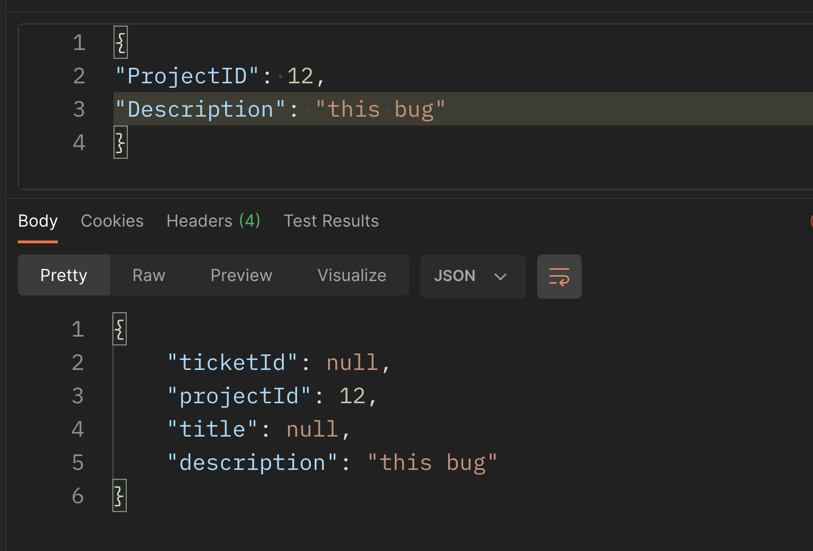
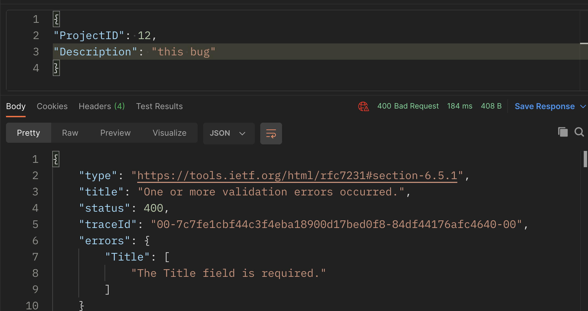

# 07 `Model Validation`

## Principe d'une seule responsabilité :

##  `Single Responsability Principle`

En un endroit donné, un seul problème est traité.

Pour cette raison on ne peut pas aire la validation dans le contrôleur.


## `Data Annotation`

Ce sont des `attributs` que l'on peut appliquer aux champs d'une classe.

- `[Required]`
- 


`Models/ticket.cs`

```cs
using System.ComponentModel.DataAnnotations;

namespace Models
{
    public class Ticket
    {
        public int TicketId { get; set; }
        [Required]
        public int ProjectId { get; set; }
        [Required]
        public string Title { get; set; }
        public string Description { get; set; }
    }
}
```

On peut déclencher manuellement la `validation`.

`AspNetCore.Mvc` déclenche automatiquement la validation avant que la méthode `action` soit appelée.

Comme le binding place une valeur par défaut aux champs non renseigné, malgré la validation, un envoie de ticket sans `ProjectId` ne déclenche pas d'erreur :


Si on passe la propriété `ProjectId` à un type `nullable`, la validation est bien déclenchée :

```cs
public class Ticket
{
    public int? TicketId { get; set; }
    [Required]
    public int? ProjectId { get; set; }
    [Required]
    public string Title { get; set; }
    public string Description { get; set; }
}
```


La valeur par défaut d'un `string` étant `null` 

#### sans l'attribut `[Required]` sur `Title`:



La validation fonctionne correctement pour `Title` sans pour autant utiliser `?` Operator.

#### Avec `[Required]` :



#### ! La validation se fait donc après le `Model Binding`

