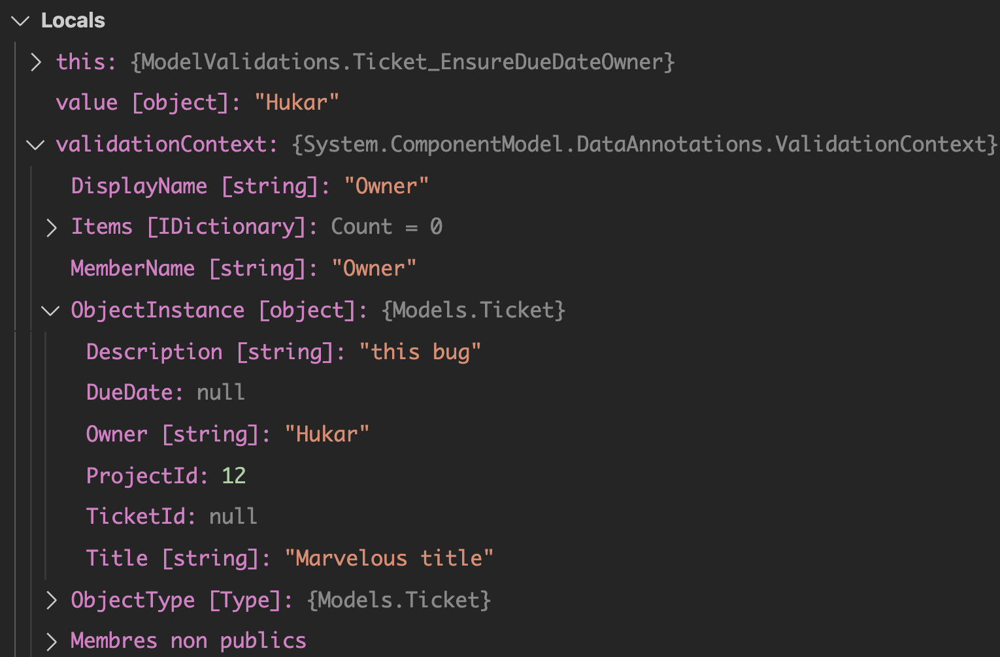
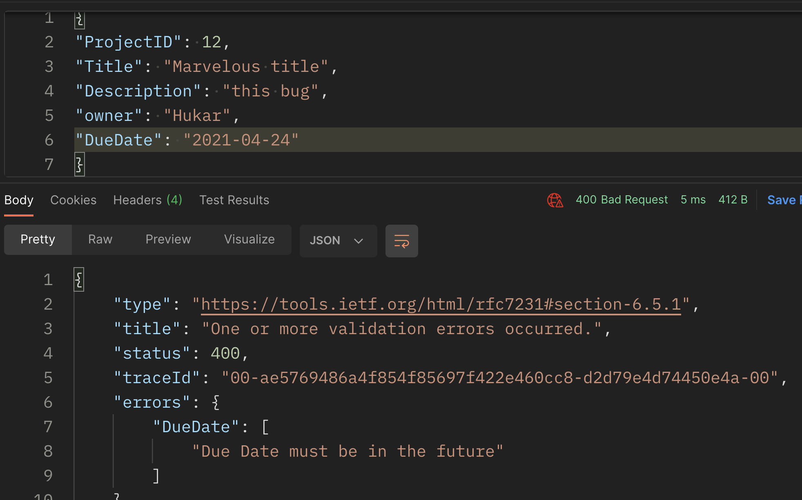
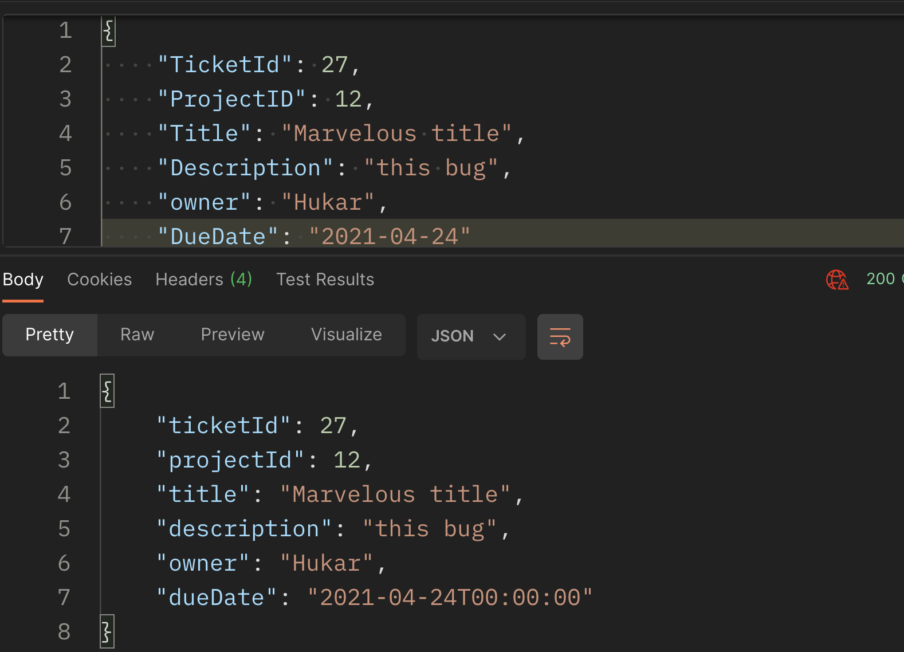

# 08 Création d'un `ValidationAttribut`

## Compliquer un peu le modèle

`Models/Ticket.cs`

```cs
public class Ticket
{
    public int? TicketId { get; set; }
    [Required]
    public int? ProjectId { get; set; }
    [Required]
    public string Title { get; set; }
    public string Description { get; set; }
    public string Owner { get; set; }
    public DateTime? DueDate { get; set; }
}
```


## Création d'une validation personnalisé

On crée un dossier `ModelValidations` et dedans une classe `Ticket_EnsureDueDateForTicketOwner` :

Si il y a un `Owner` alors il doit y avoir une `DueDate`.

```cs
using System.ComponentModel.DataAnnotations;

namespace ModelValidations
{
    public class Ticket_EnsureDueDateOwner : ValidationAttribute
    {
        protected override ValidationResult IsValid(object value, ValidationContext validationContext)
        {
            var ticket = validationContext.ObjectInstance as Ticket;
            
            if(ticket is not null && !string.IsNullOrWhiteSpace(ticket.Owner))
            {
                if(!ticket.DueDate.HasValue)
                {
                    return new ValidationResult("Due date is required when the ticket has an owner");
                }
            }
            return ValidationResult.Success;
        }
    }
}
```

Tous les objets `nullable` ont une méthode `HasValue`.

`validationContext.ObjectInstance` renvoie l'objet sur lequel l'`attribut` est utilisé.

### Anatomie de `validationContext`

Avec un `breakpoint` on peut voire le contenu des paramètres :




## Placer la `validation`

Cette `validation` personnalisé va être placée sur `DueDate`.

```cs
using System;
using System.ComponentModel.DataAnnotations;
using ModelValidations;

namespace Models
{
    public class Ticket
    {
        public int? TicketId { get; set; }
        [Required]
        public int? ProjectId { get; set; }
        [Required]
        public string Title { get; set; }
        public string Description { get; set; }
        public string Owner { get; set; }
        [Ticket_EnsureDueDateOwner]
        public DateTime? DueDate { get; set; }
    }
}
```


On voit que la validation fonctionne correctement.

La validation fonctionne en étant mise sur `owner` aussi.


## Date dans le futur

Cette `validation` doit être effectué seulement si c'est une création (`POST`), car si c'est une mise à jour (`PUT`), c'est normal que la date soit passé.

`System.ComponentModel.DataAnnotations` ne connait rien de la requête, mais on sait que `ticket` n'a pas de `TicketId` si c'est une création.

```cs
public class Ticket_EnsureDuaDateFuture : ValidationAttribute
{
    protected override ValidationResult IsValid(object value, ValidationContext validationContext)
    {
        var ticket = validationContext.ObjectInstance as Ticket;

        if (ticket is not null && ticket.TicketId is null)
        {
            if (ticket.DueDate.HasValue && ticket.DueDate.Value < DateTime.Now)
            {
                return new ValidationResult("Due Date must be in the future");
            }
        }

        return ValidationResult.Success;
    }
}
```

Avec les propriétés `nullable` on utilise `HasValue` et `Value`.

On peut comparer les dates avec les opérateurs de comparaison `<`, `>`, `<=`, ...



Si on a le `TicketId` (pour un `update` avec le verbe `PUT`), la `validation` passe :



