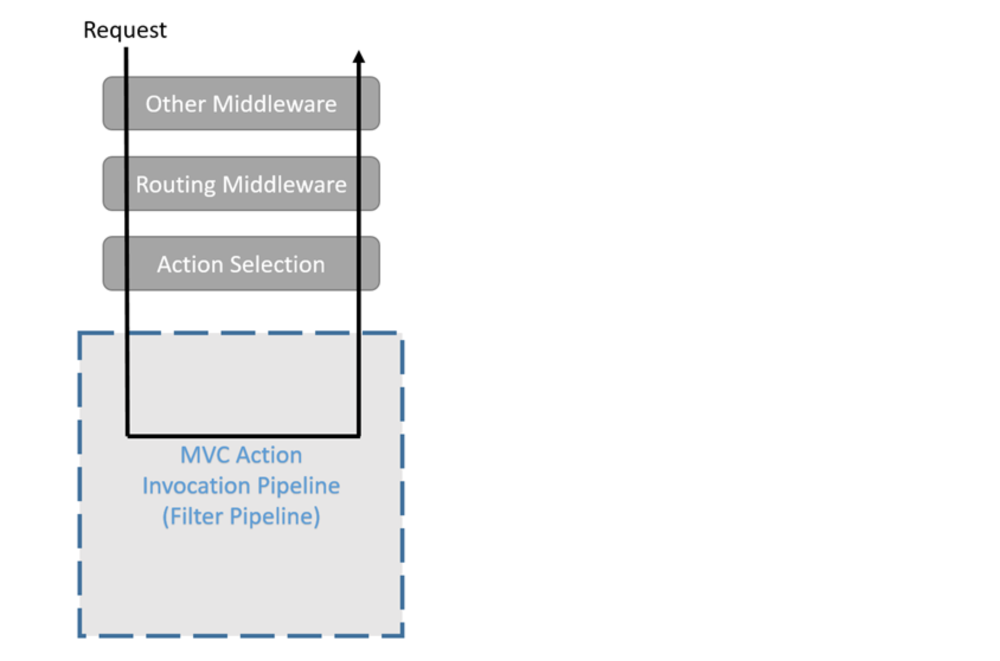
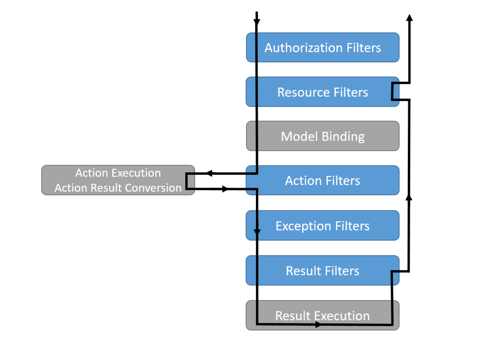

# 09 `Filters` pipeline

Les filtres évitent la duplication de code.

Une fois l'`action` déterminée, le pipeline de filtre applique les différents traitements.

> La liaison de modèle et la validation de modèle se produisent avant l’exécution d’une action de contrôleur 
>
> (doc .net)

## Différence entre `middleware` et `filter` pipeline

Le `filter` pipeline fait parti de `AspNetCore.Mvc` il a accès à des objets auquel les `middlewares` n'ont pas accès.

De plus les `middlewares` ont un scope global alors que les `filters` peuvent s'appliquer seulement à une `action` ou à un `contrôleur` particulier.

