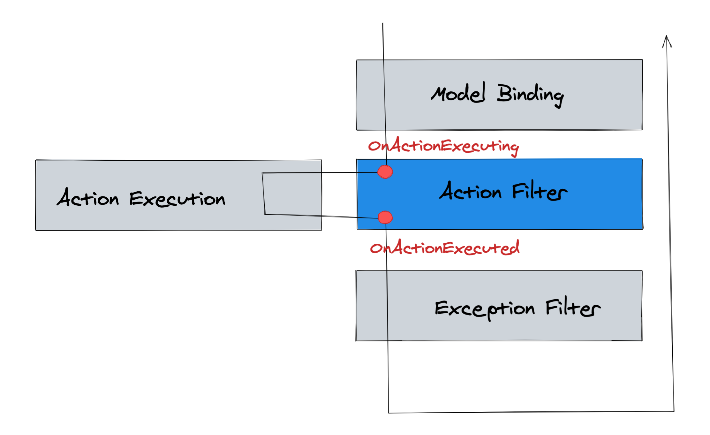

# 10 Action Filter


## `ActionFilter`

On va utiliser un `ActionFilter` pour gérer la `validation`.

### Problème

On a maintenant besoin d'une date d'enregistrement du ticket dès qu'il y a un propriétaire.

On ne veut pas modifier l'`api` déjà existante et utilisée.

On va versionner l'`api`.

On peut surcharger une route avec `[Route("/api/v1/tickets")]` par exemple.

```cs
[HttpPost]
[Route("/api/v1/tickets")]
public IActionResult PostV1(Ticket ticket)
{
    return Ok(ticket);
}

[HttpPost]
[Route("/api/v2/tickets")]
public IActionResult PostV2(Ticket ticket)
{
    return Ok(ticket);
}
```

Ici utiliser les `Data Annotation` effectuerai la validation pour les deux actions, car `Data Annotation` n'a ruen à voire avec `MVC`.

Si on veut faire une `validation` spécifique à une action donnée, il faut utiliser `ActionFilter`.


## Création de `ActionFilter`

### Modification du modèle

`Models/Ticket.cs`

```cs
using System;
using System.ComponentModel.DataAnnotations;
using ModelValidations;

namespace Models
{
    public class Ticket
    {
        public int? TicketId { get; set; }
        [Required]
        public int? ProjectId { get; set; }
        [Required]
        public string Title { get; set; }
        public string Description { get; set; }
        [Ticket_EnsureDueDateOwner]
        public string Owner { get; set; }
        [Ticket_EnsureDuaDateFuture]
        public DateTime? DueDate { get; set; }
        public DateTime? EnteredDate { get; set; } // <= ici
    }
}
```


### Implémentation d'un `ActionFilter`

On crée un dossier `Filters` et dedans une classe `Ticket_EnsureEnteredDate.cs`.

```cs
using Microsoft.AspNetCore.Mvc;
using Microsoft.AspNetCore.Mvc.Filters;
using Models;

namespace Filters
{
    public class Ticket_EnsureEnteredDate : ActionFilterAttribute
    {
        public override void OnActionExecuting(ActionExecutingContext context)
        {
            base.OnActionExecuting(context);

            var ticket = context.ActionArguments["ticket"] as Ticket;

            if (ticket is not null 
                && !string.IsNullOrWhiteSpace(ticket.Owner) 
                && !ticket.EnteredDate.HasValue)
            {
                context.ModelState.AddModelError("EnteredDate", "EnteredDate is required");

                // short-circuit
                context.Result = new BadRequestObjectResult(context.ModelState);
            }
        }
    }
}
```

Si quelque chose ne va pas dans un `filter`, on a la possibilité de créer un `court-circuit` (`short circuit`).

`ModelState` : contrairement aux `Data Annotation`, les `ActionFilter` ont accès au `model`.

`AddModelError(<Field>,<error message>)` : ici on ne place pas directement le filtre sur un champ comme avec les `annotations`, il faut donc spécifier le champ concerné et ajouter un message d'erreur.

`OnActionExecuting` se déroule avant que l'`action` s'exécute, sinon on utilise `OnActionExecuted`.

Pour une `validation` c'est ce qu'il nous faut.



### appliquer le filtre

Dans le contrôleur `TicketController.cs` on applique l'`attribute` que l'on vient de créer uniquement sur la `version 2` :

```cs
[HttpPost]
[Route("/api/v2/tickets")]
[Ticket_EnsureEnteredDate]
public IActionResult PostV2(Ticket ticket)
{
    return Ok(ticket);
}
```

