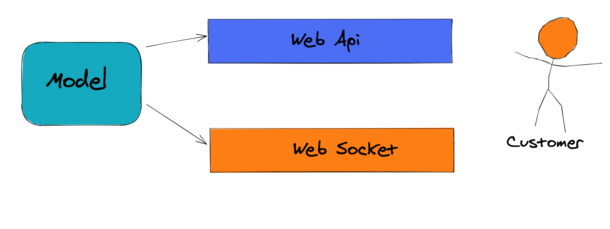

# 12 Architecture

On doit découpler le `Model` de notre `webapi`.

Il est possible que le `Model` soit utilisé par d'autre `channel` :



## Solution pour découpler le `Model`

On va créer une `Class Library` : on l'appel `Core` car plus tard on y mettra aussi la validation.

Dedans on y crée un dossier `Models` et on y ajoute `Project.cs` et `Ticket.cs`.


### Utilisation de la ligne de commande (depuis la racine)

1. Créer une solution pour englober l'ensemble

```bash
dotnet new sln -n WebAPICourse
```

2. Créer un nouveau projet de librairie

```bash
dotnet new classlib -o Core
```

3. Ajouter une référence du projet à la `webapi`

```bash
dotnet add PlatformDemo reference Core
```

4. Ajouter tous les projets à la solution 

```bash
dotnet sln add **/*.csproj
```


## Classe `Project.cs`

```cs
using System.Collections.Generic;
using System.ComponentModel.DataAnnotations;

namespace Core.Models
{
    public class Project
    {
        public int ProjectId { get; set; }
        [Required]
        [StringLength(50)]
        public string Name { get; set; }
        public List<Ticket> Tickets { get; set; }
    }
}
```

## Classe `Ticket.cs`

On copie la classe `Ticket` dans la nouvelle `classlib`.

On retire les `Custom Validation` :

```cs
using System;
using System.ComponentModel.DataAnnotations;

namespace Core.Models
{
    public class Ticket
    {
        public int? TicketId { get; set; }
        [Required]
        public int? ProjectId { get; set; }
        [Required
        [StringLength(100)]
        public string Title { get; set; }
        public string Description { get; set; }
        [StringLength(50)]
        public string Owner { get; set; }
        public DateTime? ReportDate { get; set; }
        public DateTime? DueDate { get; set; }
        public Project Project { get; set; }
    }
}
```

`Due Date` date d'échéance

On supprime le dossier `Model` de départ.

### Renommer le projet `PlatformDemo` en `WebApi`

1. Retirer `PlatformDemo` de la solution

```bash
dotnet sln remove PlatformDemo
```

2. Renomer le dossier du projet ains que le fichier `.csproj`
3. Ajouter `WebApi` à la solution

```bash
dotnet sln add WebApi
```


## Découpler de la technologie => Simple classe `c#`

Les différents filtres sont couplés à `AspNetCore.MVC`, il serait préférable de garder la logique métier dans de simples classes `C#` pour ne être trop couplé à une technologie particulière.

Nous allons donc implémenter la validation de `DueDate` directement dans le `model` :

`Models/Ticket.cs`

```cs
/// <summary>
/// When creating ticket, if a Due Date is entered, it has to be in the future
/// </summary>
/// <returns>bool</returns>
public bool ValidateFutureDueDate()
{
    if (TicketId.HasValue)
    {
        return true;
    }

    if (!DueDate.HasValue)
    {
        return true;
    }

    return (DueDate.Value > DateTime.Now);
}

// When owner is assigned, the report date has to be present
public bool ValidateReportDatePresence()
{
	if (string.IsNullOrWhiteSpace(Owner))
    {
        return true;
    }
    
    return ReportDate.HasValue;
}

// When owner is assigned, the due date has to be present
public bool ValidateDueDatePresence()
{
    if (string.IsNullOrWhiteSpace(Owner))
    {
        return true;
    }
    
    return DueDate.HasValue;
}

// When DuDate and ReportDate are present, due date has to be later or equal to report date
public bool ValidateDueDateAfterReportDate()
{
    if (!DueDate.HasValue || !ReportDate.HasValue)
    {
        return true;
    }
    
    return DueDate.Value.Date >= ReportDate.Value.Date;
}
```


## Mettre la validation dans le projet `Core`

On va créer un dossier `ValidationAttributes` dans le projet `Core`.

Puis les quatre classes correspondant aux méthodes de validation implémentés dans `Ticket.cs`.

### `Ticket_EnsureFutureDueDateOnCreationAttribute.cs`

```cs
using System.ComponentModel.DataAnnotations;
using Core.Models;

namespace Core.ValidationAttributes
{
    public class Ticket_EnsureFutureDueDateOnCreationAttribute : ValidationAttribute
    {
        protected override ValidationResult IsValid(object value, ValidationContext validationContext)
        {
            var ticket = validationContext.ObjectInstance as Ticket;

            if (!ticket.ValidateFutureDueDate())
            {
                return new ValidationResult("DueDate has to be in the future");
            }

            return ValidationResult.Success;
        }
    }
}
```


### `Ticket_EnsureReportDatePresentAttribute.cs`

```cs
using System.ComponentModel.DataAnnotations;
using Core.Models;

namespace Core.ValidationAttributes
{
    public class Ticket_EnsureReportDatePresentAttribute : ValidationAttribute
    {
        protected override ValidationResult IsValid(object value, ValidationContext validationContext)
        {
            var ticket = validationContext.ObjectInstance as Ticket;

            if (!ticket.ValidateReportDatePresence())
            {
                return new ValidationResult("ReportDate is required");
            }

            return ValidationResult.Success;
        }
    }
}
```


### `Ticket_EnsureDueDatePresentAttribute.cs`

```cs
using System.ComponentModel.DataAnnotations;
using Core.Models;

namespace Core.ValidationAttributes
{
    public class Ticket_EnsureDueDatePresentAttribute : ValidationAttribute
    {
        protected override ValidationResult IsValid(object value, ValidationContext validationContext)
        {
            var ticket = validationContext.ObjectInstance as Ticket;

            if (!ticket.ValidateDueDatePresence())
            {
                return new ValidationResult("DueDate is required");
            }

            return ValidationResult.Success;
        }
    }
}
```


### `Ticket_EnsureDueDateAfterReportDateAttribute.cs`

```cs
using System.ComponentModel.DataAnnotations;
using Core.Models;

namespace Core.ValidationAttributes
{
    public class Ticket_EnsureDueDateAfterReportDateAttribute : ValidationAttribute
    {
        protected override ValidationResult IsValid(object value, ValidationContext validationContext)
        {
            var ticket = validationContext.ObjectInstance as Ticket;

            if (!ticket.ValidateDueDateAfterReportDate())
            {
                return new ValidationResult("DueDate has to be after ReportDate");
            }

            return ValidationResult.Success;
        }
    }
}
```


## Appliquer la validation

Dans `Models/Ticket.cs`

```cs
using System;
using System.ComponentModel.DataAnnotations;
using Core.ValidationAttributes;

namespace Core.Models
{
    public class Ticket
    {
        public int? TicketId { get; set; }
        
        [Required]
        public int? ProjectId { get; set; }
        
        [Required]
        [StringLength(100)]
        public string Title { get; set; }
        
        public string Description { get; set; }
        
        [StringLength(50)]
        public string Owner { get; set; }
        
        [Ticket_EnsureReportDatePresent]
        public DateTime? ReportDate { get; set; }
        
        [Ticket_EnsureDueDatePresent]
        [Ticket_EnsureFutureDueDateOnCreation]
        [Ticket_EnsureDueDateAfterReportDate]
        public DateTime? DueDate { get; set; }
        
        public Project Project { get; set; }
        
        // les méthodes de validations
```

On peut enlever la parti `Attribute` aux noms des `attributs` :

`[Ticket_EnsureDueDatePresentAttribute]` => `[Ticket_EnsureDueDatePresent]`

Le couplage existe encore avec `System.ComponentModel.DataAnnotations`, mais la logique de validation est entièrement dans une simple classe `c#` : `Ticket.cs`.

Il n'y a plus de couplage avec `AspNetCore.MVC`.


Il n'y a pas besoin d'appeler la validation dans le `contrôleur`, elle s'exécute automatiquement.

C'est parce qu'on utilise `[ApiController]`.

L'ancienne validation est nettoyée, ainsi que `Startup.cs` (retire `options` à `services.AddController`).

La version 2 de l'`api` est aussi supprimée.

Voici l'état du `TicketController` :

```cs
using Core.Models;
using Microsoft.AspNetCore.Mvc;

namespace Controllers
{
    [ApiController]
    [Route("api/[controller]")]
    public class TicketsController : ControllerBase
    {
        [HttpGet]
        public IActionResult Get()
        {
            return Ok("Reading all the tickets");
        }

        [HttpGet("{id}")]
        public IActionResult GetById(int id)
        {
            return Ok($"Reading ticket #{id}");
        }

        [HttpPost]
        public IActionResult Post(Ticket ticket)
        {
            return Ok(ticket);
        }

        [HttpPut]
        public IActionResult Put(Ticket ticket)
        {
            return Ok(ticket);
        }

        [HttpDelete("{id}")]
        public IActionResult Delete(int id)
        {
            return Ok($"Deleting one ticket #{id}");
        }

    }
}
```


