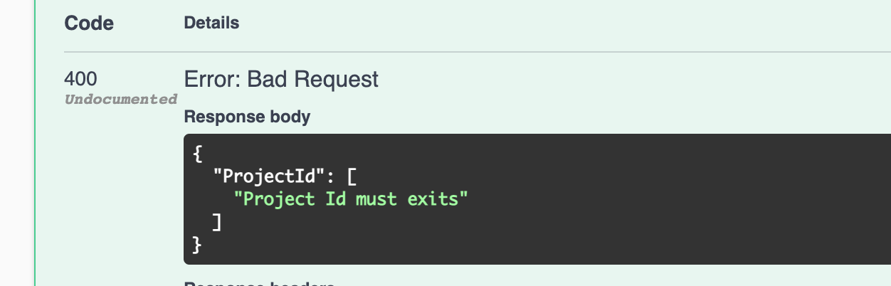

# 14 Modifications des `endpoints`


## `ProjectController` : Read

On va injecter le `DbContext` dans notre `controller` :

```cs
public class ProjectsController : ControllerBase
{
    private readonly BugsContext _db;
    
    public ProjectsController(BugsContext db)
    {
        _db = db;
    }
    
    [HttpGet]
    public IActionResult Get()
    {
        return Ok(_db.Projects.ToList());
    }

    [HttpGet("{id}")]
    public IActionResult GetById(int id)
    {
        var project = _db.Projects.Find(id);
        
        if(project is null)
        {
            return NotFound();
        }
        
        return Ok(project);
    }
    
    [HttpGet]
    [Route("api/projects/{pid}/tickets")]
    public IActionResult GetProjectTickets(int pid)
    {
        var tickets = _db.Tickets.Where(t => t.ProjectId == pid).ToList();
        
        if(tickets is null || Tickets.Count <= 0)
        {
            return NotFound();
        }
        
        return Ok(tickets);
    }
```

#### `Find(int id)` => l'entité ou `null`

#### `ToList`

#### `Where(<predicat>)`


## Writing : `POST` et `PUT`

### `POST`

```cs
[HttpPost]
public IActionResult Post([FromBody] Project project)
{
    _db.Projects.Add(project);
    _db.SaveChanges();
    
    return CreatedAtAction(nameof(GetById), new { id = project.ProjectId}, project);
}
```

`[FromBody]` si on ne le spécifie pas, `aspdotnet.MVC` regarde à 5 emplacements différents pour procéder au *binding*.

`_db.Projects.Add(project)` marque `project` comme `added`.

`_db.SaveChanges` va chercher les objets marqués et les enregistre en `BDD`. (`insert` pour une base de données `SQL`)

`CreatedAtAction(<ActionName>, <RouteValue>, <objectCreated>)` retourne un code `201` : `Created`

​			`actionName` le nom de l'`action` qui génére l'`url` d'accès à la ressource créée.

​			`routeValues` un objet avec les données nécessaire pour générer la route (ici l'`id` du projet).


On voit que l'utilisation de l'`ActionName` a permis la génération d'un header `location` avec une `url` vers la ressource créée.

### `PUT`

```cs
[HttpPut("{id}")]
public IActionResult Put(int id, Project project)
{
    if(id != project.ProjectId)
    {
        return BadRequest();
    }
    
    _db.Entry(project).State = EntityState.Modified;
    _db.SaveChanges();
    
    return NoContent();
}
```

`_db.Entry(project)` va tracker l'objet `project`.

`State = EntityState.Modified` va lui ajouter l'étiquette `modified`.

#### ! problème d'existence de `project`

Il est possible qu'entre `_db.Entry(project)` et `_db.SaveChanges` que quelqu'un est éffacé `project`.

On doit utiliser le `try/catch` car rien ne nous garantie que `project` existe encore lorsqu'on essaye de le modifier.

```cs
[HttpPut("{id}")]
public IActionResult Put(int id, Project project)
{
    if (id != project.ProjectId)
    {
        return BadRequest();
    }

    _db.Entry(project).State = EntityState.Modified;

    try
    {
        _db.SaveChanges();
    }
    catch
    {
        if(_db.Projects.Find(id) is null)
        {
            return NotFound();
        }
        throw;
    }

    return NoContent();
}
```

Ici, si le `project` a été éffacé avant la modification, l'`api` renvoie `Not Found`.


## `DELETE`

Il est peut-être préférable d'implémenter un `soft delete` avec un champs `deleted` par exemple.

Ici on implément un `delete` en dur pour l'exemple.

Un `soft-delte` ressemblera à un `PUT`.

```cs
[HttpDelete("{id}")]
public IActionResult Delete(int id)
{
    var project = _db.Projects.find(id);
    
    if(project is null)
    {
        return NotFound();
    }
    
    _db.Projects.Remove(project);
    _db.saveChanges();
    
    return Ok(project)
}
```


## Exercice `TicketController.cs`

### Reading : `GET`

On doit injecter notre `DbContext` dans le constructeur.

```cs
public class TicketsController : ControllerBase
    {
        private readonly BugsContext _db;
        public TicketsController(BugsContext db)
        {
            _db = db;
        }

        [HttpGet]
        public IActionResult Get()
        {
            return Ok(_db.Tickets.ToList());
        }

        [HttpGet("{id}")]
        public IActionResult GetById(int id)
        {
            var ticket = _db.Tickets.Find(id);

            if (ticket is null)
            {
                return NotFound();
            }

            return Ok(ticket);
        }
```


### Writing : `POST`

Il faut vérifier si le `ProjectId` existe.

Pour customiser mon message d'erreur j'utilise `this.ModelState` et `this.ModelState.AddModelError` :

```cs
[HttpPost]
public IActionResult Post([FromBody] Ticket ticket)
{
    var project = _db.Projects.Find(ticket.ProjectId);
    this.ModelState.AddModelError("ProjectId", "Project Id must exits");

    if (project is null)
    {
        return BadRequest(this.ModelState);
    }

    _db.Tickets.Add(ticket);
    _db.SaveChanges();

    return CreatedAtAction(nameof(GetById), new { id = ticket.TicketId }, ticket);
}
```

`BadRequest` peut prendre en argument un `ModelState`.


Ici le `ProjectId` n'existe pas, on a donc un retour `BadRequest` :



Cette erreur serait automatiquement levée avec une base de données relationnelle, mais comme on est avec une `in-memory database`, l'existence du `ProjectId` n'est pas vérifié.

On peut supprimer le code de vérification ou créer un `attribut` de validation.

#### ! j'ai une erreur `object cycle was detected`

Résolu :

Deux méthodes sur Stackoverflow :

1. Avec le package `Microsoft.AspNetCore.Mvc.NewtonsoftJson` et le code suivant

   ```cs
   services.AddControllers().AddNewtonsoftJson(options =>
       options.SerializerSettings.ReferenceLoopHandling = Newtonsoft.Json.ReferenceLoopHandling.Ignore
   );
   ```

2. Simplement avec l'attribut `[JsonIgnore]`  dans mon modèle :

   ```cs
   // Core/Models/Ticket.cs
   
   using System.Text.Json.Serialization;
   
   // ...
   
   [JsonIgnore]
   public Project Project { get; set; }
   ```

### Refactor

On peut éviter l'`Object Cycle` en ne récupérant pas un `project` mais seulement tester si ce `project` existe :

```cs
public async Task<IActionResult> Post([FromBody] Ticket ticket)
{
    if (!await _db.Projects.AnyAsync(p => p.ProjectId == ticket.ProjectId))
    {
        this.ModelState.AddModelError("ProjectId", "Project Id dosesn't exist");
        return BadRequest(this.ModelState);
    }
```


### Modifier : `PUT`

```cs
[HttpPut("{id}")]
public IActionResult Put(int id, Ticket ticket)
{
    if (id != ticket.TicketId)
    {
        return BadRequest(new { Message = $"id {id} and Ticket Id {ticket.TicketId} should correspond" });
    }

    _db.Entry(ticket).State = EntityState.Modified;

    try
    {
        _db.SaveChanges();
    }
    catch
    {
        if (_db.Tickets.Find(id) is null)
        {
            return NotFound();
        }
        throw;
    }

    return NoContent();
}
```

On peut passer un objet d'erreur à `BadRequest` :

```cs
BadRequest(new { Message = $"id {id} and Ticket Id {ticket.TicketId} should correspond" })
```


### Supprimer : `DELETE`

```cs
[HttpDelete("{id}")]
public IActionResult Delete(int id)
{
    var ticket = _db.Tickets.Find(id);

    if (ticket is null)
    {
        return BadRequest(new { Message = $"This id {id} doesn't exits" });
    }

    _db.Tickets.Remove(ticket);
    _db.SaveChanges();

    return Ok(ticket);
}
```

