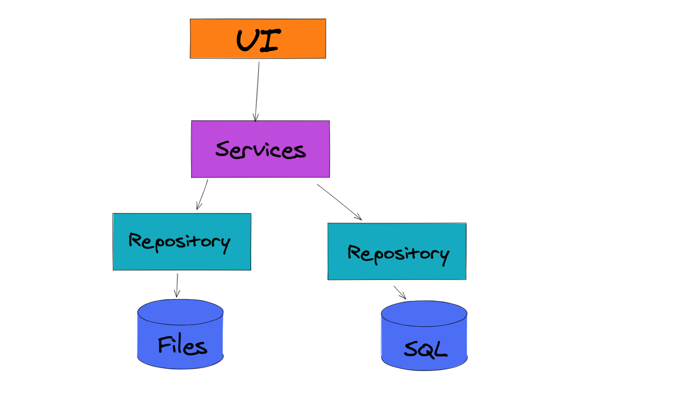

# 17 `repository` pattern : Consommer une `API`

On sépare la logique métier de la façon d'accéder aux données.



Mais en fait on peut considérer son `api` comme une source de données d'une autre `api` :


## Mise en place

On va créer une nouvelle `classlib`  : `App.Repository`

```bash
dotnet new classlib -o App.Repository

dotnet sln add App.Repository
```

On crée ensuite le dossier `ApiClient`.

On ajoute un `nuget` : `System.Net.Http.Json` à notre nouveau projet.

```bash
dotnet add package System.Net.Http.Json --version 5.0.0
```

On va maintenant créer une classe `WebApiExecuter.cs`.

C'est dans cette classe qu'on va accéder à l'api.


## `WebApiExecuter`

```cs
using System.Net.Http;
using System.Net.Http.Json;
using System.Threading.Tasks;

namespace App.Repository.ApiClient
{
    public class WebApiExecuter
    {
        private readonly string _baseUrl;
        private readonly HttpClient _httpClient;
        
        public WebApiExecuter(HttpClient httpClient, string baseUrl)
        {
            _baseUrl = baseUrl;
            _httpClient = httpClient;

            _httpClient.DefaultRequestHeaders.Accept.Clear();
            _httpClient.DefaultRequestHeaders.Accept.Add(new System.Net.Http.Headers.MediaTypeWithQualityHeaderValue("application/json"));
        }
    }
}
```

`_httpClient.DefaultRequestHeaders.Accept.Clear()` on supprime le header `accept`.

`_httpClient.DefaultRequestHeaders.Accept.Add(new System.Net.Http.Headers.MediaTypeWithQualityHeaderValue("application/json"))` on le met à `"application/json"`.

### Les méthodes génériques

```cs
public async Task<T> InvokeGet<T>(string uri)
{
    return await httpClient.GetFromJsonAsync<T>(GetUrl(uri));
}

public async Task<T> InvokePost<T>(string uri, T obj)
{
    var response = await httpClient.PostAsJsonAsync(GetUrl(uri), obj);
    response.EnsureSuccessStatusCode(); // throw exception if not success
    
    return await response.Content.ReadFromJsonAsync<T>();
}

public async Task InvokePut<T>(string uri, T obj)
{
    var response = await httpClient.PutAsJsonAsync(GetUrl(uri), obj);
    response.EnsureSuccessStatusCode(); // throw exception if not success
}

public async Task InvokeDelete(string uri)
{
    var response = await httpClient.DeleteAsync(GetUrl(uri));
    response.EnsureSuccessStatusCode(); // throw exception if not success
}

private string GetUrl(string uri)
{
    return $"{_baseUrl}/{uri}";
}
```

`GetFromJsonAsync`, `ReadFromJsonAsync`, `PostAsJsonAsync`  et `PutAsJsonAsync` font partie du package `System.Net.Http.Json`.


## Création de `ProjectRepository`

On va d'abord générer l'interface de `WebApiRepository` :

```cs
using System.Threading.Tasks;

namespace App.Repository.ApiClient
{
    public interface IWebApiExecuter
    {
        Task InvokeDelete(string uri);
        Task<T> InvokeGet<T>(string uri);
        Task<T> InvokePost<T>(string uri, T obj);
        Task InvokePut<T>(string uri, T obj);
    }
}
```

Puis notre classe `ProjectRepository` :

```cs
using System.Collections.Generic;
using System.Threading.Tasks;
using App.Repository.ApiClient;
using Core.Models;

namespace App.Repository
{
    public class ProjectRepository
    {
        private readonly IWebApiExecuter _webApiExecuter;
        public ProjectRepository(IWebApiExecuter webApiExecuter)
        {
            _webApiExecuter = webApiExecuter;
        }
        
        // methods
    }
}
```

On utilise les interfaces pour découpler au maximum les classes.

`ProjectRepository` dépend d'une abstraction : `IWebApiExecuter` et non pas d'une implémentation.

c'est le principe de l'injection de dépendances.

### Implémentation des méthodes

On doit ajouter une référence au projet `Core`.

```bash
dotnet add reference ../Core
```

Si on utilisait les `DTO`, c'est ici qu'on les placerait, `DTOProject` à la place de `Project`.

Mais comme on est dans la même solution, on a accès directement à la classe `Project`.

```cs
public async Task<IEnumerable<Project>> Get()
{
     return await _webApiExecuter.InvokeGet<IEnumerable<Project>>("api/projects");
}
```


## Création d'une application console

Pour tester notre `repository`, on va créer une application `console`.

```bash
dotnet new console -o App.Testing.Console
dotnet sln add App.Testing.Console
```

Avec `.net 5` on a plus besoin de classe `Program` et de méthode `Main` pour exécuter du code.

On doit ajouter une référence vers `App.Repository`

```bash
dotnet add App.Testing.Console reference App.Repository 
```

On doit aussi ajouter le `model` pour `Project` : `Core`.

```bash
dotnet add App.Testing.Console reference Core 
```


```cs
using System;
using System.Net.Http;
using System.Threading.Tasks;
using App.Repository;
using App.Repository.ApiClient;

HttpClient httpClient = new();
IWebApiExecuter apiExecuter = new WebApiExecuter("https://localhost:5001", httpClient);

await GetProjects();

async Task GetProjects()
{
    ProjectRepository repository = new(apiExecuter);
    var projects = await repository.Get();
    
    foreach(var project in projects)
    {
        Console.WriteLine($"Project: {project.Name}")
    }
}
```


