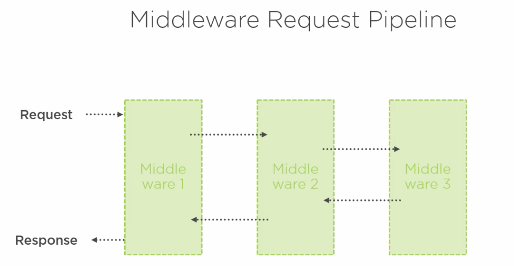

# 01 Settings

`ASP` Active Server Page

`ASP.NET Core MVC` est un framework


## Dépendances

On ajoute les `package` `EntityFrameworkCore.Design` et `EntityFrameworkCore.SqlServer`.

```bash
dotnet package add PackageName
```

On met à jour les `tools`

```bash
dotnet tool update --global dotnet-ef
```


## Création d'un projet

On veut créer un projet vide avec `https` activé :

```bash
dotnet new web -o BethanyPieShop
```

Si on veut supprimer le support d'`https` : `--no-https`

> ```bash
> -rrc --razor-runtime-compilation
> ```
>
> Pour avoir la compilation des templates `razor` à l'exécution.


## `Startup.cs`

`Startup` a deux méthodes :

### 1 `ConfigureServices`

Injection de dépendances

```cs
public void ConfigureServices(IServiceCollection services)
{
    // enregistre tous les services
    // Services du framework
    services.AddControllerWithViews();
    
    // Nos propres services ...plus tard
}
```

`ConfigureServices` est un conteneur de service qui va référencer les services et les injecter dans les classes de l'application.

Pour cela il faut passer au conteneur une `inteface` et un classe implémentant cette `interface`.

C'est là où se résout l'`Injection de dépendances`.


### 2 `Configure`

Pipeline de `middleware`

```cs
public void Configure(IApplicationBuilder app, IWebHostEnvironment env)
{
	// on ajoute des middleware ici
    app.UseDeveloperExceptionPage();
    app.UseStatusCodePages();
    app.UseStaticFiles();
}
```

La requête et la réponse `HTTP` parcourent l'ensemble des `middleware` définis dans `Configure`.




## `Program.cs`

C'est un programme `console` qui va créer un `host` (hébergement) avec le serveur `kestrel`.


## Ajouter le service `AddMvc` à `Startup`

Dans les dernières versions ce service s'appelle `AddControllersWithViews()`

```cs
public void ConfigureServices(IServiceCollection services)
{
    services.AddControllersWithViews();
}
```


## Environnement de l'application

Dans le `pipeline` on injecte l'environnement :

```cs
public void Configure(IApplicationBuilder app, IWebHostEnvironment env)
```

On peut alors vérifier si on est bien en développement :

```cs
if (env.IsDevelopment())
```

Au niveau de la machine c'est la variable d'environnement `ASPNETCORE_ENVIRONMENT` qui est mise à la valeur `Development`.


## Ajouter des `middleware`

### `UseHttpsRedirection`

On veut que les requêtes `HTTP` soient toutes redirigées vers `HTTPS` :

```cs
app.UseHttpsRedirection();
```


### `UseStaticFiles`

On veut pouvoir servir des `static files` comme du `css` ou des `images` :

```cs
app.UseStaticFiles();
```

Par défaut c'est le dossier `wwwroot` qui sera dédié aux `static files`.


### `UseRouting` et `UseEndpoints`

Ce sont ces deux `middleware` qui permettent de répondre à une requête.

```cs
app.UseRouting();
app.UseEndpoints(endpoints =>
            {
                endpoints.MapGet("/", async context =>
                {
                    await context.Response.WriteAsync("Hello World!");
                });
            });
```

On va modifier cela pour pouvoir répondre autre chose que `Hello World` :

```cs
app.UseRouting();

app.UseEndpoints(endpoints =>
{
      endpoints.MapControllerRoute(
      	name: "default",
        pattern: "{controller=Home}/{action=Index}/{id?}"
      );          
});
```

