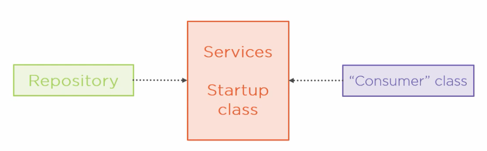
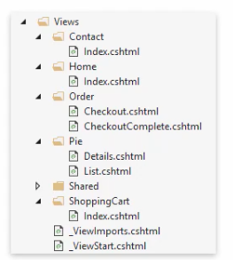
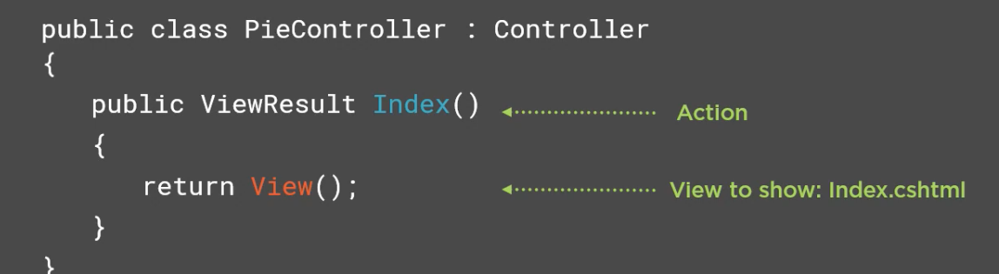
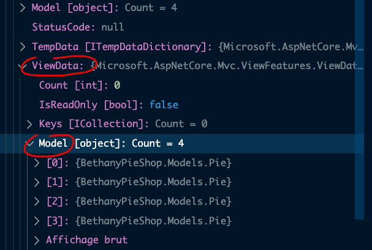

# 02 List `page`

## Framework `MVC`

`asp.net core mvc` fonctionne beaucoup avec les conventions.

On a donc trois dossiers qui suivent les conventions de nommage :

- `Models`
- `Views`
- `Controllers`

## Le `Model`

C'est le domaine de données (`Domain Data`) et la logique pour gérer les données.

Ce sont principalement des `POCO` ou `Plain Old CLR Objects`

```cs
public class Pie
{
    public int Id { get; set; }
    public string Name { get; set; }
    public string ShortDescription { get; set; }
    public string LongDescription { get; set; }
    public string AllergyInformation { get; set; }
    public decimal Price { get; set; }
    public string ImageUrl { get; set; }
    public string ImageThumbnailUrl { get; set; }
    public bool IsPieOfTheWeek { get; set; }
    public bool InStock { get; set; }
    public int CategoryId { get; set; }
    public Category Category { get; set; }
}
```

On va aussi travailler avec un `repository`, cette classe abstrait le **comment** de l'accès aux données.

Pour l'instant on va déclaré `l'interface` du `repository`,  c'est le contrat de ce que l'on peut faire avec les données.

#### Pie Repository Interface

```cs
public interface IPieRepository
{
    IEnumerable<Pie> GetAllPies();
    Pie GetPieById(int pieId);
}
```

On va d'abord créer un `MockPieRepository` pour commencer avec des données fausse (`mock data`). Ce repository doit implémenter l'interface :

```cs
public class MockPieRepository : IPieRepository
{
    public IEnumerable<Pie> Pies 
    {
        get { ... }
    }
    
    public IEnumerable<Pie> GetAllPies()
    {
        // ...
    }
    
    public Pie GetPieById(int pieId)
    {
        // ...
    }
}
```


## Faible couplage

En `MVC` on cherche à découpler au maximum les classes entre elles.

C'est pour cela que l'injection de dépendances va être utilisé pour rendre accéssible le `repository` aux autres classes en ayant besoin.



### Configuration de l'injection du `repository`

```cs
public vois ConfigureServices(IServiceCollection services)
{
    // register framework services
    services.AddControllersWithViews();
    
    // Register our own services
    services.AddScoped<IPieRepository, MockPieRepository>();
}
```

Options d'enregistrement d'un service : `Registration options`

### `AddTransient` 

À chaque fois que le service est demandé au conteneur, il renvoie un nouvel objet.

### `AddSingleton` 

Un seul objet est créé, à chaque nouvelle demande c'est le même objet qui est renvoyé.

### `AddScoped`

Un seul objet par requête, un nouvel objet à chaque nouvelle requête. C'est un `singleton` par requête.

## Demo

On doit ajouter une classe `Category`

```cs
public class Category
{
    public int CategoryId { get; set; }
    public string CategoryName { get; set; }
    public string Description { get; set; }
    public List<Pie> Pies { get; set; }
}
```


On ajoute aussi les `interfaces` des `repository`  dans le dossier `Models` :

`IPieRepository.cs`

```cs
public interface IPieRepository
{
	IEnumerable<Pie> AllPies { get; }
  IEnumerable<Pie> PiesOfTheWeek { get; }
  Pie GetPieById(int pieId);
}
```

`ICategoryRepository.cs`

```cs
public interface IcategoryRepository
{
	IEnumerable<Category> AllCategories { get; }
}
```


### On ajoute maintenant les données `mock` :

`MockCategoryRepository`

```cs
public class MockCategoryRepository : ICategoryRepository
{

}
```


`MockPieRepository`

```cs
public class MockPieRepository : IPieRepository
{

}
```


### Injection de dépendances

```cs
public void ConfigureServices(IServiceCollection services)
{
    services.AddScoped<IPieRepository, MockPieRepository>();
    services.AddScoped<ICategoryRepository, MockCategoryRepository>();
    
    // ...
    services.AddControllersWithViews();
}
```

`AddTransient` un nouvel objet à chaque fois.

`AddSingleton` un seul unique objet pour toutes les demandes.


## Le `Controller`

Un simple `controller`

```cs
public class PieController : Controller
{
    public ViewResult Index()
    {
        return View();
    }
}
```

Pour savoir quelle vue est retournée, `asp.net mvc` utilise les conventions.

```cs
public class PieController : Controller
{
    private readonly IPieRepository _pieRepository;
    public PieController(IPieRepository pieRepository)
    {
        _pieRepository = pieRepository;
    }
    
    public ViewResult List()
    {
        return View(_pieRepository.AllPies);
    }
}
```


## La `View`

C'est un `template` `html`

`*.cshtml`

Il y a deux types de `View` : `Plain` ou `Strongly-Typed`

Les `View` utilisent `Razor` pour la syntaxe.


### Faire correspondre la `View` et le `Controller`

`asp.net mvc` utilise des conventions pour automatiquement faire correspondre un fichier `View` avec son `Controller` :



Chaque contrôleur a un sous dossier à son nom dans le dossier `Views`.



De même chaque `Action` à un fichier `.cshtml` à son nom dans le sous-dossier.


## Passer des données à la `View`

### `ViewBag`

```cs
public ViewResult Index()
{
    ViewBag.Message = "Welcom coco";
    
    return View();
}
```

```html
<div>
    @ViewBag.Message
</div>
```


### `Strongly-Typed View`

```cs
public ViewResult List()
{
    return View(_pieRepository.AllPies);
}
```

Les données sont envoyées sous forme de paramètres, c'est en fait assigné à la propriété `ViewData.Model` de `ViewResult` qui sera retourné :



On a maintenant une `Strongly-Typed View` :

```html
@model IEnumerable<Pie>
    
@foreach(var pie in Model.AllPies)
{
	<p>
        @pie.Name | @pie.Price.ToString("c")
    </p>    
}
```


### `View Model`

Un modèle pour la vue.

On peut avoir envie de passer plusieurs types de données à la `View` et on peut utiliser un `ViewBag` pour ça.

Mais le mieux est d'utiliser une `View Model` :

```cs
public class PieListViewModel
{
    public IEnumerable<Pie> Pies { get; set; }
    public string CurrentCategory { get; set; }
}
```


## Demo

On crée le dossier `Views/Pie`. Dedans un fichier `List.cshtml`.

```asp
@model IEnumerable<BethanyPieShop.Models.Pie>

<!DOCTYPE html>
<html lang="en">

<head>
    <meta charset="UTF-8">
    <meta http-equiv="X-UA-Compatible" content="IE=edge">
    <meta name="viewport" content="width=device-width, initial-scale=1.0">
    <title>Document</title>
</head>

<body>
    @foreach (var pie in Model)
    {
        <div>
            <h2>@pie.Name</h2>
            <h3>@pie.Price</h3>
            <h4>@pie.Category.CategoryName</h4>
        </div>
    }
</body>

</html>
```

### `ViewBag`

Si on veut ajouter des données comme per exemple la `CurrentCategory` on peut utiliser un `ViewBag` :

```cs
public ViewResult List()
{
    ViewBag.CurrentCategory = "Cheese Cakes";

    return View(_pieRepository.AllPies);
}
```

Le `ViewBag` est passé à la `ViewResult` par l'intermédiaire de `ViewData`.

```asp
<body>
    <h1>@ViewBag.CurrentCategory</h1>
```


### `ViewModel`

On peut aussi utiliser un `View Model` pour transmettre plusieurs types à la `View`.

On va créer un dossier `ViewModels` et dedans le fichier `PieListViewModel.cs`.

```cs
public class PieListViewModel
{
    public IEnumerable<Pie> Pies { get; set; }
    public string CurrentCategory { get; set; }
}
```

On refactor notre `controller` :

```cs
public ViewResult List()
{
    var pieListViewModel = new PieListViewModel();

    pieListViewModel.CurrentCategory = "Cheese Cakes";
    pieListViewModel.Pies = _pieRepository.AllPies;

    return View(pieListViewModel);
}
```

Ou encore :

```cs
public ViewResult List() => View(new PieListViewModel
                   {
                			CurrentCategory = "Cheese Cakes",
            					Pies = _pieRepository.AllPies
            				});
```

On modifie la vue :

```asp
@model BethanyPieShop.ViewModels.PieListViewModel

<body>
    <h1>@Model.CurrentCategory</h1>
    @foreach (var pie in Model.Pies)
    {
        <div>
            <h2>@pie.Name</h2>
            <h3>@pie.Price</h3>
            <h4>@pie.Category.CategoryName</h4>
        </div>
    }
</body>
```


## `_Layout.cshtml`

Le `Layout` permet de partager une structure `HTML` entre les pages.
Il Est stocké dans le dossier `Views/Shared`.

Il peut y avoir plusieurs `layout` pour une même application.

`_Layout.cshtml`

```asp
<!DOCTYPE html>
<html lang="en">

  <head>
    <title>@ViewBag.Title</title>
  </head>

  <body>
    @RenderBody()
  </body>

</html>
```

`@RenderBody` indique où la vue doit être rendue.


## `_ViewStart.cshtml`

On peut indiquer dans chaque vue le `Layout` :

```cs
@{
  Layout = "_Layout";
}
```

En pratique on utilise le fichier spécial `_ViewStart.cshtml`.

`.net mvc` va chercher ce fichier automatiquement et l'exécuter avant le rendu de chaque vue.

On place donc dans ce fichier l'appelle au `Layout`.

On peut la placer à la racine de `Views`.


## `_ViewImports.cshtml`

```cs
@using BethanyPieShop.Models
```

Il existe encore un autre fichier spécial : `_ViewImports` (attention au `s` à la fin).

Il permet de centraliser les imports nécessaires avec `@using`.

On place aussi ce fichier à la racine du dossier `Views`.


## `List.cshtml` modifié

```csharp
@model PieListViewModel

@{
    ViewBag.Title = "Bethany's List Of Pie";
}


<h1>@Model.CurrentCategory</h1>
@foreach (var pie in Model.Pies)
{
    <div>
    <h2>@pie.Name</h2>
    <h3>@pie.Price</h3>
    <h4>@pie.Category.CategoryName</h4>
		</div>
}
```


## Ajouter des librairies `css` ou `javascript`

Par défaut on a un dossier `wwwroot` pour les fichier statiques.

Il faut bien sûr le créer.

`wwwroot`

|_`lib`

​	|_`tailwind`

Par exemple.

Cela est possible grâce au `middleware` : `app.UseStaticFiles()`.

On ajoute aussi un dossier `images` et `content` avec dedans un fichier `site.css`.

Comme `wwwroot` est le répertoire courant de l'application, on obtient ce genre d'adresse :

```html
<link href="~/lib/tailwind/tailwind.css" rel="stylesheet" />
```

