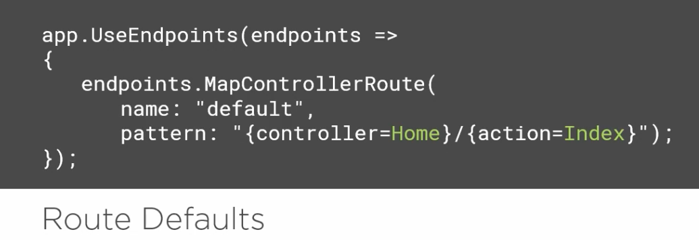
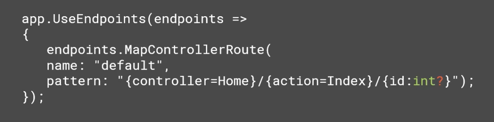
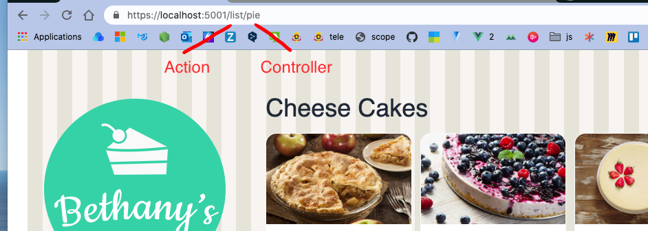
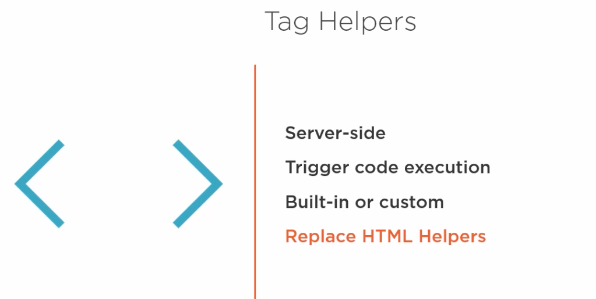

# 04 La `navigation`

## Le `Routing`

C'est la possibilité qu'a `ASP.net` de *mapper* une `URI` sur un `endpoint`.

On peut faire ça car dans notre fichier `Startup.cs` on a ajouté les `middlewares` `UseRouting` et `UseEndpoints`.

Le routage est de deux types différents :

- `Convention-based routing`
- `attribute-based routing`

`convention-based routing` est plus utilisé pour les applications `MVC`.

`attribute-based routing` est plutôt utilisé par les `API`.


## `Patterns` et `Routes`

###  http://www.bethanypieshop.com/<span style="color:red">pie</span>/<span style="color:cyan">list</span>

Le premier segment est le `contrôleur` et le deuxième segment est l'`action`.

Ceci ne ce fait pas automatiquement, il faut créer un réglage avec ce pattern :

### <span style="color:red">{Controller}</span>/<span style="color:cyan">{Action}</span>


## Travailler avec les segments

### http://www.bethanypieshop.com/<span style="color:red">pie</span>/<span style="color:cyan">list</span>/<span style="color:magenta">12</span>

On a ajouter un nouveau segment, ce sera l'`Id`

### <span style="color:red">{Controller}</span>/<span style="color:cyan">{Action}</span>/<span style="color:magenta">{id}</span>

```cs
public class PieController : Controller
{
    public ViewResult Details(int id)
    {
        // do something
    }
}
```


## Configurer le `Routing system`

On configure dans `Startup.cs`

```cs
app.UseRouting();
app.UseEndpoints(endpoints => {
    endpoints.MapControllerRoute(
    	name: "default",
        pattern: "{controller}/{action}"
    );
});
```

On renseigne aussi les valeurs par défaut.



On peut aussi ajouter une valeur :

```cs
app.UseEndpoints(endpoints => {
    endpoints.MapControllerRoute(
    	name: "default",
        pattern: "{controller=Home}/{action=Index}/{id}"
    );
});
```

Le `Model Binding` permet de recevoir la valeur de cette `id` directement en paramètre de son `action` :

```cs
public ViewResult Details(int id)
{
    // Do something
}
```

On peut rendre le segment de paramètre optionnel ains les routes :

```
/Pie/List
```

et

```
/Pie/Details/17
```

*matcheront* bien le `pattern` :

### {Controller}/{Action}/{id<span style="color:magenta">?</span>}


## Ajouter une contrainte 

On peut ajouter une contrainte suivant `:` par exemple pour limiter le type :




## Exemple

Si on inverse le `pattern` :

```cs
endpoints.MapControllerRoute(
    name: "default",
    pattern: "{action=Index}/{controller=Home}/{id?}"
);
```

Il faudra alors aussi inverser les deux segments de l'`url` en relation :




## Les `Tag Helpers` pour la navigation

Basé sur les routes définies dans l'application `asp.net core mvc` est capable de générer les liens correctes en `HTML`.

Les `Tag helpers` fonctionnent comme les `HTML Helpers` :

```cs
@Html.ActionLink("View Pie List", "List", "Pie")
```

```html
<a asp-controller="Pie" asp-action="List">View Pie List</a>
```



- ils sont présent que du côté serveur
- Ils déclenche l'exécution de code
- Ils font partie du framework ou on peut en faire des customs
- Ils remplacent les `HTML Helpers`

Le `link` est généré par le `Tag Helpers` :

```html
<a href="/Pie/List">View Pie List</a>
```


## Ajouter les `Tag Helpers` aux `View`

On utilise le fichier `_ViewImports.cshtml`

```csharp
@using BethanyPieShop.ViewModels
@addTagHelper *, Microsoft.AspNetCore.Mvc.TagHelpers
```


## Différents `Tag Helpers`

- `asp-controller`
- `asp-action`
- `asp-route-*` où on peut remplacer l'astérisque par le nom d'un paramètre : `id` par exemple
- `asp-route` 


## Demo

On crée une nouvelle `action` : `Details`

```cs
public IActionResult Details(int id)
{
    var pie = _pieRepository.GetPieById(id);
    if (pie == null)
    {
        return NotFound();
    }
    
    return View(pie);
}
```

On crée une vue `Details.cshtml`

```html
@model Pie

<h2>@Model.Name</h2>

<div>
    
    <div>
        <h3>@Model.Price</h3>
        <h3>
            <a href="#">@Model.Name</a>
        </h3>
        <h4>@Model.ShortDescription</h4>
        <p>@Model.LongDescription</p>
    </div>
</div>
```

On ajoute l'espace de nom `BethanyPieShop.Models` au fichier `_ViewImports.cshtml`.

```cs
@using BethanyPieShop.ViewModels
@using BethanyPieShop.Models
    
@addTagHelper *, Microsoft.AspNetCore.Mvc.TagHelpers
```

On va maintenant ajouter un lien dans la vue `List` :

```html
<a asp-controller="Pie" asp-action="Details">@pie.Name</a>
```

Pour que cela fonctionne il faut aussi passer le paramètre avec `asp-route-id` :

```html
<a asp-controller="Pie" asp-action="Details" asp-route-id="@pie.">@pie.Name</a>
```

On va maintenant ajouter la navigation au `_Layout.cshtml`

```html
<ul>
    <li><a asp-controller="Pie" asp-action="List">Pies</a></li>
</ul>
```

