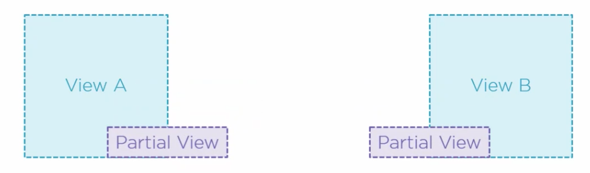
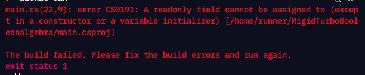

# 05 Améliorer la vue

## `Partial View`

Les `Partial View` permettent la réutilisation de code en créant des fragment de vue réutilisable dans différentes vues.



Voici une `partial view` :

```cs
@model Pie

<div>
    <div class="thumbnail">
        
        <h3>@Model.Price.ToString("c")</h3>
    </div>
 </div>
```

C'est exactement comme une vue sauf que le nom du fichier commence par `_`.

### Utilisation : `<partial>`

```cs
@foreach(var pie in Model.Pies)
{
    <partial name="_PieCard" model="pie" />
}
```

Le résultat de cette `Partial View` va être rechercher dans le dossier courant de la `View` (ici `View/Pie`) ou dans le dossier `shared`.


## `Home Controller`

> Attention de bien utiliser une `interface` pour l'injection de dépendance dans le constructeur car sinon cela ne fonctionne pas (une `exception` est lancée) :
>
> ```cs
> // Code OK
> private readonly IPieRepository _pieRepository;
> public HomeController(IPieRepository pieRepository)
> {
>     _pieRepository = pieRepository;
> }
> ```
>
> ```cs
> // Une exception est lancée
> private readonly PieRepository _pieRepository;
> public HomeController(PieRepository pieRepository)
> {
>     _pieRepository = pieRepository;
> }
> ```
>
> 

On va créer un `View Model` pour cette vue dans le dossier `ViewModels` :

`HomeViewModel.cs`

```cs
namespace BethanyPieShop.ViewModels
{
    public class HomeViewModel
    {
        public IEnumerable<Pie> PiesOfTheWeek { get; set; }
    }
}
```


### Utilisation dans le `controller`

```cs
public class HomeController : Controller
{
    private readonly IPieRepository _pieRepository;
    public HomeController(IPieRepository pieRepository)
    {
        _pieRepository = pieRepository;

    }

    public ViewResult Index()
    {
		var homeViewModel = new HomeViewModel {
            PiesOfTheWeek = _pieRepository.PiesOfTheWeek
        };
        return View(homeViewModel);
    }
}
```

## Création d'une `Partial View` : `_Carousel.cshtml`

L'idée d'une `Partial View` est d'être utilisée dans plusieurs `View` différentes.

Le meilleur endroit pour la ranger est donc le dossier `Shared`.


## Création de `Index.cshtml`

```cs
@model HomeViewModel
    
<partial name="_carousel" />
    
<h1>Pies Of The week</h1>
<p>Our weekly selection - just for you ! </p>
<div>
    @foreach(var pie in Model.PiesOfTheWeek)
    {
		<partial name="_PieCard" model="pie" />
    }
</div>
```


## Shopping Cart

### Ajout d'une `session`

```cs
public void ConfigureServices(IServiceCollection services)
{
    services.AddHttpContextAccessor();
    services.AddSession();
}

public void Configure(IApplicationBuilder app, IWebHostEnvironment env)
{
    app.UseSession();
}
```


### Modification du `Model`

Création d'une `ShoppingCartItem` class :

```cs
namespace BethanyPieShop.Models
{
    public class ShoppingCartItem
    {
        public int ShoppingCartItemId { get; set; }
        public Pie Pie { get; set; }
        public int Amount { get; set; }
        public string ShoppingCartId { get; set; }
    }
}
```

On doit aussi ajouter un `DbSet` pour notre nouveau `Model` :

`AppDbContext.cs`

```cs
// ...

public DbSet<Pie> Pies { get; set; }
public DbSet<ShoppingCartItem> ShoppingCartItems { get; set; }
```


### Ajout d'une `migration`

```bash
dotnet ef migrations add ShoppingCartAdded
dotnet ef database update
```


### La classe `ShoppingCart`

> #### Différence entre `readonly` et propriété avec seulement `get`
>
> Un champ `readonly` peut uniquement être initialisé dans le constructeur ou lors de sa déclaration.
>
> ```cs
> public readonly string _name = "Toto";
> ```
>
> ```cs
> public readonly string _name;
> 
> public Test(string name)
> {
>     _name = name;
> }
> ```
>
> Une assignation ailleurs dans la classe générera une exception à la compilation :
>
> ```cs
> public void ChangeName(string newName)
>     {
>         _name = $"Mr {newName}";
>     }
> ```
>
> 
>
> Une propriété en `get only` se comportera pareil.

```cs
public class ShoppingCart
{
    private readonly AppDbContext _appDbContext;
    public string ShoppingCartId { get; set; }
    public List<ShoppingCartItem> shoppingCartItems { get; set; }
    
    
    public ShoppingCart(AppDbContext appDbContext)
    {
        _appDbContext = appDbContext;
    }

```

On remarque qu'un `ShoppingCart` a un identifiant de type `string` : `ShoppingCartId`.

```cs
	public static ShoppingCart GetCart(IServiceProvider services)
    {
        ISession session = 
            services
            .GetRequiredService<IHttpContextAccessor>()?
            .HttpContext.Session;
        
        var context = services.GetService<AppDbContext>();
        string cartId = session.GetString("cartId") ?? Guid.NewGuid().ToString();
        
        session.SetString("CartId", cartId);
        
        return new ShoppingCart(context) { ShoppingCartId = cartId };
    }
```

On implémente ensuite une méthode `static` pour récupérer une instance de `ShoppingCart`.

Cette méthode reçoit le conteneur d'injection de dépendance `IServiceProvider services`.

On récupère ensuite la `session` grâce au `HttpContext` et `GetRequiredService`.


### Modification de `Startup.cs`

```cs
// ... ConfiguerServices
services.AddScoped<ShoppingCart>(sp => ShoppingCart.GetCart(sp));
services.AddHttpContextAccessor();
services.AddSession();
services.AddControllersWithViews();

// ... Configure
app.UseSession(); // before use routing
app.UseRouting();
```

`sp` = `Service Provider`

On passe une instance du `Service Provider` à `GetCart` qui va pouvoir récupérer la `session` et le `context` grâce à ça.


### Création du `ShoppingCartController`

```cs
using Microsoft.AspNetCore.Mvc;

namespace BethanyPieShop.Controllers
{
    public class ShoppingCartController : Controller
    {
        private readonly ShoppingCart _shoppingCart;
        private readonly IPieRepository _pieRepository;
        public ShoppingCartController(IPieRepository pieRepository, ShoppingCart shoppingCart)
        {
            _pieRepository = pieRepository;
            _shoppingCart = shoppingCart;

        }

        public ViewResult Index()
        {
            var items = _shoppingCart.GetShoppingCartItems();
            _shoppingCart.ShoppingCartItems = items;
            
            var shoppingCartViewModel = new ShoppingCartViewModel
            {
                ShoppingCart = _shoppingCart,
                ShoppingCartTotal = _shoppingCart.GetShoppingCartTotal()
            };
            
            return View(shoppingCartViewModel);
        }
    }
}
```

Deux méthodes `Add` et `Remove` :

```cs
public RedirectToActionResult AddToShoppingCart(int pieId)
{
    var selectedPie = _pieRepository.AllPies.FirstOrDefault(p => p.PieId == pieId);
    
    if(selectedPie != null)
    {
        _shoppingCart.AddToCart(selectedPie, 1);
    }
    
    return RedirectToAction("Index");
}
```

```cs
public RedirectToActionResult RemoveFromShoppingCart(int pieId)
{
    var selectedPie = _pieRepository.AllPies.FirstOrDefault(p => p.PieId == pieId);
    
    if(selectedPie != null)
    {
        _shoppingCart.RemoveFromCart(selectedPie);
    }
    
    return RedirectToAction("Index");
}
```


### Création de `SohppingCartViewModel`

```cs
using BethanyPieShop.Models;

namespace BethanyPieShop.ViewModels
{
    public class ShoppingCartViewModel
    {
        public ShoppingCart ShoppingCart { get; set; }
        public decimal ShoppingCartTotal { get; set; }
    }
}
```


### Création de la `View` : `ShoppingCart`

On crée un dossier `Views/ShoppingCart` et dedans le fichier `Index.cshtml`

```cs
@model ShoppingCartViewModel

<h2>Your shopping cart</h2>
<h4>Here are the delicious pies in your shopping cart.</h4>
<table class="table table-bordered table-striped">
    <thead>
    <tr>
        <th>Selected amount</th>
        <th>Pie</th>
        <th class="text-right">Price</th>
        <th class="text-right">Subtotal</th>
    </tr>
    </thead>
    <tbody>
    @foreach (var line in Model.ShoppingCart.ShoppingCartItems)
    {
        <tr>
            <td class="text-center">@line.Amount</td>
            <td class="text-left">@line.Pie.Name</td>
            <td class="text-right">@line.Pie.Price.ToString("c")</td>
            <td class="text-right">
                @((line.Amount * line.Pie.Price).ToString("c"))
            </td>
        </tr>
    }
    </tbody>
    <tfoot>
    <tr>
        <td colspan="3" class="text-right">Total:</td>
        <td class="text-right">
            @Model.ShoppingCartTotal.ToString("c")
        </td>
    </tr>
    </tfoot>
</table>
```

On va maintenant ajouter un `button` à notre `_PieCard` pour pouvoir l'ajouter au `ShoppingCart` :

```cs
// _PieCart.cshtml

@model Pie

<div class="card bordered bg-white">
    <figure>
        
    </figure>

    <div class="card-body">

        <a asp-controller="Pie" asp-action="Details" asp-route-id="@Model.PieId"
            class="card-title text-accent link link-hover">@Model.Name</a>
        <p class="badge badge-warning mb-4">@Model.Price</p>

        <p class="text-lg text-red-500">@Model.ShortDescription</p>
    </div>
    <div class="card-actions">
        <a class="btn btn-primary" asp-controller="ShoppingCart" 
            							  asp-action="AddToShoppingCart"
            							  asp-route-pieId="@Model.PieId">
            Add To Cart
        </a>
    </div>

</div>
```

On va aussi ajouter cette possibilité à la `View` : `Pie/Details.cshtml`


