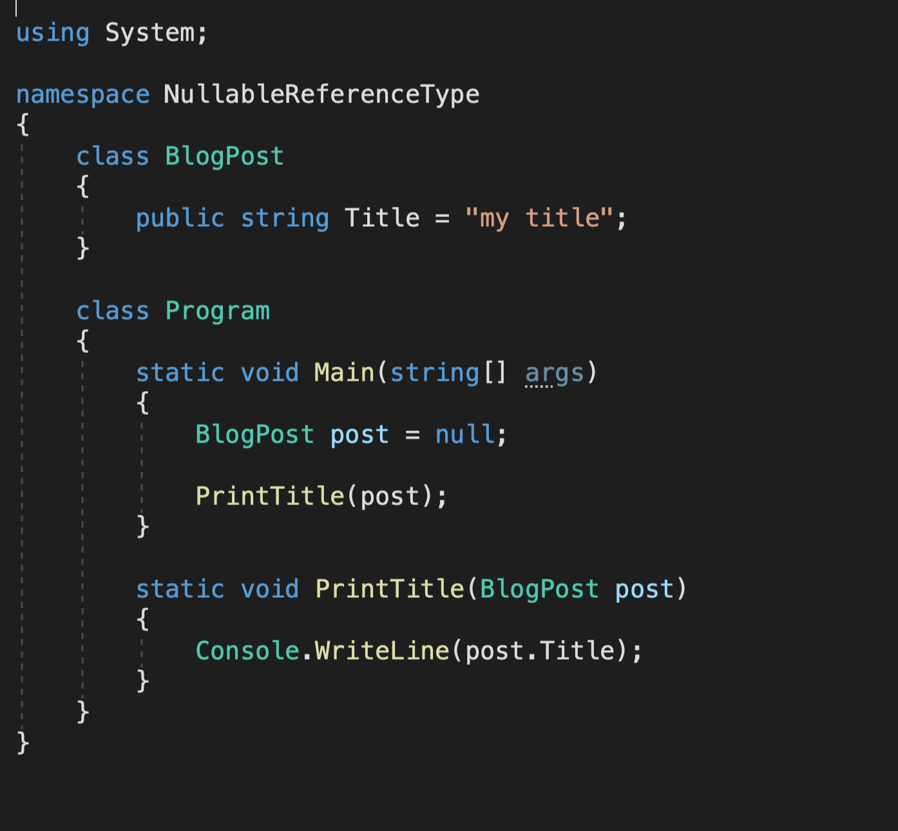
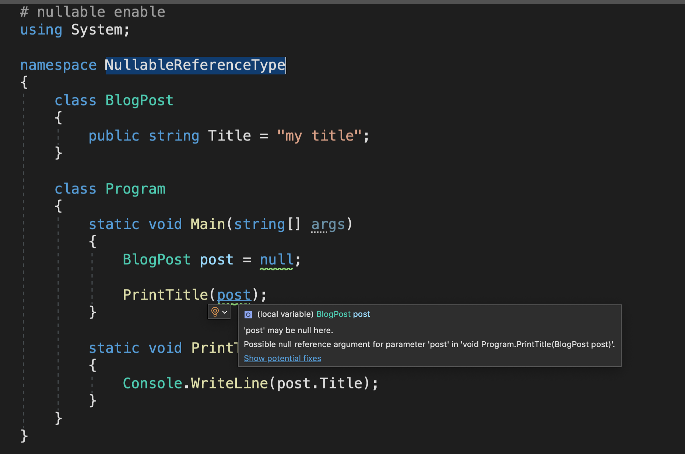
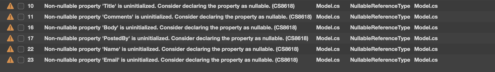
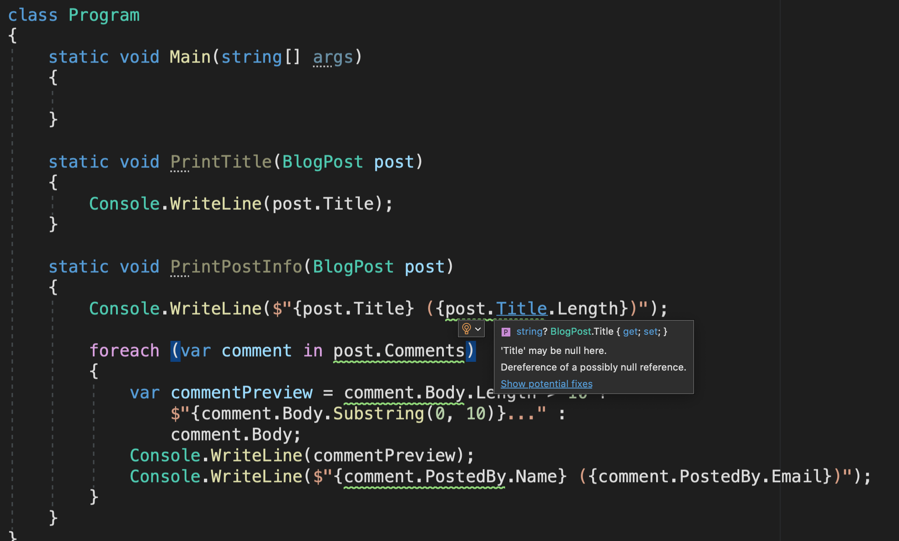
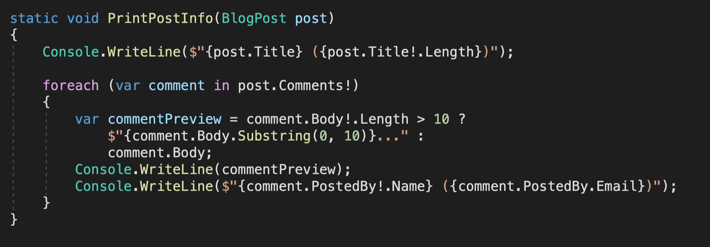
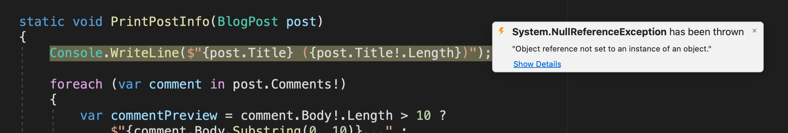
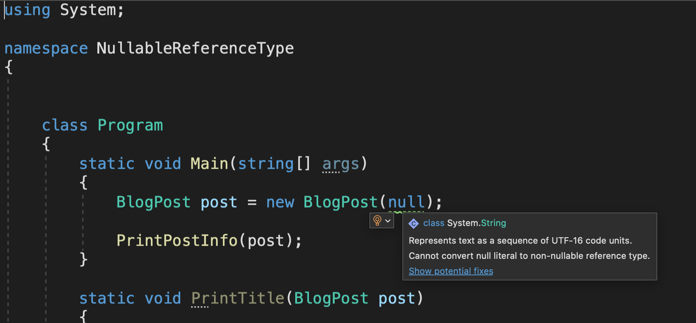
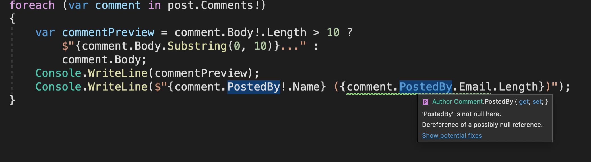
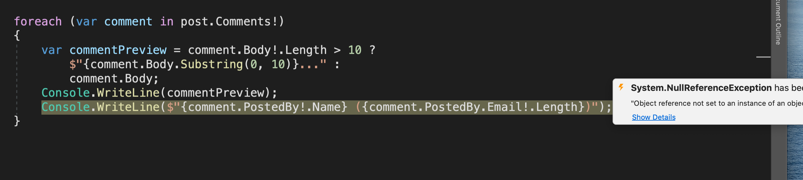

# 01 Nullable Reference Type

## Afficher les `warning`

Pour pouvoir avoir les `warnings`, on doit ajouter une directive en haut du fichier :

```cs
# nullable enable
```

### Sans



### Avec



## demo

`Model.cs`

```cs
# nullable enable

using System;
using System.Collections.Generic;

namespace NullableReferenceType
{
    public class BlogPost
    {
        public string Title { get; set; }
        public List<Comment> Comments { get; set; }
    }

    public class Comment
    {
        public string Body { get; set; }
        public Author PostedBy { get; set; }
    }

    public class Author
    {
        public string Name { get; set; }
        public string Email { get; set; }
    }
}

```

À ce stade un `build` provoque 6 `warnings` :



On nous dit que par défaut ces propriétés sont `Non-nullable`.

L'jout d'un `?` après le type rend celui-ci `nullable`.

```cs
public class BlogPost
{
    public string? Title { get; set; }
    public List<Comment>? Comments { get; set; }
}

public class Comment
{
    public string? Body { get; set; }
    public Author? PostedBy { get; set; }
}

public class Author
{
    public string? Name { get; set; }
    public string? Email { get; set; }
}
```

Ici le `build` ne provoque aucun `warning`.

## Dans la classe `Program.cs`



On a maintenant des `warning` dans la classe `Program.cs`.

Si mes propriétés était `Non-nullable`, je n'aurai pas de `warning` à ce niveau.

#### attention : cela ne change rien pour le `runtime`, si un objet est `null` une exception sera lancée

`!` dit au compilateur qu'on est sûr que notre objet ne sera pas `null` :



Les `warning` ont disparu, mais attention de nouveau ça n'évite pas qu'une exception soit levée au `runtime`.

```cs
# nullable enable
using System;

namespace NullableReferenceType
{


    class Program
    {
        static void Main(string[] args)
        {
            BlogPost post = null;

            PrintPostInfo(post);
        }

        static void PrintTitle(BlogPost post)
        {
            Console.WriteLine(post.Title);
        }

        static void PrintPostInfo(BlogPost post)
        {
            Console.WriteLine($"{post.Title} ({post.Title!.Length})");

            foreach (var comment in post.Comments!)
            {
                var commentPreview = comment.Body!.Length > 10 ?
                    $"{comment.Body.Substring(0, 10)}..." :
                    comment.Body;
                Console.WriteLine(commentPreview);
                Console.WriteLine($"{comment.PostedBy!.Name} ({comment.PostedBy.Email})");
            }
        }
    }
}
```



#### `NullReferenceException`

## Amélioration du code

On ajoute des constructeurs et on initialise la `List<Comment`.

```cs
# nullable enable

using System;
using System.Collections.Generic;

namespace NullableReferenceType
{
    public class BlogPost
    {
        public BlogPost(string title)
        {
            Title = title;
        }

        public string Title { get; set; }
        public List<Comment>? Comments { get; } = new List<Comment>();
    }

    public class Comment
    {
        public Comment(string body, Author postedBy)
        {
            Body = body;
            PostedBy = postedBy;
        }

        public string Body { get; set; }
        public Author PostedBy { get; set; }
    }

    public class Author
    {
        public Author(string name, string email)
        {
            Name = name;
            Email = email;
        }

        public string Name { get; set; }
        public string Email { get; set; }
    }
}
```

Ainsi des warning nous préviennent de possible problème dans `Program.cs` :

 

## Ne pas utiliser les directives

On peut modifier notre fichier `*.csproj` pour afficher les `warning` pour tout le projet sans utiliser les directive `#nullable enable` dans chaque fichier.

```cs
<Project Sdk="Microsoft.NET.Sdk">

  <PropertyGroup>
    <OutputType>Exe</OutputType>
    <TargetFramework>netcoreapp3.1</TargetFramework>
    <nullable>enable</nullable>
  </PropertyGroup>

  <PropertyGroup Condition=" '$(Configuration)|$(Platform)' == 'Debug|AnyCPU' ">
    <LangVersion>latest</LangVersion>
  </PropertyGroup>
  <PropertyGroup Condition=" '$(Configuration)|$(Platform)' == 'Release|AnyCPU' ">
    <LangVersion>latest</LangVersion>
  </PropertyGroup>
</Project>
```

#### `<nullable>enable</nullable>`



## Propriété `nullable`

On peut spécifier qu'une propriété peut être `null` au compilateur avec `?` :

Par exemple si on laisse la possibilité à `Email` d'être `null` :

```cs
public class Author
{
    public Author(string name, string? email)
    {
        Name = name;
        Email = email;
    }

    public string Name { get; set; }
    public string? Email { get; set; }
}
```

On aura dans `Program.cs` :



Il suffit d'utiliser le `?` pour enlever le `warning` :

Et il n'y a pas d'erreur au `runtime` :

```cs
using System;

namespace NullableReferenceType
{
    class Program
    {
        static void Main(string[] args)
        {
            var author = new Author("Michel", null);

            var comment = new Comment("hello comment", author);

            var post = new BlogPost("hello nullable");

            post.Comments.Add(comment);

            PrintPostInfo(post);
        }

        static void PrintTitle(BlogPost post)
        {
            Console.WriteLine(post.Title);
        }

        static void PrintPostInfo(BlogPost post)
        {
            Console.WriteLine($"{post.Title} ({post.Title.Length})");

            foreach (var comment in post.Comments!)
            {
                var commentPreview = comment.Body!.Length > 10 ?
                    $"{comment.Body.Substring(0, 10)}..." :
                    comment.Body;
                Console.WriteLine(commentPreview);
                Console.WriteLine($"{comment.PostedBy!.Name} ({comment.PostedBy.Email?.Length})");
            }
        }
    }
}
```

```bash
hello nullable (14)
hello comm...
Michel ()
```

Avec `!` on aurai eu une exception :


