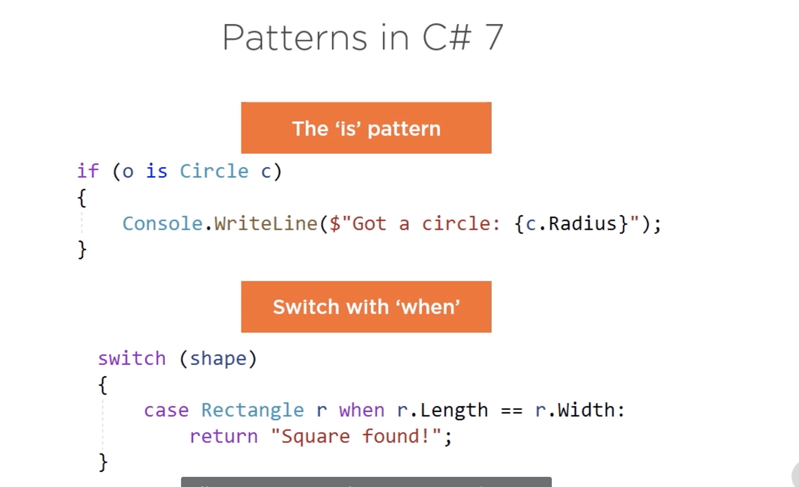
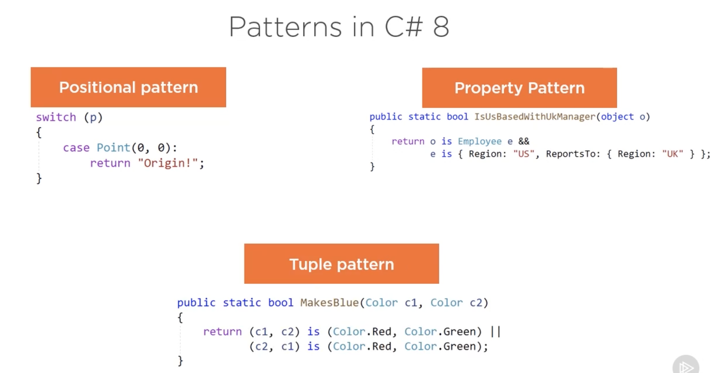
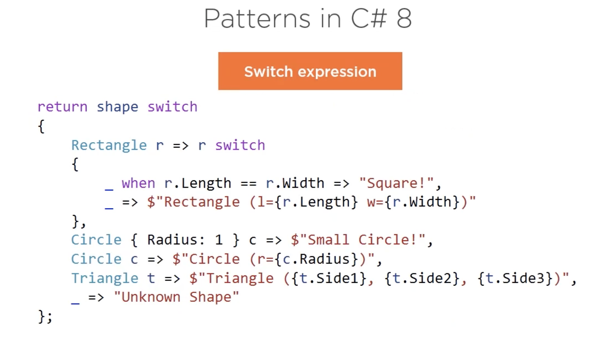

# 02 Pattern Matching







## `Deconstructors` : Positional Pattern

La méthode **`Deconstrutors`** doit obligatoirement s'appeler `Deconstruct`.

```cs
using System;
namespace PatternMatching
{
    public static class PositionalPatternSample
    {

    }

    public class Student
    {
        public string FirstName;
        public string LastName;
        public Teacher HomeRoomTeacher;
        public int GradeLevel;

        public Student(string firstName, string lastName, Teacher homeRoomTeacher, int gradeLevel)
        {
            FirstName = firstName;
            LastName = lastName;
            HomeRoomTeacher = homeRoomTeacher;
            GradeLevel = gradeLevel;
        }

        public void Deconstruct(out string firstName,
                                out string lastName,
                                out Teacher homeRoomTeacher,
                                out int gradeLevel)
        {
            firstName = FirstName;
            lastName = LastName;
            homeRoomTeacher = HomeRoomTeacher;
            gradeLevel = GradeLevel;
        }
    }

    public class Teacher
    {
        public string FirstName;
        public string LastName;
        public string Subject;

        public Teacher(string firstName, string lastName, string subject)
        {
            FirstName = firstName;
            LastName = lastName;
            Subject = subject;
        }

        public void Deconstruct(out string firstName,
                                out string lastName,
                                out string subject)
        {
            firstName = FirstName;
            lastName = LastName;
            subject = Subject;
        }
    }
}

```

On est pas obligé de passer toutes les propriétés à la méthode `Deconstruct`.

### Création d'une classe utilisant le Positional Pattern

```cs
public static class PositionalPatternSample
{
    public static bool IsInSeventhGradeMath(Student s)
    {
        return s is Student(_, _, _, _);
    }
}
```

Ici pour l'instant on correspond à tout les étudiant, limitons à une note de `7` :

```cs
return s is Student(_, _, _, 7);
```

De manière récursive, on peut aussi décomposer un membre de la décomposition, ici on cherche un prof de math :

```cs
return s is Student(_, _, Teacher(_, _, "Math"), 7);
```

On peut finalement simplifier l'écriture :

```cs
public static class PositionalPatternSample
{
    public static bool IsInSeventhGradeMath(Student s)
    {
        return s is (_, _, (_, _, "Math"), 7);
    }
}
```

### Mise en oeuvre

```cs
class Program
{
    static void Main(string[] args)
    {
        var tmath = new Teacher("Michel", "Michelot", "Math");
        var tdrawing = new Teacher("Ali", "Gato", "Drawing");

        var sbob = new Student("Bob", "Sponge", tmath, 7);
        var spola = new Student("Pola", "Roïd", tdrawing, 7);

        Console.WriteLine(PositionalPatternSample.IsInSeventhGradeMath(sbob));
        Console.WriteLine(PositionalPatternSample.IsInSeventhGradeMath(spola));
    }
}
```

```
True
False
```

## Property Patterns

```cs
public class Employee
{
    public string FirstName;
    public string LastName;
    public string Type;
    public string Region;
    public Employee ReportsTo;
}

public static class PropertyPatternSample
{
    public static bool IsUsBasedWithUkManager(Employee e)
    {
        return e is { Region: "US" };
    }
}
```

On cherche ici les employés qui ont comme région `"US"`.

On peut aussi utiliser le `Property Patterns` de manière récursive sur le `ReportsTo` :

```cs
return e is { Region: "US", ReportsTo: { Region: "UK" } };
```

On peut rendre notre méthode plus générique en acceptant un `object` plutôt qu'un `Employee` :

```cs
public static class PropertyPatternSample
{
    public static bool IsUsBasedWithUkManager(object o)
    {
        return  o is Employee e &&
            e is { Region: "US", ReportsTo: { Region: "UK" } };
    }
}
```

### Test du programme

```cs
class Program
{
    static void Main(string[] args)
    {
        var bob = new Employee("Bob", "UK", null);
        var nick = new Employee("Nick", "FR", bob);
        var stella = new Employee("Stella", "US", bob);

        var blob = new object();

        Console.WriteLine(PropertyPatternSample.IsUsBasedWithUkManager(bob));
        Console.WriteLine(PropertyPatternSample.IsUsBasedWithUkManager(nick));
        Console.WriteLine(PropertyPatternSample.IsUsBasedWithUkManager(stella));
        Console.WriteLine(PropertyPatternSample.IsUsBasedWithUkManager(blob));
    }
}
```

```
False
False
True
False
```

## Switch Expression

### Création de trois formes géométriques

```cs
public class Circle
    {
        public int Radius { get; }

        public Circle(int radius) =>
            Radius = radius;
    }

    public class Rectangle
    {
        public int Length { get; }
        public int Width { get; }

        public Rectangle(int length, int width) =>
            (Length, Width) = (length, width);
    }

    public class Triangle
    {
        public int Side1 { get; }
        public int Side2 { get; }
        public int Side3 { get; }

        public Triangle(int side1, int side2, int side3) =>
            (Side1, Side2, Side3) = (side1, side2, side3);
    }
```

### Structure du `Switch Expression`

```cs
public static class SwitchExpressionSample
    {
        public static string DisplayShapeInfo(object shape)
        {
            string result = shape switch
            {

            };

            return result;
        }
    }
```

On peut donc utiliser un `switch` dans une expression, ce qui permet d'assigner une variable avec la valeur de l'expression.

Il n'y a pas de mot clé `case`, le `switch expression` utilise à la place les `lambdas`.

```cs
string result = shape switch
{
        Rectangle r => $"Rectangle (l={r.Length} w={r.Width})",
};
```

Il n'y a pas non plus de `break` ni de `fall-through` (tomber à travers).

```cs
string result = shape switch
{
        Rectangle r => $"Rectangle (l={r.Length} w={r.Width})",
        Circle c => $"Circle (r={c.Radius})",
        Triangle t => $"Trinagle (s1={t.Side1} s2={t.Side1} s3={t.Side3})"
};
```

On voudrait maintenant ajouter une clause par défaut, on peut faire ça avec le `discard pattern` : `_`

```cs
string result = shape switch
{
        Rectangle r => $"Rectangle (l={r.Length} w={r.Width})",
        Circle c => $"Circle (r={c.Radius})",
        Triangle t => $"Trinagle (s1={t.Side1} s2={t.Side1} s3={t.Side3})",
        _ => "Unknow shape"
};
```

On peut aussi utiliser les `property pattern`:

```cs
string result = shape switch
{
        Rectangle r => $"Rectangle (l={r.Length} w={r.Width})",
        Circle {  Radius: 1 } c => "Small Circle!",
        Circle c => $"Circle (r={c.Radius})",
        Triangle t => $"Trinagle (s1={t.Side1} s2={t.Side1} s3={t.Side3})",
        _ => "Unknow shape"
};
```

On peut utiliser les `switch expression` de manière récursive :

```cs
string result = shape switch
{
        Rectangle r => r switch
        {
                _ when r.Length == r.Width => $"Square ! ({r.Length}x{r.Width})"
                    _ => $"Rectangle(l={r.Length} w={r.Width})"
        },
        Circle {  Radius: 1 } c => "Small Circle!",
        Circle c => $"Circle (r={c.Radius})",
        Triangle t => $"Trinagle (s1={t.Side1} s2={t.Side1} s3={t.Side3})",
        _ => "Unknow shape"
};
```

Comme c'est une expression on peut simplifier la syntaxe de la méthode `expression-bodied method`

```cs
public static string DisplayShapeInfo(object shape) =>
    shape switch
    {
            Rectangle r => r switch
            {
                    _ when r.Length == r.Width => $"Square ! ({r.Length}x{r.Width})",
                    _ => $"Rectangle(l={r.Length} w={r.Width})"
            },
            Circle { Radius: 1 } c => "Small Circle!",
            Circle c => $"Circle (r={c.Radius})",
            Triangle t => $"Trinagle (s1={t.Side1} s2={t.Side2} s3={t.Side3})",
            _ => "Unknow shape"
    };
```

### Test du `switch expression`

```cs
class Program
{
    static void Main(string[] args)
    {
        var r = new Rectangle(5, 8);
        var c = new Circle(5);
        var s = new Rectangle(6, 6);
        var smallc = new Circle(1);
        var t = new Triangle(5, 6, 7);
        var blob = new object();

        Console.WriteLine(SwitchExpressionSample.DisplayShapeInfo(r));
        Console.WriteLine(SwitchExpressionSample.DisplayShapeInfo(c));
        Console.WriteLine(SwitchExpressionSample.DisplayShapeInfo(s));
        Console.WriteLine(SwitchExpressionSample.DisplayShapeInfo(smallc));
        Console.WriteLine(SwitchExpressionSample.DisplayShapeInfo(t));
        Console.WriteLine(SwitchExpressionSample.DisplayShapeInfo(blob));
    }
}
```

```
Circle (r=5)
Square ! (6x6)
Small Circle!
Trinagle (s1=5 s2=6 s3=7)
Unknow shape
```

## Tuple Pattern

On peut utiliser les `tuple` pour créer des `patterns` :

```cs
public enum Color
{
    Unknow,
    Red,
    Blue,
    Green,
    Purple,
    Orange,
    Brown,
    Yellow
}

public static class TuplePatternSample
{
    public static Color GetColor(Color c1, Color c2)
    {
        return (c1, c2) switch
        {
                (Color.Blue, Color.Red) => Color.Purple,
                (Color.Red, Color.Blue) => Color.Purple,

                (Color.Red, Color.Yellow) => Color.Orange,
                (Color.Yellow, Color.Red) => Color.Orange,

                (Color.Green, Color.Red) => Color.Brown,
                (Color.Red, Color.Green) => Color.Brown,

                (_, _) when c1 == c2 => c1,
                _ => Color.Unknow
        };
    }
}
```

le `_` peut remplacer le `tuple` entier ou un élément du `tuple`.

Dans le program :

```cs
class Program
{
    static void Main(string[] args)
    {
        Console.WriteLine(TuplePatternSample.GetColor(Color.Red, Color.Blue));
        Console.WriteLine(TuplePatternSample.GetColor(Color.Yellow, Color.Blue));
        Console.WriteLine(TuplePatternSample.GetColor(Color.Green, Color.Green));
        Console.WriteLine(TuplePatternSample.GetColor(Color.Green, Color.Red));

    }
}
```

```
Purple
Unknow
Green
Brown
```
