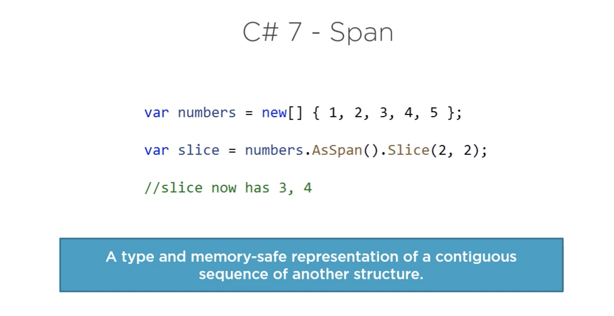
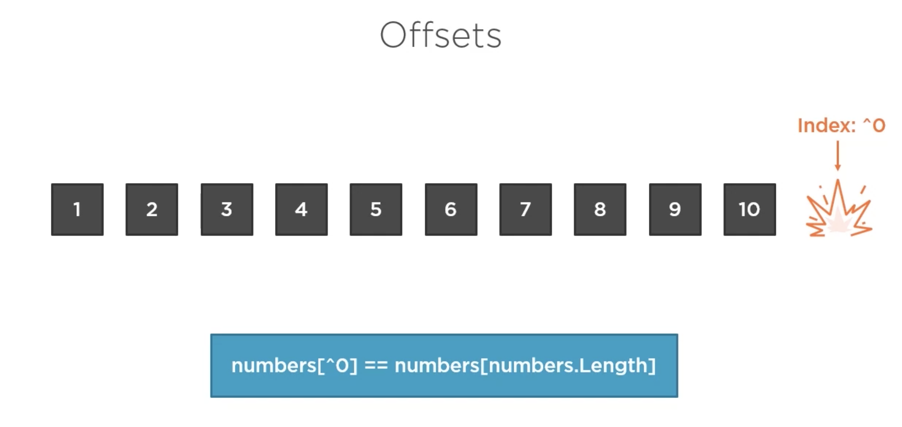
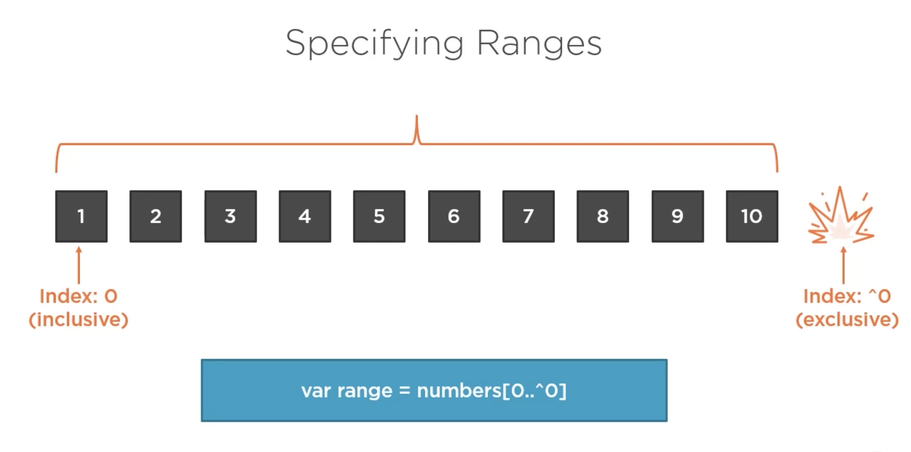

# `Indices` et `range` (zone)

## `span`



### écriture simplifiée

```cs
class Program
{
    static void Main(string[] args)
    {
        var numbers = new[] { 1, 2, 3, 4, 5 };

        var slice = numbers[2..4];

        foreach(var nb in slice)
        {
            Console.WriteLine(nb);
        }
    }
}
```

```
3
4
```

On peut déclarer et utiliser une variable de type `Range` :

```cs
static void Main(string[] args)
{
    var numbers = new[] { 1, 2, 3, 4, 5 };

    Range range = 1..4;

    var slice = numbers[range];

    foreach(var nb in slice)
    {
        Console.WriteLine(nb);
    }
}
```

#### range operator `..`

## Index

```cs
static void Main(string[] args)
{
    var numbers = new[] { 1, 2, 3, 4, 5 };

    var number = numbers[^1];

    Console.WriteLine(number);
}
```

On peut maintenant utiliser `^` pour sélectionner un élément à partir de la fin d'un tableau.

```
5
```

On a aussi un type `Index`.

```cs
var numbers = new[] { 1, 2, 3, 4, 5 };

Index index = ^2;

var number = numbers[index];

Console.WriteLine(number);
```

```
4
```

### Combinaison de `Range` et `Indice`

```cs
var numbers = new[] { 1, 2, 3, 4, 5 };

var lastTwo = numbers[^2..];

foreach(var nb in lastTwo)
{
    Console.WriteLine(nb);
}
```

```
4
5
```

En décomposé :

```cs
var numbers = new[] { 1, 2, 3, 4, 5 };

var position = 2;
Index index = ^position;
Range range = index..;

var lastTwo = numbers[range];

foreach(var nb in lastTwo)
{
    Console.WriteLine(nb);
}
```

```
4
5
```

## Offset



Les tableaux sont indexés de 0 à `length -1`.

L'élément d'index `^0` est l'élément d'index `length`, c'est à dire en dehors du tableau.


Un `Range` est **premier élément inclus - dernier élément exclus**.

**Tous les éléments** s'écrit donc `[0..^0]`.



Ce qui est l'équivalent de `numbers[0..]`.

### Exemples

```cs
var numbers = Enumerable.Range(1, 10).ToArray();

var copy = numbers[0..^0];
var copy2 = numbers[..];
var allButFirst = numbers[1..];
var lastItemRange = numbers[^1..];
var lastItem = numbers[^1];
var lastThree = numbers[^3..];

Index middle = 4;
Index threeFromEnd = ^3;
Range customRange = middle..threeFromEnd;

var custom = numbers[customRange];

Console.WriteLine($"customRange: {string.Join(", ", custom)}");
```

```
customRange: 5, 6, 7
```
