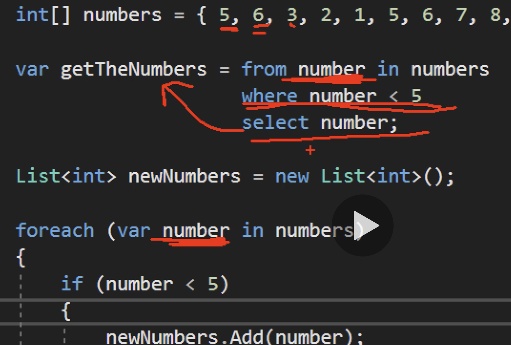

# 01 Linq

## créer un projet en ligne de commande

```bash
🦄 csharp-advanced-topic dotnet new console -n chap02-linq
```

`-n` nom de la sortie.

## intro

`Linq` est un langage de requête pour les collections.

```
from elt in collection
where condition
select elt;
```

```csharp
using System.Linq;

// ...

int[] numbers = { 5, 6, 78, 34, 3, 3, 89, 234, 7, 8, 9, 12, 2, 3, 12, 1 };

var getTheNumbers = from number in numbers
    select number;

Console.WriteLine(string.Join(", ", getTheNumbers));
```

```bash
dotnet run
5, 6, 78, 34, 3, 3, 89, 234, 7, 8, 9, 12, 2, 3, 12, 1
```

```csharp
var getTheNumbers = from number in numbers
                    where number < 5
                    select number;
```

```bash
🦄 chap01-linq dotnet run
3, 3, 2, 3, 1
```

#### `string.Join(separator, collection)` : transforme une collection en chaine.

On obtient la même chose en faisant :

```csharp
using System.Collections.Generic;

List<int> newNumbers = new List<int>();

foreach(var number in numbers)
{
    if(number < 5)
    {
        newNumbers.Add(number);
    }
}
```



`select` récupère la valeur et l'envoie dans `getTheNumbers`. On voit que `Linq` fonctionne comme notre `foreach`, mais dans une syntaxe plus concise (plus descriptive).

La `query` `Linq` est exécuté seulement lorsque le résultat est utilisé, c'est à dire ici dans le `Console.WriteLine`.

## Exemple avec des caractères

```csharp
string[] catNames = { "Lucky", "Bella", "Aria", "Luna", "Oreo", "Simba", "Grizouille", "Minouchette", "White" };

var catsWithA = from cat in catNames
                where cat.Contains("a")
                select cat;
```

```bash
🦄 chap01-linq dotnet run
Bella, Aria, Luna, Simba
```

On voit que `.Contains` n'est pas sensible à la casse.

### Plusieurs conditions

```csharp
var catsWithA = from cat in catNames
                where cat.Contains("a") && (cat.Length < 5)
                select cat;
```

```bash
🦄 chap01-linq dotnet run
Aria, Luna
```

De même avec les nombres

```csharp
var getTheNumbers = from number in numbers
                    where number > 5 && number < 10
                    select number;
```

```bash
6, 7, 8, 9
```

On peut écrire comme ça aussi :

```csharp
var getTheNumbers = from number in numbers
                    where number > 5
                    where number < 10
                    select number;
```

### Trie : `ascending` et `descending`

```csharp
var getTheNumbers = from number in numbers
                    where number > 5
                    where number < 10
                    orderby number ascending
                    select number;
```

```bash
6, 6, 6, 7, 7, 8, 8, 9, 9
```

`ascending` étant la valeur par défaut, le mot n'est pas obligatoire.

```csharp
var getTheNumbers = from number in numbers
                    where number > 5
                    where number < 10
                    orderby number descending
                    select number;
```

```bash
9, 9, 8, 8, 7, 7, 6, 6, 6
```

## Exemple avec des objets

#### ! l'utilisation d'un seul caractères comme nom de variable signale un `iterator`

`Person.cs`

```csharp
namespace chap02_linq
{
    class Person
    {

        public string Name
        {
            get;
            set;
        }

        public int Size
        {
            get;
            set;
        }

        public int Age
        {
            get;
            set;
        }

        public Gender Gender
        {
            get;
            set;
        }

        public Person(string name, int size, int age, Gender gender)
        {
            Name = name;
            Size = size;
            Age = age;
            Gender = gender;
        }
    }
}
```

`Gender.cs`

```csharp
namespace chap02_linq
{
    enum Gender
    {
        Male,
        Female
    }
}
```

```csharp
using System;
using System.Collections.Generic;
using System.Linq;

// ...

List<Person> people = new List<Person>()
{
    new Person("Tony", 182, 49, Gender.Male),
    new Person("Maria", 166, 72, Gender.Female),
    new Person("Roberto", 159, 62, Gender.Male),
    new Person("Francine", 172, 33, Gender.Female),
    new Person("Raymonde", 123, 79, Gender.Female),
    new Person("Thierry", 197, 22, Gender.Male),
    new Person("Ginette", 164, 50, Gender.Female),
    new Person("Pierrot", 187, 31, Gender.Male)
};

var fourCharPeople = from p in people
                    where p.Name.Length < 5
                    select p;

foreach(Person person in fourCharPeople)
{
    Console.WriteLine(person.Name);
}
```

```bash
Tony
```

### `orderby`

```csharp
var sevenCharPeople = from p in people
                        where p.Name.Length == 7
                        orderby p.Age
                        select p;

foreach(Person p in sevenCharPeople)
{
    Console.WriteLine($"name: {p.Name} age : {p.Age} size: {p.Size}");
}
```

```bash
name: Thierry age : 22 size: 197
name: Ginette age : 50 size: 164
name: Pierrot age : 50 size: 187
name: Roberto age : 62 size: 159
```

```csharp
var sevenCharPeople = from p in people
                        where p.Name.Length == 7
                        orderby p.Age, p.Size descending
                        select p;
```

```bash
name: Thierry age : 22 size: 197
name: Pierrot age : 50 size: 187
name: Ginette age : 50 size: 164
name: Roberto age : 62 size: 159
```

On voit que `Pierrot` et ` Ginette` se sont intervertit.

### `select`

On peut choisir de n'enregistrer qu'un champ :

```csharp
var sevenCharPeople = from p in people
                        where p.Name.Length == 7
                        orderby p.Age, p.Size descending
                        select p.Name ;

foreach(var n in sevenCharPeople)
{
    Console.WriteLine($"name: {n}");
}
```

```bash
name: Thierry
name: Pierrot
name: Ginette
name: Roberto
```
