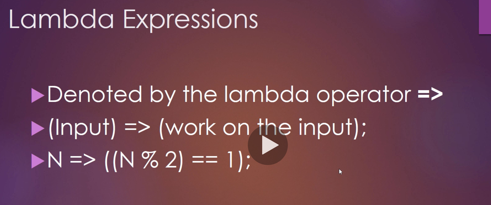
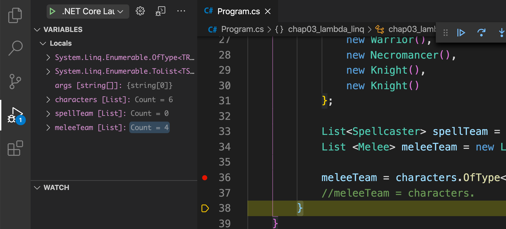
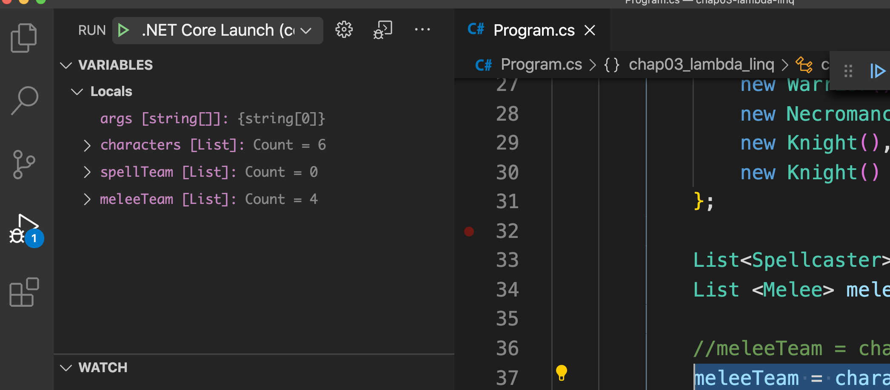
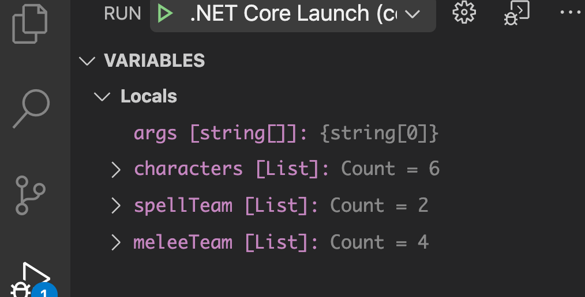
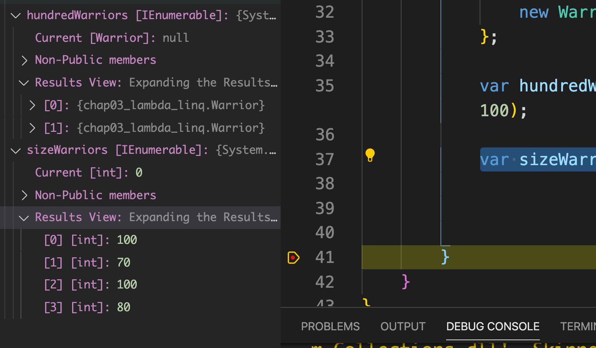
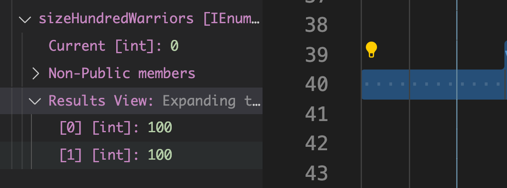

# 02 `Linq` et les `Lambda expression`



Les `lamdba expression` sont des fonctions très dépouillées où il ne reste que l'entrée et le traitement sur cette entrée.

## `Where`

### Obtenir les nombres impairs avec `Linq`

```csharp
List<int> numbers = new List<int>() { 1, 34, 7, 4, 5, 1, 67, 9, 8, 1, 3, 2, 54, 67 };

var oddNumber = from n in numbers
                where n%2 == 1
                select n;

Console.WriteLine(string.Join(",", oddNumber));
```

```bash
🦄 chap03-lambda-linq dotnet run
1,7,5,1,67,9,1,3,67
```

### Utilisation de `Linq` et de `Lambda expression`

```csharp
List<int> numbers = new List<int>() { 1, 34, 7, 4, 5, 1, 67, 9, 8, 1, 3, 2, 54, 67 };

var oddNumber = numbers.Where(n => n % 2 == 1);

Console.WriteLine(string.Join(",", oddNumber));
```

### Conversion du résultat `IEnumerable` en `List`

```csharp
List<int> oddNumber = numbers.Where(n => n % 2 == 1).ToList();
```

`ToList()` _cast_ un `IEnumerable` en `List`.

## `Average`

```csharp
string[] catNames = { "Lucky", "Bella", "Aria", "Luna", "Oreo", "Simba", "Grizouille", "Minouchette", "White" };

            double average = catNames.Average(cat => cat.Length);

            Console.WriteLine(average);
```

```bash
5.888888888888889
```

## `Min` `Max` `Sum`

```csharp
double minCatName = catNames.Min(cat => cat.Length);
Console.WriteLine(minCatName);

double maxCatName = catNames.Max(cat => cat.Length);
Console.WriteLine(maxCatName);

double sumCatName = catNames.Sum(cat => cat.Length);
Console.WriteLine(sumCatName);
```

```bash
4
11
53
```

## `OfType`

Permet de filtrer un tableau de types mix par type.

```csharp
object[] mix = { 1, "hello", 'a', new List<int>() {1, 3, 6, 8, 7, 34}, new List<int>() { 3,4,5}, "dd", "koko", 'e', 78 };

var allInteger = mix.OfType<int>();

Console.WriteLine(string.Join(", ", allInteger));
```

```bash
1, 78
```

Filtrer avec `Where` :

```csharp
var allInteger = mix.OfType<int>().Where(i => i > 1);
```

```bash
78
```

#### Avec des `List`

```csharp
var allIntList = mix.OfType<List<int>>().ToList();

for(int i = 0; i < allIntList.Count; i++)
{
    Console.WriteLine($"Int List[{i}]: {string.Join(", ", allIntList[i])}");
}
```

```bash
Int List[0]: 1, 3, 6, 8, 7, 34
Int List[1]: 3, 4, 5
```

## Exemple avec de l'héritage et `OfType`

```csharp
using System;
using System.Collections.Generic;
using System.Linq;

namespace chap03_lambda_linq
{
    abstract class Character {}

    interface Spellcaster {}
    interface Melee {}

    class Warrior : Character, Melee {}
    class Mage : Character, Spellcaster {}
    class Necromancer : Character, Spellcaster {}
    class Knight : Character, Melee {}

    class Program
    {
        static void Main(string[] args)
        {
            List<Character> characters = new List<Character> {
                new Mage(),
                new Warrior(),
                new Warrior(),
                new Necromancer(),
                new Knight(),
                new Knight()
            };

            List<Spellcaster> spellTeam = new List<Spellcaster>();
            List <Melee> meleeTeam = new List<Melee>();

            meleeTeam = characters.OfType<Melee>().ToList();
        }
    }
}
```



On voit que notre liste contient bien 4 items.

### Avec `Where`

```csharp
meleeTeam = characters.Where(c => c is Melee).Cast<Melee>().ToList();
```

Le `Where` renvoie un `IEnumerable<Characters>`, il faut le _caster_ vers `Melee` : `Cast<Melee>()`.



De même pour la liste des `Spellcaster` :

```csharp
spellTeam = characters.Where(c => c is Spellcaster).Cast<Spellcaster>().ToList();
```

On voit l'utilisation de la lambda `c => c is Spellcaster` et du mot clé `is`.



## Différence entre `Select` et `Where`

### Liste avec condition `Where`

```csharp
var hundredWarriors = warriors.Where( w => w.Height == 100);
```

### Liste d'un attribut en particulier `Select`

```csharp
var sizeWarriors = warriors.Select( w => w.Height);
```



### Une combinaison des deux

```csharp
var sizeHundredWarriors = warriors.Where( w => w.Height == 100)
                                                .Select(w => w.Height);
```


