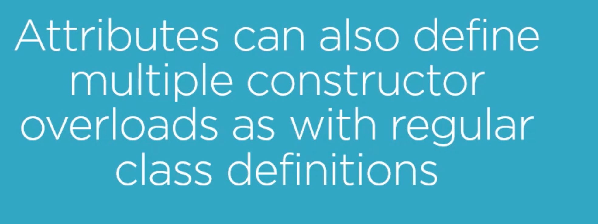

# 01 Les attributs en `C#`

Assembly = 1 fichier `.exe` ou `.dll` ensemble des types formant une unité et des ressources.

`dll` dynamic link library

Le reflexion permet d'obtenir des infos sur un assembly.

https://stackoverflow.com/questions/1362242/what-exactly-is-an-assembly-in-c-sharp-or-net

> Un `assembly` est la sortie compilée de votre code, généralement une `DLL`, mais votre `EXE` est également un `assembly`. C'est la plus petite unité de déploiement pour tout projet ` .NET`.
>
> `L'assembly` contient généralement du code `.NET` en `MSIL` (Microsoft Intermediate language) qui sera compilé en code natif ("JITted" - compilé par le compilateur Just-In-Time) la première fois qu'il sera exécuté sur une machine donnée. Ce code compilé sera également stocké dans `l'assembly` et réutilisé lors des appels ultérieurs.
>
> L'`assembly` peut également contenir des ressources telles que des icônes, des bitmaps, des tables de chaînes de caractères, etc. En outre, l'`assembly` contient également des métadonnées dans l'`assembly manifest` - des informations comme le numéro de version, le `strong name`, la culture, les `assembly` référencés, etc.
>
> Dans 99 % des cas, un `assembly` est égal à un fichier physique sur le disque.
>
> Traduit avec www.DeepL.com/Translator (version gratuite)

## Comprendre le `constructor` et les `Properties` des `attributes`

```csharp
[Display(42.5)]
[Display(42.5, 0.5)]
[Display(42.5, precision: 0.5)]
[Display(value: 42.5, precision: 0.5)]
[Display(42.5, 0.5, Prefix = "X")]
[Display(42.5, 0.5, Prefix = "X", Postfix = "Y")]
[Display(42.5, Postfix = "Y")]
```



Les `attributes` peuvent avoir plusieurs constructeur (surcharge) tout comme les classes.
