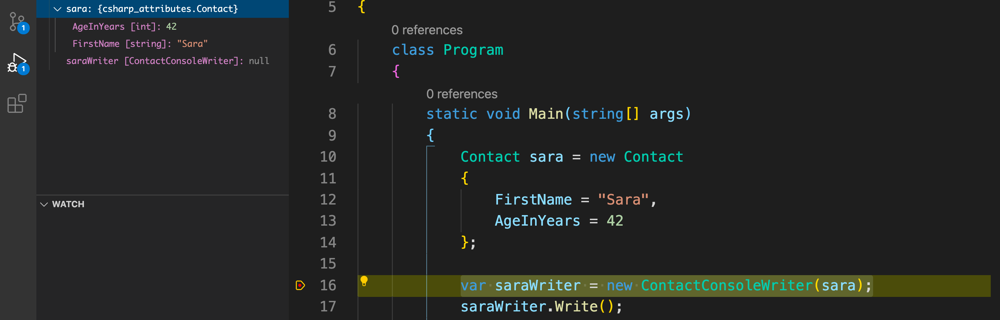
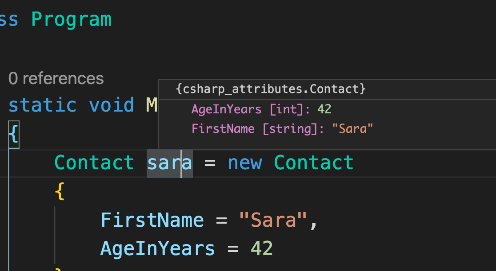
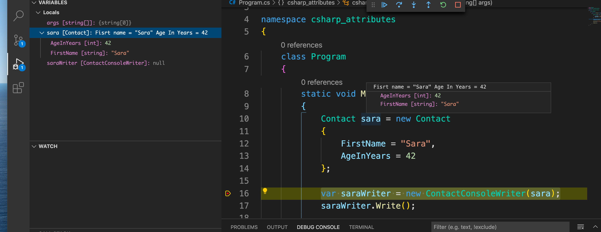
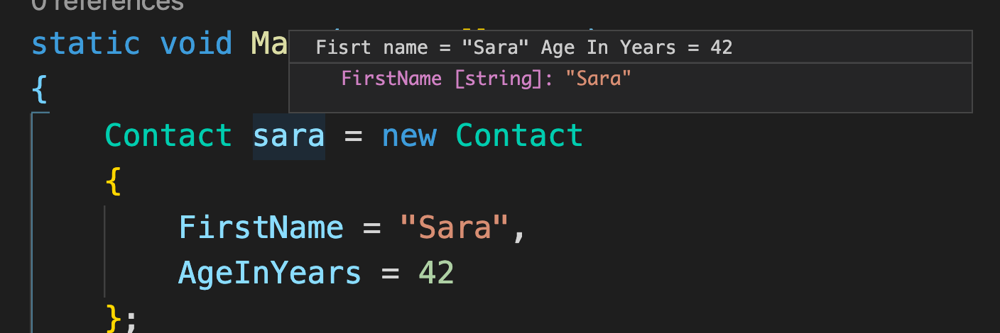
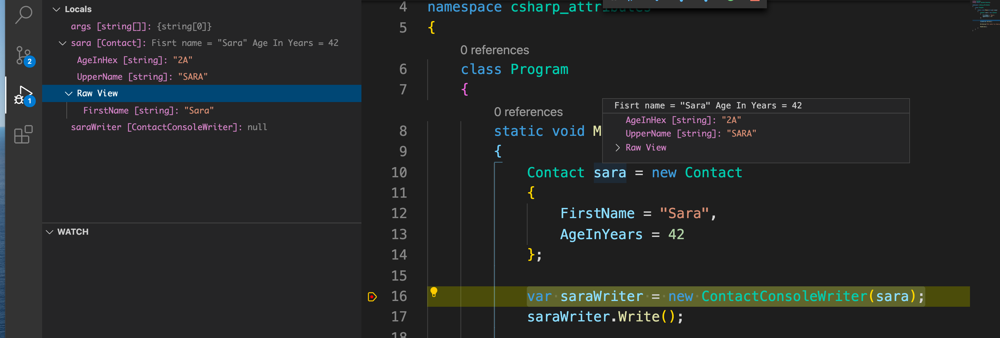

# 02. `Attributes` et Debug

## Debug `Attributes`

### Afficher des infos custom `[DebuggerDisplay("message")]`





On voit lors du Debug les métadonnées affichées au survol ou dans l'explorateur : `{csharp_attributes.Contact}`.

On va pouvoir personnaliser ces métadonnées.

Dans notre classe `Contact.cs` :

```csharp
using System.Diagnostics;

namespace csharp_attributes
{
    [DebuggerDisplay("Fisrt name = {FirstName} Age In Years = {AgeInYears}")]
    public class Contact
    {
        public string FirstName { get; set; }
        public int AgeInYears { get; set; }
    }
}
```



### Ne pas afficher la valeur d'une propriété dans le debugger

### `[DebuggerBrowsable(option)]`

```csharp
public class Contact
{
    public string FirstName { get; set; }

    [DebuggerBrowsable(DebuggerBrowsableState.Never)]
    public int AgeInYears { get; set; }
}
```



L'`AgeInYears` n'apparait plus dans la boîte de dialogue du `Debugger`.

### Utilisation d'un `proxy debug` : `[DebuggerTypeProxy(Type t)]`

On peut créer une classe qui va jouer le rôle d'un proxy de Debug, c'est à dire fournir des informations calculées sur la classe.

classe de `proxy` : `ContactDebugDisplay.cs`

```csharp
namespace csharp_attributes
{
    internal class ContactDebugDisplay
    {
        private readonly Contact _contact;

        public ContactDebugDisplay(Contact contact)
        {
            _contact = contact;
        }

        public string UpperName =>  _contact.FirstName.ToUpperInvariant();
        public string AgeInHex => _contact.AgeInYears.ToString("X");
    }
}
```

`ToString("X")` pour afficher la valeur décimal en `hexa`.

Dans `Contact.cs`

```csharp
using System.Diagnostics;

namespace csharp_attributes
{
    [DebuggerDisplay("Fisrt name = {FirstName} Age In Years = {AgeInYears}")]
    [DebuggerTypeProxy(typeof(ContactDebugDisplay))]
    public class Contact
    {
        public string FirstName { get; set; }

        [DebuggerBrowsable(DebuggerBrowsableState.Never)]
        public int AgeInYears { get; set; }
    }
}
```



On voit que nos infos issues du `Proxy` de Debug apparaissent bien.
