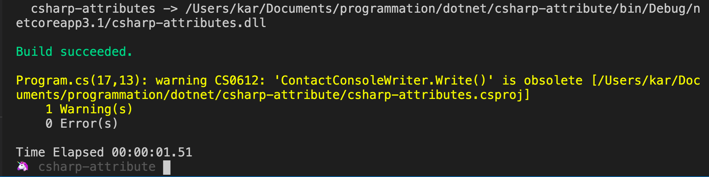
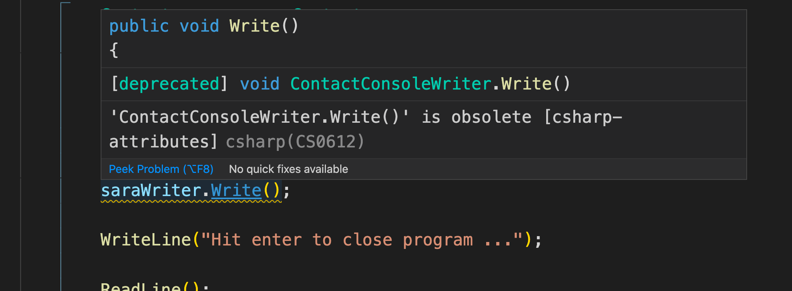
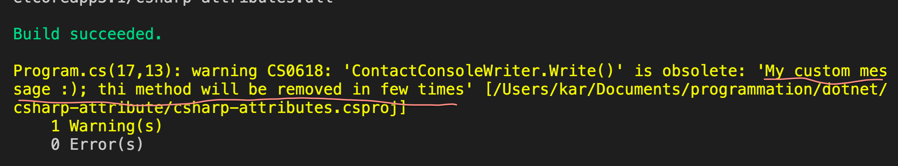
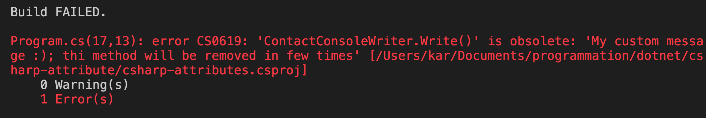
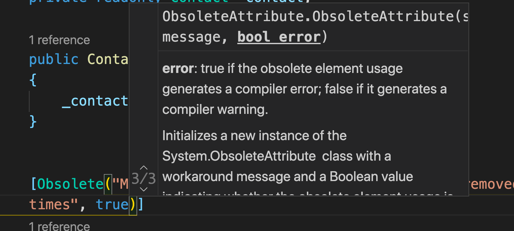

# 03 Marquer le code comme déprécié : `deprecated`

## `[Obsolete]`

Il faut ajouter `using System`.

```csharp
using System; // On a besoin de System
using static System.Console;

namespace csharp_attributes
{
    public class ContactConsoleWriter
    {
        // ...
        [Obsolete]
        public void Write()
        {
            WriteFirstName();

            WriteAge();
        }

       // ...
    }
}
```

Cela va générer un `warning` au `build` et un surlignage dans `VSCode`.

```bash
dotnet build
```





## `[Obsolete(message)]`

On peut ajouter un message :

```csharp
[Obsolete("My custom message :); thi method will be removed in few times")]
public void Write()
{
    WriteFirstName();

    WriteAge();
}
```



## `[Obsolete(message,error)]`

`error` est un booléen par défaut à `false`.

Si on le passe à `true`, une `error` sera générée à la place du `warning`.

```csharp
[Obsolete("My custom message :); thi method will be removed in few times", true)]
public void Write()
{
    WriteFirstName();

    WriteAge();
}
```



> #### Afficher les `overloads` : `shift` + `command` + `space`


