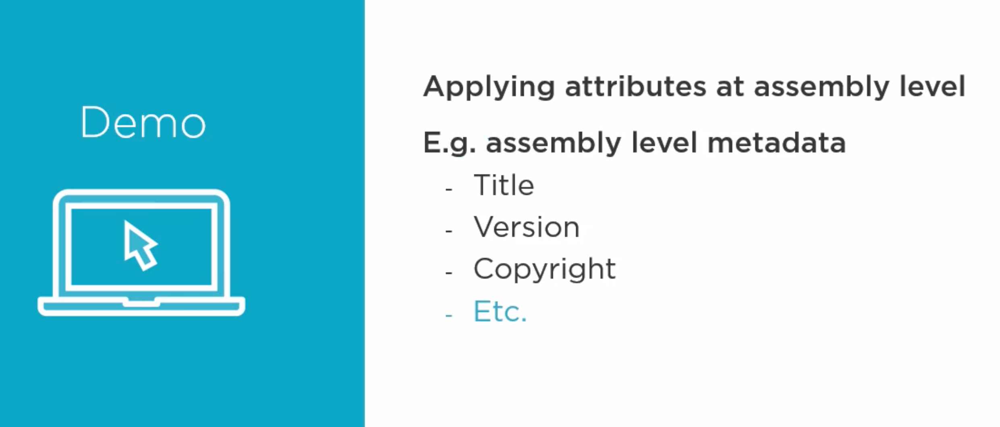
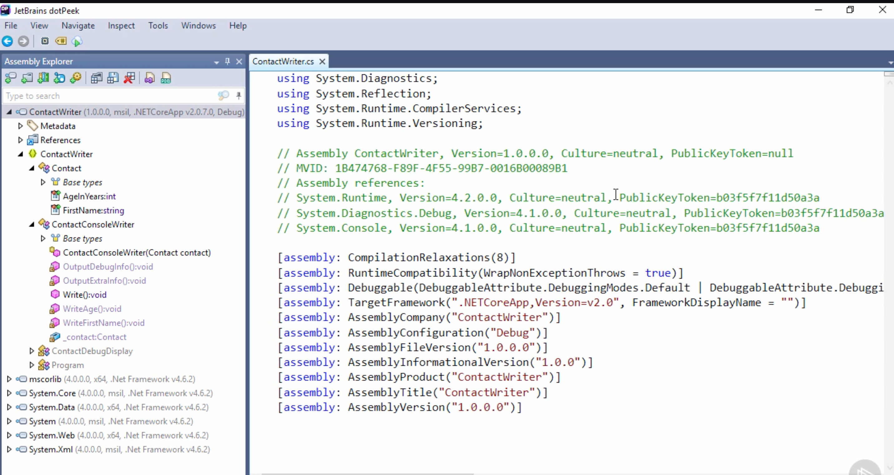
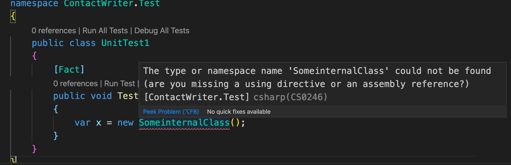
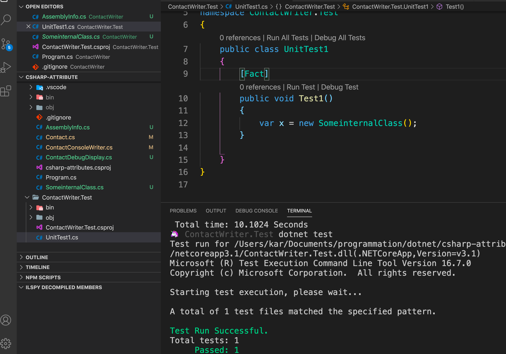

# 05. Au niveau d'un `assembly`



### `Assembly: keyword`

On utilise un dé-compilateur en `.net core` car le fichier de métadonnée n'est plus accessible.



Automatiquement le contenu de `project.csproj` est transformé en `assembly info` par le compilateur.

On peut créer ce fichier si on le désire :

`AssemblyInfo.cs`

```csharp
using System.Reflection;

[assembly: AssemblyCopyright("zzzzzzzzzzz")]
```

On retrouve ce fichier lorsque l'on `build` une `class library` :

`LibLinked/obj/Debug/netstandard2.0/LibLinked.AssemblyInfo.cs`

```csharp
//------------------------------------------------------------------------------
// <auto-generated>
//     This code was generated by a tool.
//
//     Changes to this file may cause incorrect behavior and will be lost if
//     the code is regenerated.
// </auto-generated>
//------------------------------------------------------------------------------

using System;
using System.Reflection;

[assembly: System.Reflection.AssemblyCompanyAttribute("LibLinked")]
[assembly: System.Reflection.AssemblyConfigurationAttribute("Debug")]
[assembly: System.Reflection.AssemblyFileVersionAttribute("1.0.0.0")]
[assembly: System.Reflection.AssemblyInformationalVersionAttribute("1.0.0")]
[assembly: System.Reflection.AssemblyProductAttribute("LibLinked")]
[assembly: System.Reflection.AssemblyTitleAttribute("LibLinked")]
[assembly: System.Reflection.AssemblyVersionAttribute("1.0.0.0")]

// Generated by the MSBuild WriteCodeFragment class.


```

## `InternalVisibleTo` : donner un accèsà la visibilité `internal`

`internal` seulement visible par le même `assembly`.

Cet `attribut` est utile pour des test et rends accessible des éléments notés `internal` à un autre `assembly`.

### Création d'un projet de test

```bash
🦄 csharp-attribute dotnet new xunit -n ContactWriter.Test
```

On crée dans notre projet principal une classe `internal` (seulement visible par son propre `assembly`).

erreur :

```bash
error CS0246: The type or namespace name 'Xunit' could not be found (are you missing a using directive or an assembly reference?)
```

> Solution : Il ne faut pas imbriquer les projets.
>
> À la place les deux projets doivent être séparés (côte à côte par exemple).

### Ajoute d'une référence vers le projet principal

```bash
🦄 ContactWriter.Test dotnet add reference /Users/kar/Documents/programmation/dotnet/csharp-attribute/ContactWriter/csharp-attributes.csproj
```

Ce qui donne dans ` ContactWriter.Test.csproj`

```csharp
<Project Sdk="Microsoft.NET.Sdk">

  <PropertyGroup>
    <TargetFramework>netcoreapp3.1</TargetFramework>

    <IsPackable>false</IsPackable>
  </PropertyGroup>

  <ItemGroup>
    <PackageReference Include="Microsoft.NET.Test.Sdk" Version="16.5.0" />
    <PackageReference Include="xunit" Version="2.4.0" />
    <PackageReference Include="xunit.runner.visualstudio" Version="2.4.0" />
    <PackageReference Include="coverlet.collector" Version="1.2.0" />
  </ItemGroup>

  <ItemGroup>
    <ProjectReference Include="..\ContactWriter\csharp-attributes.csproj" />
  </ItemGroup>

</Project>
```

### Dans la classe de test `UnitTest1.cs`

```csharp
using System;
using Xunit;
using csharp_attributes;

namespace ContactWriter.Test
{
    public class UnitTest1
    {
        [Fact]
        public void Test1()
        {
            var x = new SomeinternalClass();
        }
    }
}
```



### Rendre la classe `internal` accessible

Dans `ContactWriter/AssemblyInfo.cs`

```csharp
using System.Reflection;
using System.Runtime.CompilerServices;

[assembly: AssemblyCopyright("zzzzzzzzzzz")]
[assembly: InternalsVisibleTo("ContactWriter.Test")]
```



La classe `SomeinternalClass` est maintenant accessible et on peut lancer le test.
