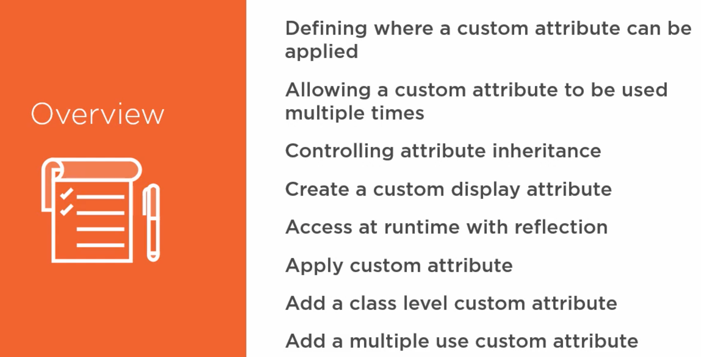
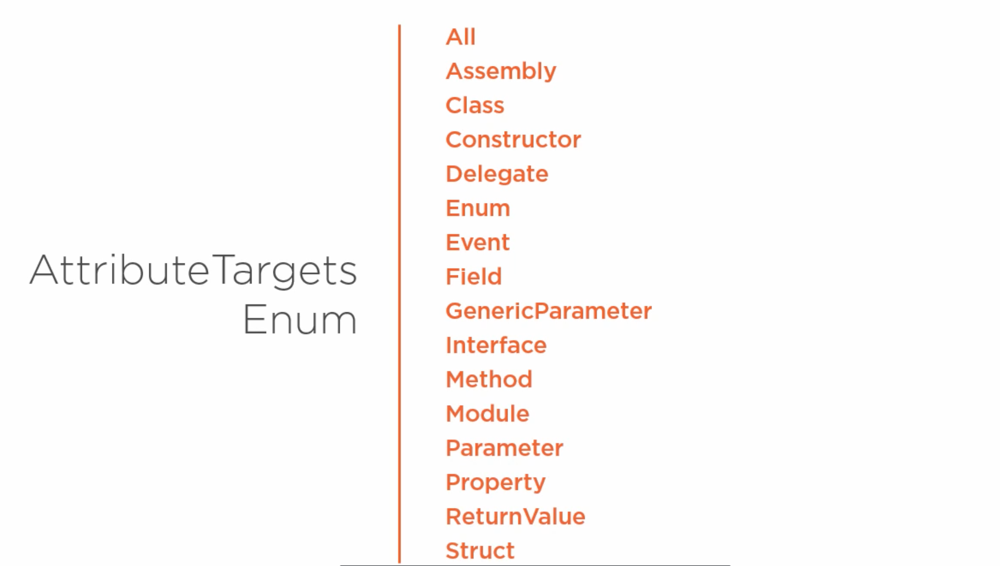
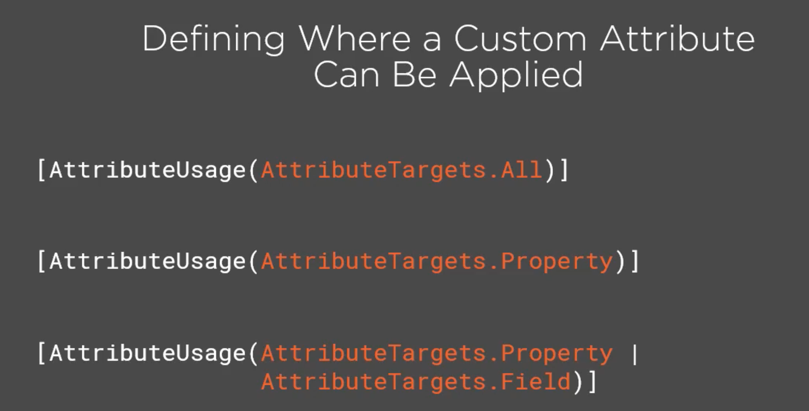
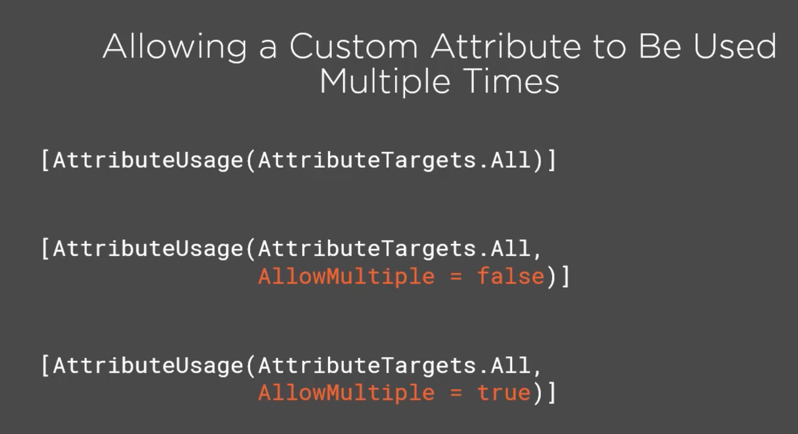
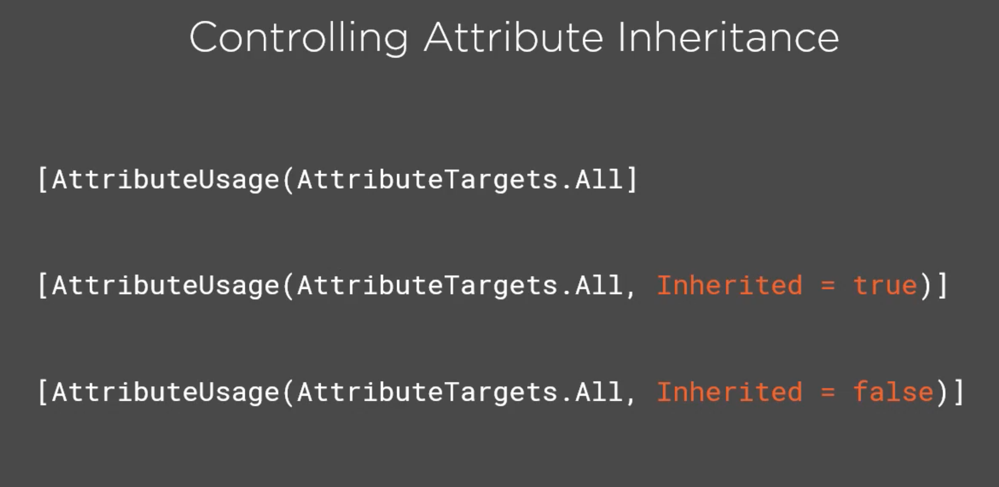

# 08. Créer ses propres `attributes`

## Sommaire



## Où un `custom attribute` peut être appliqué



Voici les éléments sur lesquels un `attribute` peut être appliqué.

### Cible `AttributeTargets.Property`



```csharp
[AttributeUsage(AttributeTargets.Target | AttributeTargets.OtherTarget)]
```

### Nombre d'utilisation `AllowMultiple = true`

Par défaut un `attribute` ne peux être utilisé qu'une fois par fichier de code.



Par défaut on a `[AttributeUsage(Target, AllowMultiple = false)]`.

Les deux premiers exemples sont donc équivalent.

### Héritage `inherited = false`



Les deux premiers exemple sont identiques (valeur par défaut).
