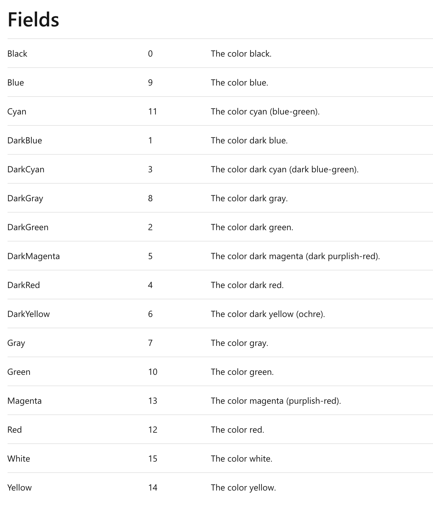
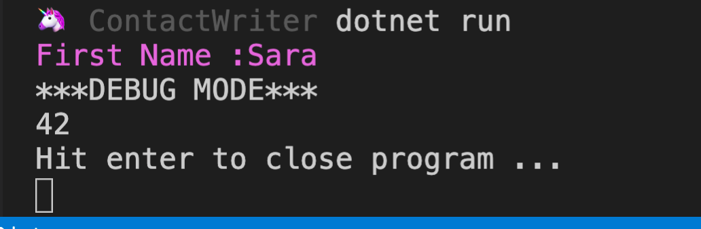
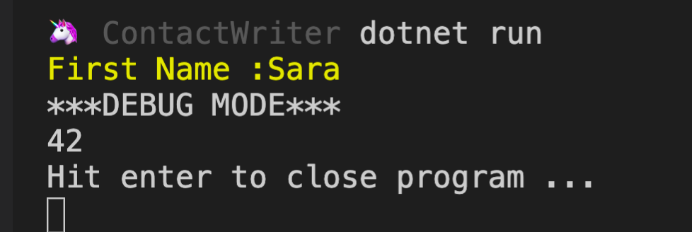

# 09. Implémentation d'un `property attribute`

## Création d'une classe `DisplayAttribute`

```csharp
using System;

namespace csharp_attributes
{
    [AttributeUsage(AttributeTargets.Property)]
    public class DisplayAttribute : Attribute
    {
       // public string Label { get; private set; }
		public string Label { get; }

        public ConsoleColor Color { get; }

        public DisplayAttribute(string label, ConsoleColor color = ConsoleColor.Magenta)
        {
            Label = label ?? throw new ArgumentNullException(nameof(label));
            Color = color;
        }
    }
}
```

On hérite de `Attribute (System.Attribute)`.

Utilisation de `[AttributeUsage(AttributeTargets.Property)]` pour spécifier que cet `attribute` n'est assignable qu'à une propriété.

## `nameof(var)`

renvoie le nom de la variable en `string`.

## null-coalescing operator `??` : opérateur de fusion null

> L’opérateur de fusion null `??` retourne la valeur de l’opérande de gauche si elle n’est pas `null` ; sinon, il évalue l’opérande de droite et retourne son résultat. L’opérateur `??` n’évalue pas son opérande droit si l’opérande gauche a la valeur non null.

## Propriété sans `setter`

On utilise une propriété sans `set;` et pourtant elle peut être assignée par le constructeur :

> Une `read-only property automatically-implemented` est convertie par le compilateur en un `read-only field` et un `read-only property`. Les attributions à la `property` dans le constructeur sont compilées comme des attributions au `field` sous-jacent.
>
> Donc votre code ici :
>
> ```cs
> public class GetOnlyProperty
> {
>     public string Thing { get; }
>
>     public GetOnlyProperty(string thing)
>     {
>         Thing = thing;
>     }
> }
> ```
>
> est compilé dans l'`IL` comme si vous aviez écrit :
>
> ```cs
> public class GetOnlyProperty
> {
>     private readonly string _thing;
>     public string Thing => _thing;
>
>     public GetOnlyProperty(string thing)
>     {
>         _thing = thing;
>     }
> }
> ```
>
> ... sauf que `_thing` reçoit en réalité un "`unspeakable name`" qui ne serait pas un identifiant C# valide.

Et sur les champs en `readonly`

> Dans une [déclaration de champ](https://docs.microsoft.com/fr-fr/dotnet/csharp/language-reference/keywords/readonly#readonly-field-example), `readonly` indique que l’assignation au champ peut uniquement se produire dans le cadre de la déclaration ou dans un constructeur de la même classe. Un champ en lecture seule peut être affecté et réaffecté plusieurs fois dans la déclaration de champ et le constructeur.

## Utilisation de la `reflection` pour recoder `WriteFirstName`

```csharp
using System;
using System.Diagnostics;
using System.Reflection;
using System.Text;
using static System.Console;

namespace csharp_attributes
{
    public class ContactConsoleWriter
    {
        private readonly Contact _contact;
        private ConsoleColor _color;

        // ...

        public void WriteFirstName()
        {
            PropertyInfo firstNameProperty = typeof(Contact).GetProperty(nameof(Contact.FirstName));

            DisplayAttribute firstNameDisplayAttribute = (DisplayAttribute)Attribute.GetCustomAttribute(firstNameProperty, typeof(DisplayAttribute));

            PreserveForgroundColor();

            StringBuilder sb = new StringBuilder();

            if(firstNameDisplayAttribute != null)
            {
                ForegroundColor = firstNameDisplayAttribute.Color;
                sb.Append(firstNameDisplayAttribute.Label);
            }

            if(_contact.FirstName != null)
            {
                sb.Append(_contact.FirstName);
            }

            WriteLine(sb);

            RestoreForegroundColor();
        }

       // ...

        private void PreserveForgroundColor()
        {
            _color = ForegroundColor;
        }

        private void RestoreForegroundColor()
        {
            ForegroundColor = _color;
        }
    }
}
```

### `Console.ForegroundColor`

Couleur de premier plan de la `Console`.

Valeur : `ConsoleColor`.

> # ConsoleColor Enum
>
> - Namespace:
>
>   [System](https://docs.microsoft.com/en-us/dotnet/api/system?view=netcore-3.1)
>
> Specifies constants that define foreground and background colors for the console.
>
> 

### `StringBuilder`

Namespace : `System.Text`

Représente une chaîne de caractères modifiable (mutable).

## Utilisation dans la classe `Contact`

```csharp
using System.Diagnostics;

namespace csharp_attributes
{
    [DebuggerDisplay("Fisrt name = {FirstName} Age In Years = {AgeInYears}")]
    [DebuggerTypeProxy(typeof(ContactDebugDisplay))]
    public class Contact
    {
        [Display("First Name :")]
        public string FirstName { get; set; }

        [DebuggerBrowsable(DebuggerBrowsableState.Never)]
        public int AgeInYears { get; set; }
    }
}
```

Résultat :



On a bien le `Label` affiché avant le prénom et le tout est `Magenta` la couleur par défaut.

On peut spécifier la couleur :

```csharp
[Display("First Name :", System.ConsoleColor.DarkYellow)]
public string FirstName { get; set; }
```


