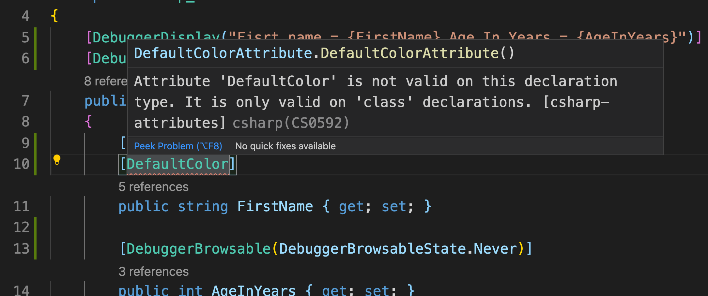

# 10. custom `class attribute`

## Création de l'`attribute` pour une class

`ColorDefaultAttribute.cs`

```csharp
using System;

namespace csharp_attributes

{

    [AttributeUsage(AttributeTargets.Class)]
    public class DefaultColorAttribute : Attribute
    {
        public ConsoleColor Color { get; set; } = ConsoleColor.Yellow;
    }
}
```



Si on essaye de le mettre sur une `property` on obtient un message d'erreur.

On l'applique donc sur la classe `Contact` :

```csharp
[DebuggerDisplay("Fisrt name = {FirstName} Age In Years = {AgeInYears}")]
[DebuggerTypeProxy(typeof(ContactDebugDisplay))]
[DefaultColor]
public class Contact
{
```

## Utilisation de l'`attribute` dans la classe `ContactConsoleWriter.cs`

```csharp
public void Write()
{
    UseDefaultColor();

    WriteFirstName();

    WriteAge();
}

private void UseDefaultColor()
{
    DefaultColorAttribute defaultColorAttribute = (DefaultColorAttribute)Attribute.GetCustomAttribute(typeof(Contact), typeof(DefaultColorAttribute));

    if(defaultColorAttribute != null)
    {
        ForegroundColor = defaultColorAttribute.Color;
    }
}
```

### `Attribute.GetCustomAttribute(<ElementType>, <AttibuteType>)`

On récupère les attributs pour un type d'élément ici `Contact` et pour un type d'attribut `DefaultColorAttribute`.

Résultat :


On a bien le first name en `Cyan` et le texte en `Yellow`.

## Spécifier une Propriété d'`attribute`

```csharp
[DefaultColor(Color = System.ConsoleColor.Magenta)]
public class Contact
{
```


