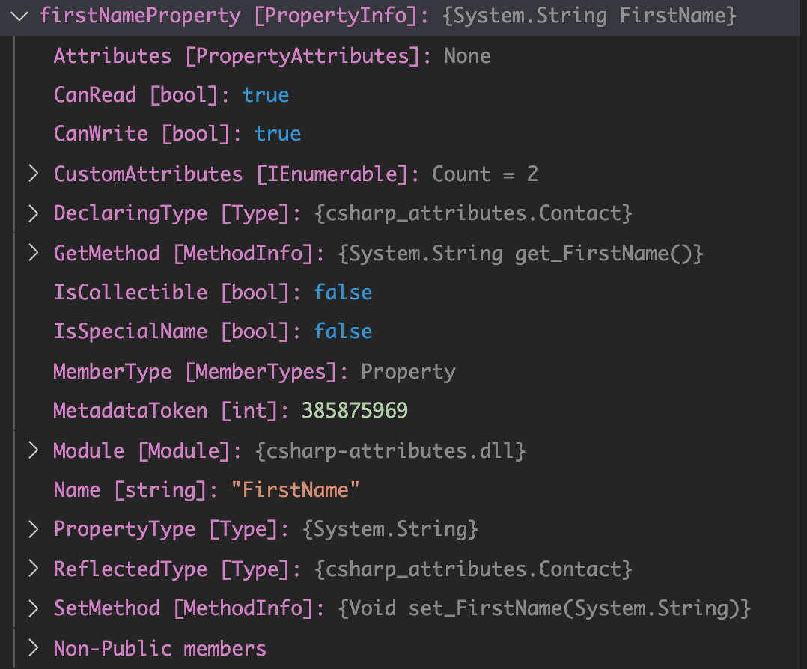

# 11. Création d'un attribut à usage multiple


## Création de la classe `IndentAttribute`

```csharp
using System;

namespace csharp_attributes
{
    [AttributeUsage(AttributeTargets.Property, AllowMultiple = true)]
    public class IndentAttribute : Attribute {}
}
```

## Modification de `WriteFirstName` dans la. classe `ContactConsoleWriter.cs`

```csharp
public void WriteFirstName()
{
    PropertyInfo firstNameProperty = typeof(Contact).GetProperty(nameof(Contact.FirstName));
	// ...

    IndentAttribute[] indentAttributes = (IndentAttribute[])Attribute.GetCustomAttributes(firstNameProperty, typeof(IndentAttribute));

    PreserveForgroundColor();

    StringBuilder sb = new StringBuilder();

    if(indentAttributes != null)
    {
        foreach(var a in indentAttributes)
        {
            sb.Append(new String(' ', 4));
        }
    }
    // ...
```

### Reflection

On récupère un `PropertyInfo` pour le `FirstName` :



Comme l'`attribute` peut être multiple, on, utilise `Attribute.GetCustomAttributes` avec un `s`.

Cette méthode renvoie un tableau de `CustomAttribute`.

## Dans la class `Contact.cs`

```csharp
 public class Contact
 {
     [Display("First Name :", System.ConsoleColor.Cyan)]
     [Indent]
     public string FirstName { get; set; }

     [DebuggerBrowsable(DebuggerBrowsableState.Never)]
     public int AgeInYears { get; set; }
 }
```


Si je mets l'`attribute` deux fois :

```csharp
[Display("First Name :", System.ConsoleColor.Cyan)]
[Indent]
[Indent]
public string FirstName { get; set; }
```

J'obtiens deux indentation :


