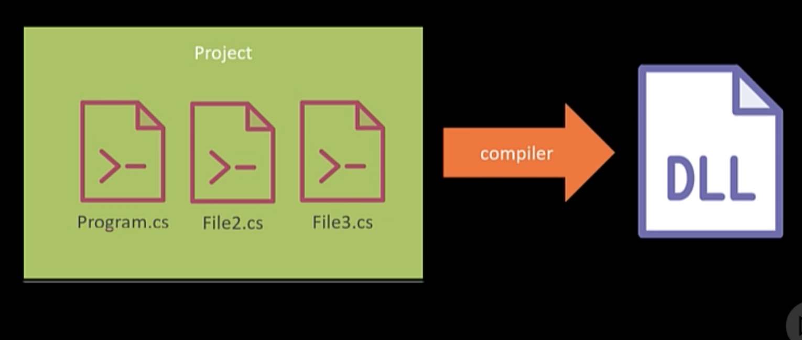
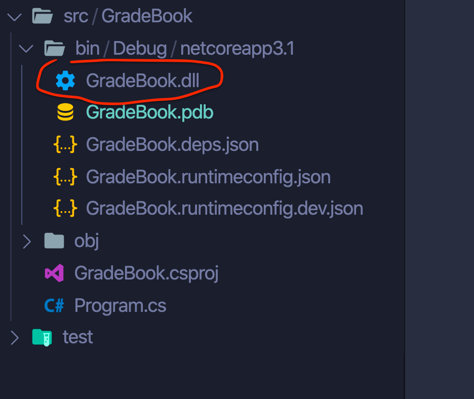
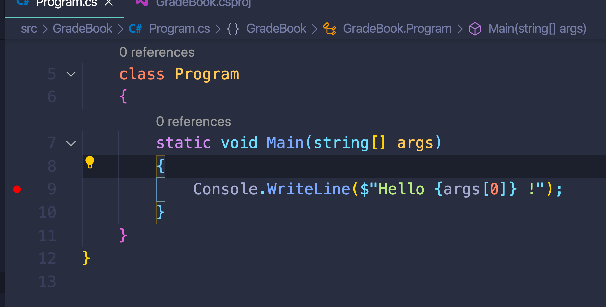
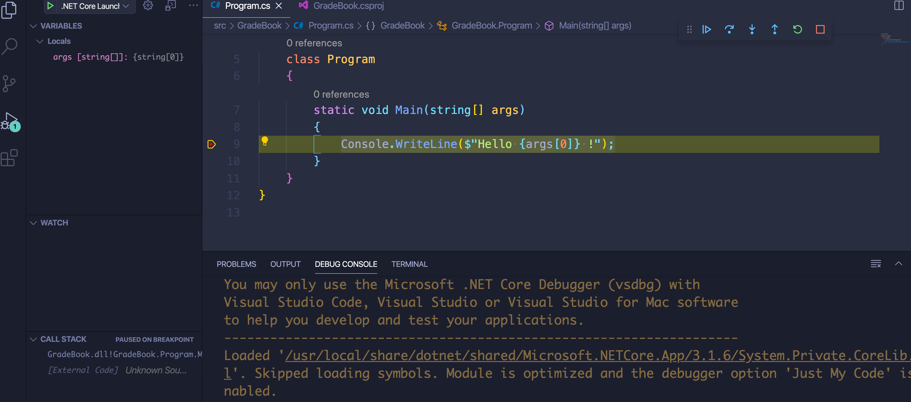
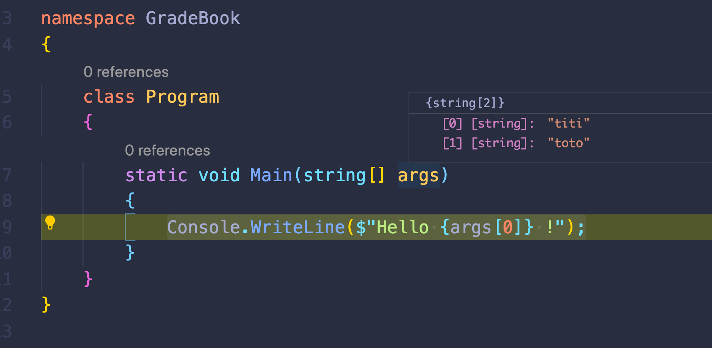

# 01 Introduction


Un `runtime` est un logiciel qui exécute le code, ici `c#`.

`SDK` : Software Development Kit.

`CLI` : Command Line Interface.

## Dotnet `CLI`

### `dotnet --info`

```bash
🦄 ~ dotnet --info
.NET Core SDK (reflecting any global.json):
 Version:   3.1.302
 Commit:    41faccf259

Runtime Environment:
 OS Name:     Mac OS X
 OS Version:  10.15
 OS Platform: Darwin
 RID:         osx.10.15-x64
 Base Path:   /usr/local/share/dotnet/sdk/3.1.302/

Host (useful for support):
  Version: 3.1.6
  Commit:  3acd9b0cd1

.NET Core SDKs installed:
  # ...
  3.0.100 [/usr/local/share/dotnet/sdk]
  3.1.301 [/usr/local/share/dotnet/sdk]
  3.1.302 [/usr/local/share/dotnet/sdk]

.NET Core runtimes installed:
  # ...
  Microsoft.NETCore.App 3.0.0 [/usr/local/share/dotnet/shared/Microsoft.NETCore.App]
  Microsoft.NETCore.App 3.1.5 [/usr/local/share/dotnet/shared/Microsoft.NETCore.App]
  Microsoft.NETCore.App 3.1.6 [/usr/local/share/dotnet/shared/Microsoft.NETCore.App]

To install additional .NET Core runtimes or SDKs:
  https://aka.ms/dotnet-download
```

On peut voire que les versions du SDK et du runtime sont différentes.

### `dotnet -h`

### `dornet new`

```bash
🦄 ~ dotnet nuget add -h


Usage: dotnet nuget add [options] [command]

Options:
  -h|--help  Show help information

Commands:
  source  Add a NuGet source.

Use "add [command] --help" for more information about a command.
```

On peut avoir grace à `-h` plus de détails à différents niveaux :

```bash
🦄 ~ dotnet -h
# ...

🦄 ~ dotnet nuget -h
# ...

🦄 ~ dotnet nuget add -h
# ...
```

```bash
dotnet new -h
Usage: new [options]

Options:
  -h, --help          Displays help for this command.
  -l, --list          Lists templates containing the specified name. If no name is specified, lists all templates.
  -n, --name          The name for the output being created. If no name is specified, the name of the current directory is used.
  -o, --output        Location to place the generated output.
  -i, --install       Installs a source or a template pack.
  -u, --uninstall     Uninstalls a source or a template pack.
  --nuget-source      Specifies a NuGet source to use during install.
  --type              Filters templates based on available types. Predefined values are "project", "item" or "other".
  --dry-run           Displays a summary of what would happen if the given command line were run if it would result in a template creation.
  --force             Forces content to be generated even if it would change existing files.
  -lang, --language   Filters templates based on language and specifies the language of the template to create.
  --update-check      Check the currently installed template packs for updates.
  --update-apply      Check the currently installed template packs for update, and install the updates.


Templates                                         Short Name               Language          Tags
----------------------------------------------------------------------------------------------------------------------------------
Console Application                               console                  [C#], F#, VB      Common/Console
Class library                                     classlib                 [C#], F#, VB      Common/Library
WPF Application                                   wpf                      [C#]              Common/WPF
WPF Class library                                 wpflib                   [C#]              Common/WPF
WPF Custom Control Library                        wpfcustomcontrollib      [C#]              Common/WPF
WPF User Control Library                          wpfusercontrollib        [C#]              Common/WPF
Windows Forms (WinForms) Application              winforms                 [C#]              Common/WinForms
Windows Forms (WinForms) Class library            winformslib              [C#]              Common/WinForms
Worker Service                                    worker                   [C#]              Common/Worker/Web
Unit Test Project                                 mstest                   [C#], F#, VB      Test/MSTest
NUnit 3 Test Project                              nunit                    [C#], F#, VB      Test/NUnit
NUnit 3 Test Item                                 nunit-test               [C#], F#, VB      Test/NUnit
xUnit Test Project                                xunit                    [C#], F#, VB      Test/xUnit
Razor Component                                   razorcomponent           [C#]              Web/ASP.NET
Razor Page                                        page                     [C#]              Web/ASP.NET
MVC ViewImports                                   viewimports              [C#]              Web/ASP.NET
MVC ViewStart                                     viewstart                [C#]              Web/ASP.NET
Blazor Server App                                 blazorserver             [C#]              Web/Blazor
Blazor WebAssembly App                            blazorwasm               [C#]              Web/Blazor/WebAssembly
ASP.NET Core Empty                                web                      [C#], F#          Web/Empty
ASP.NET Core Web App (Model-View-Controller)      mvc                      [C#], F#          Web/MVC
ASP.NET Core Web App                              webapp                   [C#]              Web/MVC/Razor Pages
ASP.NET Core with Angular                         angular                  [C#]              Web/MVC/SPA
ASP.NET Core with React.js                        react                    [C#]              Web/MVC/SPA
ASP.NET Core with React.js and Redux              reactredux               [C#]              Web/MVC/SPA
Razor Class Library                               razorclasslib            [C#]              Web/Razor/Library/Razor Class Library
ASP.NET Core Web API                              webapi                   [C#], F#          Web/WebAPI
ASP.NET Core gRPC Service                         grpc                     [C#]              Web/gRPC
dotnet gitignore file                             gitignore                                  Config
global.json file                                  globaljson                                 Config
NuGet Config                                      nugetconfig                                Config
Dotnet local tool manifest file                   tool-manifest                              Config
Web Config                                        webconfig                                  Config
Solution File                                     sln                                        Solution
Protocol Buffer File                              proto                                      Web/gRPC

Examples:
    dotnet new mvc --auth Individual
    dotnet new nunit-test
    dotnet new --help
```

## créer un projet `console`

```bash
🦄 GradeBook dotnet new console
The template "Console Application" was created successfully.

Processing post-creation actions...
Running 'dotnet restore' on /Users/kar/Documents/programmation/dotnet/csharp-fundamental/gradebook/src/GradeBook/GradeBook.csproj...
  Determining projects to restore...
  Restored /Users/kar/Documents/programmation/dotnet/csharp-fundamental/gradebook/src/GradeBook/GradeBook.csproj (in 125 ms).

Restore succeeded.

🦄 GradeBook ls
GradeBook.csproj        Program.cs              obj
```

L'exécuter : `dotnet run`

```bash
🦄 GradeBook dotnet run
Hello World!
```

## Premier programme

`Program.cs`

```cs
using System;

namespace GradeBook
{
    class Program
    {
        static void Main(string[] args)
        {
            var name = "hukar";
            Console.WriteLine($"Hello {name}!");
        }
    }
}
```

```bash
🦄 gradebook dotnet run --project src/GradeBook/
Hello hukar!
```

### `dotnet run --project <path>`

## Que fait `dotnet run`

### 1 `dotnet restore`

`NuGet` et le `package manager` de `dotnet`.

Les dépendances sont référencées dans `GradeBook.csproj`.

En premier lieu `dotnet run` va restaurer les dépendances.

```bash
🦄 GradeBook dotnet restore
  Determining projects to restore...
  All projects are up-to-date for restore.
```

### 2 `dotnet build`

Les fichiers de code sont compilés en un unique fichier :





`GradeBook.dll`

`dll` : Dynamic Link Library (historique)

En .net core on appelle ce genre de fichier des `assembly`.

### Un `assembly` est le résultat d'un `dotnet build`.

```bash
🦄 GradeBook dotnet build
Microsoft (R) Build Engine version 16.6.0+5ff7b0c9e for .NET Core
Copyright (C) Microsoft Corporation. All rights reserved.

  Determining projects to restore...
  All projects are up-to-date for restore.
  GradeBook -> /Users/kar/Documents/programmation/dotnet/csharp-fundamental/gradebook/src/GradeBook/bin/Debug/netcoreapp3.1/GradeBook.dll

Build succeeded.
    0 Warning(s)
    0 Error(s)

Time Elapsed 00:00:01.01
```

On voit que `dotnet build` exécute un `dotnet restore` aussi.

Le dossier `obj` est un dossier stockant des fichiers temporaires utiles au `build`.

Les dossiers `bin` et `obj` peuvent être effacés, seul le fichier `Program.cs` est important.

Un `assembly` peut être exécuter par le `runtime dotnet` tout comme `node` peut exécuter un fichier `*.js` :

```bash
🦄 GradeBook dotnet bin/Debug/netcoreapp3.1/GradeBook.dll
Hello hukar!
```

### `dotnet <path>/MyFile.dll`

## Paramètre en ligne de commande

Le tableau `args` passé à la fonction `Main` contient les paramètres passés au programme.

```cs
using System;

namespace GradeBook
{
    class Program
    {
        static void Main(string[] args)
        {
            Console.WriteLine($"Hello {args[0]} !");
        }
    }
}
```

```bash
🦄 GradeBook dotnet run Milou
Hello Milou !
```

On doit utiliser `--` pour séparer sémantiquement les paramètres du programme de ceux de la commande `dotnet` :

```bash
🦄 GradeBook dotnet run -- Milou
Hello Milou !
```

Pour plus de sécurité si on n'a pas d'arguments :

```cs
        static void Main(string[] args)
        {
            Console.WriteLine($"Hello {(args.Length > 0 ? args[0] : "unknow") } !");
        }
```

On doit mettre des parenthèse dans un `interpolate string` pour utiliser une expression conditionnelle.

`.Length` renvoie le nombre d'éléments d'un tableau.

## Debugging

```bash
🦄 GradeBook dotnet run
Unhandled exception. System.IndexOutOfRangeException: Index was outside the bounds of the array.
   at GradeBook.Program.Main(String[] args) in /Users/kar/Documents/programmation/dotnet/csharp-fundamental/gradebook/src/GradeBook/Program.cs:line 9
```

Je vois que j'ai une erreur en ligne 9.

Je met un point d'arrêt (`breakpoint`) :





On peut voire la valeur de `args` : c'est un tableau de taille 0 `string[0]`.

### passer des arguments au Debugger

Dans le fichier `.vscode/lauch.json` on peut spécifier le contenu de `args` :

```json
{
  // Use IntelliSense to find out which attributes exist for C# debugging
  // Use hover for the description of the existing attributes
  // For further information visit https://github.com/OmniSharp/omnisharp-vscode/blob/master/debugger-launchjson.md
  "version": "0.2.0",
  "configurations": [
    {
      "name": ".NET Core Launch (console)",
      "type": "coreclr",
      "request": "launch",
      "preLaunchTask": "build",
      // If you have changed target frameworks, make sure to update the program path.
      "program": "${workspaceFolder}/src/GradeBook/bin/Debug/netcoreapp3.1/GradeBook.dll",
      "args": ["titi", "toto"],
      "cwd": "${workspaceFolder}/src/GradeBook",
      // For more information about the 'console' field, see https://aka.ms/VSCode-CS-LaunchJson-Console
      "console": "internalConsole",
      "stopAtEntry": false
    },
    {
      "name": ".NET Core Attach",
      "type": "coreclr",
      "request": "attach",
      "processId": "${command:pickProcess}"
    }
  ]
}
```



On voit que le Debugger a chargé mes valeurs.
