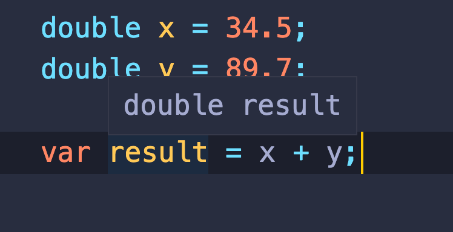

# 02 la syntaxe

`statement` : en c# veut dire instruction.

## Implicit typing : `var`

On peut typer de manière implicite si la déclaration et l'assignation sont fait sur la m^me ligne.

```cs
var x;

x = 2.1;
```

```
Implicitly-typed variables must be initialized
```

```cs
var x = 2.1 + 45.7;

Console.WriteLine(x);
```

```bash
47.800000000000004
```



Au survol `VSCode` nous indique le type de la variable déclarée avec `var`.

## Déclaration et initialisation d'un tableau

```cs
double[] numbers = new double[3];

numbers[0] = 4.56;
```

On peut aussi utiliser le typage implicite `var` :

```cs
var numbers = new double[3];
```

## Array initialisation syntax

```cs
// plutot que d'écrire ça :
var numbers = new double[3];

numbers[0] = 12.7;
numbers[1] = 8.1;
numbers[2] = 7.45;

// on va écrire cela :
double[] numbers = new double[3] { 12.7, 8.1, 7.45 };

// le compilateur peut déduire le nombre d'éléments du tableau on écrit :
double[] numbers = new double[] { 12.7, 8.1, 7.45, 2.6 };
```

Le compilateur pouvant aussi induire le type on peut encore simplifier l'écriture :

```cs
var numbers = new [] { 12.7, 8.1, 7.45, 2.6 };
```

## Les listes

### Namespace

Pour différencier les classes de même nom et éviter les collisions, on utilise les `namespaces`.

```cs
using System;

// ...

Console.WriteLine(something);
```

`using System` permet d'aller rechercher les classes dans le `namespace` `system`.

On pourrait juste écrire :

```cs
System.Console.WriteLine(something);
```

sans utiliser le `using` en début de fichier :

```cs
namespace GradeBook
{
    class Program
    {
        static void Main(string[] args)
        {
			var result = 0.0;

            System.Console.WriteLine(result);
        }
    }
}
```

### `System.Collections.Generic`

`List` se trouve dans le `namespace` `System.Collections.Generic`.

En effectuant `cmd` + click sur `List` on accède à son code :

```cs
namespace System.Collections.Generic
{
    //
    // Summary:
    //     Represents a strongly typed list of objects that can be accessed by index. Provides
    //     methods to search, sort, and manipulate lists.
    //
    // Type parameters:
    //   T:
    //     The type of elements in the list.
    [DefaultMember("Item")]
    public class List<T> : ICollection<T>, IEnumerable<T>, IEnumerable, IList<T>, IReadOnlyCollection<T>, IReadOnlyList<T>, ICollection, IList
    {
        //
        // Summary:
        //     Initializes a new instance of the System.Collections.Generic.List`1 class that
        //     is empty and has the default initial capacity.
        public List();
        //
        // Summary:
        //     Initializes a new instance of the System.Collections.Generic.List`1 class that
        //     contains elements copied from the specified collection and has sufficient capacity
        //     to accommodate the number of elements copied.
        // ...
```

On voit le nom explicite du `namespace` en haut puis suit le code de la classe `List`.

```cs
using System;
using System.Collections.Generic;

namespace GradeBook
{
    class Program
    {
        static void Main(string[] args)
        {
            List<double> grades = new List<double>();
			// ...
```

On peut aussi utiliser le mot `var` :

```cs
var grades = new List<double>();
```

L'utilisation des `()` montre qu'on invoque une méthode : le constructeur.

### Liste d'initialisation

```cs
var grades = new List<double>() { 12.7, 8.1, 7.45, 2.6 };
```

### Ajouter un élément `Add`

```cs
grades.Add(4.5);
```

### Accéder à un élément `[]`

```cs
Console.WriteLine(grades[0]);
```

### Itérer sur une `List` : `foreach in`

```cs
foreach(var number in grades) {
    result += number;
}
```

### Le nombre d'éléments `Count`

```cs
Console.WriteLine(result/ grades.Count);
```

## Texte formatée

On peut formater le texte d'un `interpolation string` :

```cs
Console.WriteLine($"Your grade average is {result} _<(<)/°=");
```

```bash
Your grade average is 15.5474 _<(<)/°=
```

```cs
Console.WriteLine($"Your grade average is {result:N1} _<(<)/°=");
```

```bash
Your grade average is 15.5 _<(<)/°=
```

## Code complet

```cs
using System;
using System.Collections.Generic;

namespace GradeBook
{
    class Program
    {
        static void Main(string[] args)
        {
            var grades = new List<double>() { 12.7, 8.19, 7.456, 2.6 };
            grades.Add(46.791);
            var result = 0.0;

            foreach(var number in grades) {
                result += number;
            }

            result /= grades.Count;
            Console.WriteLine($"Your grade average is {result:N1} _<(<)/°=");

        }
    }
}
```
