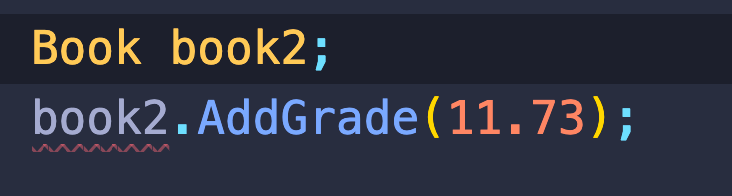

# 03 Classes et Objets

## Type = Class

Une `class` permet d'encapsuler la complexité.

> ### Global Namespace
>
> Il existe un `namespace` global, mais il ne faut pas l'utiliser, il est **dangereux**!
>
> À la place il faut bien préciser son `namespace`.

## Convention

On peut déclarer plusieurs classes dans un seul fichier, mais les conventions veulent que l'on ne déclare qu'une classe par fichier.

## Créer une classe

Dans un fichier `Book.cs` :

```cs
namespace GradeBook
{
    class Book
    {

    }
}
```

Dans `Program.cs` :

```cs
var book = new Book();
```

### Ajouter une méthode

```cs
class Book
{
    public void AddGrade(double grade)
    {

    }
}
```

### Ajouter un `state`

Création de champs (`fields`).

```cs
public void AddGrade(double grade)
{

}

List<double> grades;
```

On ne peut pas utiliser le typage implicite avec `var` pour un champs.

```cs
var grades = new List<double>() {1.9};
```

On a une erreur :

```bash
The contextual keyword 'var' may only appear within a local variable declaration or in script code
```

### Erreur célèbre

```bash
Unhandled exception. System.NullReferenceException: Object reference not set to an instance of an object.
```

Dans `Program.cs` :

```cs
static void Main(string[] args)
        {
            var book = new Book();
            book.AddGrade(56.8);
```

On essaye d'ajouter un élément à une liste qui n'est pas encore initialisée.

### Valeur `null`



```bash
🦄 GradeBook dotnet run
Program.cs(15,13): error CS0165: Use of unassigned local variable 'book2' [/Users/kar/Documents/programmation/dotnet/csharp-fundamental/gradebook/src/GradeBook/GradeBook.csproj]

The build failed. Fix the build errors and run again.
```

Ici on a une erreur à la compilation.


Avec la valeur spécial `null`, le programme compile mais on a une erreur à l'exécution :

```bash
🦄 GradeBook dotnet run
Unhandled exception. System.NullReferenceException: Object reference not set to an instance of an object.
   at GradeBook.Program.Main(String[] args) in /Users/kar/Documents/programmation/dotnet/csharp-fundamental/gradebook/src/GradeBook/Program.cs:line 15
```

### Initialisation du champs `List`

Deux façon de faire :

Sans le constructeur

```cs
class Book
{
    public void AddGrade(double grade)
    {
        grades.Add(grade);
    }

    List<double> grades = new List<double>();
}
```

Avec un constructeur

```cs
class Book
{
    public Book()
    {
        grades = new List<double>();
    }

    public void AddGrade(double grade)
    {
        grades.Add(grade);
    }

    List<double> grades;
}
```

Le constructeur

- n'a pas de type de retour
- porte le même nom que la classe

## Accès aux champs

Si on tape ce code :

```cs
book.grades.Add(0.99);
```

```bash
'Book.grades' is inaccessible due to its protection level
```

Par défaut les champs sont encapsulés dans la classe, on ne peut pas directement y avoir accès.

L'encapsulation cache la complexité et les détails.

### Access modifier

#### `public`

Les méthodes et les champs peuvent être public :

```cs
class Book
{
    public Book()
    {
        grades = new List<double>();
    }

    public void AddGrade(double grade)
    {
        grades.Add(grade);
    }

    public List<double> grades;
}
```

Du coup on peut écrire :

```cs
book.grades.Add(0.99);
```

#### `private`

Le code est disponible seulement à l'intérieur de sa classe.

```cs
private List<double> grades;
```

## le mot clé `this`

Si il y a une

possible confusion entre le nom d'un champ et celui d'un paramètre, on peut utiliser le mot `this` pour lever cette ambiguïté.

```cs
class Book
    {
        public Book(string name)
        {
            grades = new List<double>();
            this.name = name;
        }

    	// ...

        private string name;
    }
```

## `static`

Sans le mot `static `, les méthodes et les champs appartiennent à l'instance.

Une méthode `static` n'est disponible que pour la classe :

```cs
// Dans la classe Book.cs

static public void AddGrade(double grade)
{
    grades.Add(grade);
}
```

```cs
// dans Program.cs

Book.AddGrade(5.78);
```

### exemple

#### `Console.WriteLine`

```cs
Console.WriteLine("I'm static method");
```

#### `double.MinValue`

`MinValue` est un champs statique de la classe `double`.

```cs
var maxGrade = double.MinValue;

foreach (var number in grades)
{
    if(number > maxGrade) {
        maxGrade = number;
    }
}

Console.WriteLine($"The highest grade is {maxGrade:N2} <(°-°)>");
```

```bash
The highest grade is 46.79 <(°-°)>
```
