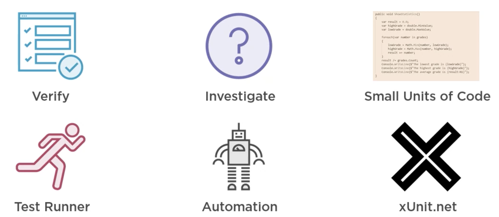
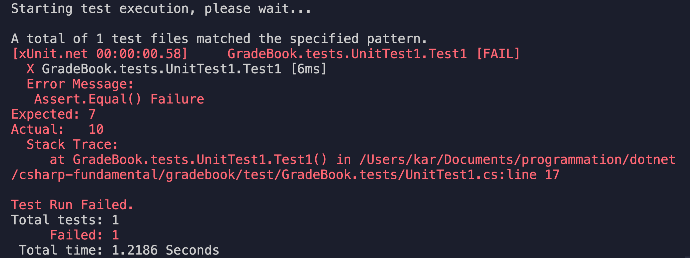

# 04 testing

## Unit test



Utilisation du framework de test `xUnit.net`.

## Création d'un projet de test

En `.net` la convention veut que les test soit dans un dossier séparé et face l'objet d'un projet propre.

```bash
🦄 gradebook cd test
🦄 test mkdir GradeBook.tests
🦄 test cd GradeBook.tests/

🦄 GradeBook.tests dotnet new xunit

The template "xUnit Test Project" was created successfully.
```

On crée un dossier `MonProjet.tests` par convention.

`xunit` ne fait pas partie de `.net core`, il faut le télécharger via `NuGet`.

`GradeBook.tests.csproj`

```cs
<Project Sdk="Microsoft.NET.Sdk">

  <PropertyGroup>
    <TargetFramework>netcoreapp3.1</TargetFramework>

    <IsPackable>false</IsPackable>
  </PropertyGroup>

  <ItemGroup>
    <PackageReference Include="Microsoft.NET.Test.Sdk" Version="16.5.0" />
    <PackageReference Include="xunit" Version="2.4.0" />
    <PackageReference Include="xunit.runner.visualstudio" Version="2.4.0" />
    <PackageReference Include="coverlet.collector" Version="1.2.0" />
  </ItemGroup>

</Project>
```

Le `package` est référencé dans le fichier `*.csproj`.

```cs
using System;
using Xunit;

namespace GradeBook.tests
{
    public class UnitTest1
    {
        [Fact]
        public void Test1()
        {

        }
    }
}
```

`[fact]` est un attribut (`decorator`) en `c#`.

## test runner

### CLI : `dotnet test`

On peut faire tourner les tests simplement avec la ligne de commande :

```bash
🦄 GradeBook.tests dotnet test

Test run for /Users/kar/Documents/programmation/dotnet/csharp-fundamental/gradebook/test/GradeBook.tests/bin/Debug/netcoreapp3.1/GradeBook.tests.dll(.NETCoreApp,Version=v3.1)
Microsoft (R) Test Execution Command Line Tool Version 16.6.0
Copyright (c) Microsoft Corporation.  All rights reserved.

Starting test execution, please wait...

A total of 1 test files matched the specified pattern.

Test Run Successful.
Total tests: 1
     Passed: 1
 Total time: 11.8367 Seconds
```

## `Assert`

On écrit des assertion à vérifier :

### `Assert.Equal(<expected>, <real>)`

Vérifie l'égalité d'une valeur attendu avec une valeur réel.

Écriture d'un test :

```cs
[Fact]
public void Test1()
{
    var x = 5;
    var y = 2;

    var expected = 7;
    var actual = x * y;

    Assert.Equal(expected, actual);
}
```

```bash
dotnet test
```



Les test sont habituellement divisés en trois parties :

`arrange` c'est l'endroit où on pose les données de test et où on prépare les objets pour le test.

`act` c'est l'endroit où on calcul quelque chose, où un programme agit sur des données.

`assert` c'est l'endroit où on affirme (`assert`) quelque chose.

```cs
// arrange
var x = 5;
var y = 2;
var expected = 7;

// act
var actual = x * y;

// assert
Assert.Equal(expected, actual);
```

## Tester la classe `Book`

Le première chose à faire est de renommer la classe de test.

Le nommage est une partie importante de la création d'une abstraction informatique.

On peut considérer que coder est l'action de trouver la meilleur abstraction informatique.

### Créer une référence vers GradeBook `dotnet add`

Cette commande peut être utilisée avec deux options :

- `package` pour les `nuget package`
- `reference` pour ajouter une référence vers un autre projet

On doit ajouter le chemin vers le fichier `.csproj` que l'on veut ajouter.

```bash
dotnet add reference ../../src/GradeBook/GradeBook.csproj
```

```bash
🦄 GradeBook.tests dotnet add reference ../../src/GradeBook/GradeBook.csproj
Reference `..\..\src\GradeBook\GradeBook.csproj` added to the project.
```

### `GradeBook.tests.csproj`

```cs
<Project Sdk="Microsoft.NET.Sdk">

  <PropertyGroup>
    <TargetFramework>netcoreapp3.1</TargetFramework>

    <IsPackable>false</IsPackable>
  </PropertyGroup>

  <ItemGroup>
    <PackageReference Include="Microsoft.NET.Test.Sdk" Version="16.5.0" />
    <PackageReference Include="xunit" Version="2.4.0" />
    <PackageReference Include="xunit.runner.visualstudio" Version="2.4.0" />
    <PackageReference Include="coverlet.collector" Version="1.2.0" />
  </ItemGroup>

  <ItemGroup>
    <ProjectReference Include="..\..\src\GradeBook\GradeBook.csproj" />
  </ItemGroup>

</Project>
```

on voit qu'en plus des `<PackageReference ... />` on a un `<ProjectReference ... />` pointant vers notre projet `GradeBook`.

Par défaut une classe n'ayant pas de modificateur d'accès spécifié est considérée comme `internal`, c'est à dire qu'elle n'est pas accessible à l'extérieur de son projet.

`BookTests.cs`

```cs
using System;
using Xunit;

namespace GradeBook.tests
{
    public class BookTests
    {
        [Fact]
        public void Test1()
        {
            // arrange
            var book = new Book("");
```

On a pas besoin d'utiliser la directive `using` pour `Book` car le `namespace` `GradeBook.tests` est considéré être dans le `namespace` `GradeBook`.

### Code Design

Pratiquer les `unit test` permet de composer un meilleur design de code, car il faut que le test soit possible à écrire.

```cs
using System;
using Xunit;

namespace GradeBook.tests
{
    public class BookTests
    {
        [Fact]
        public void Test1()
        {
            // arrange
            var book = new Book("");
            book.AddGrade(67.89);
            book.AddGrade(43.95);
            book.AddGrade(88.12);

            // act
            var result = book.ShowStatistics();

            // assert
            Assert.Equal(85.6, result.Average);
        }
    }
}
```

Pour l'instant mon test ne pourra pas fonctionner car `ShowStatistics` ne renvoie pas une valeur mais en affiche trois (moyenne, note la plus petite, note la plus grande).

#### Une méthode = une responsabilité

Voici une règle de design informatique qu'il est bon de respecter. Les tests nous obligent d'ailleurs à la suivre.

#### Découpé son projet en petites classes et petites méthodes

## Création de la classe de donnée `Statistics`

`Statistics` est une classe contenant uniquement des données `public`.

```cs
namespace GradeBook
{
    public class Statistics
    {
        public double Average;
        public double High;
        public double Low;
    }
}
```

Dans la classe `Book` nous allons transformer la méthode `ShowStatistics` en `GetStatistics` :

```cs
public Statistics GetStatistics()
        {

            var result = new Statistics();
           result.Average = 0.0;  // ligne inutile
```

Le compilateur `c#` initialise les champs en passant tous ses bits à `0`.

la ligne `result.Average = 0.0` est donc inutile.

## Refactoring de la classe `Book`

```cs
using System;
using System.Collections.Generic;
using ColoredConsole;

namespace GradeBook
{
    public class Book
    {
        public Book(string name)
        {
            grades = new List<double>();
            this.name = name;
        }

        public void AddGrade(double grade)
        {
            grades.Add(grade);
        }

        public Statistics GetStatistics()
        {

            var result = new Statistics();
            // result.Average = 0.0;

            result.High = double.MinValue;
            result.Low = double.MaxValue;


            foreach (var grade in grades)
            {
                result.High = Math.Max(result.High, grade);
                result.Low = Math.Min(result.Low, grade);
                result.Average += grade;
            }

            result.Average /= grades.Count;

            return result;
        }

        private List<double> grades;
        private string name;
    }
}
```

La logique d'affichage est laissée à `Program.cs` et n'est plus intégrée à la classe.

## Test de la classe `Book`

`BookTests.cs`

```cs
using System;
using Xunit;

namespace GradeBook.tests
{
    public class BookTests
    {
        [Fact]
        public void Test1()
        {
            // arrange
            var book = new Book("");
            book.AddGrade(89.1);
            book.AddGrade(90.5);
            book.AddGrade(77.3);

            // act
            var result = book.GetStatistics();

            // assert
            Assert.Equal(85.6, result.Average);
            Assert.Equal(90.5, result.High);
            Assert.Equal(77.3, result.Low);
        }
    }
}
```

```bash
🦄 GradeBook.tests dotnet test
Test run for /Users/kar/Documents/programmation/dotnet/csharp-fundamental/gradebook/test/GradeBook.tests/bin/Debug/netcoreapp3.1/GradeBook.tests.dll(.NETCoreApp,Version=v3.1)
Microsoft (R) Test Execution Command Line Tool Version 16.6.0
Copyright (c) Microsoft Corporation.  All rights reserved.

Starting test execution, please wait...

A total of 1 test files matched the specified pattern.
[xUnit.net 00:00:00.52]     GradeBook.tests.BookTests.Test1 [FAIL]
  X GradeBook.tests.BookTests.Test1 [10ms]
  Error Message:
   Assert.Equal() Failure
Expected: 85.6
Actual:   85.63333333333333
  Stack Trace:
     at GradeBook.tests.BookTests.Test1() in /Users/kar/Documents/programmation/dotnet/csharp-fundamental/gradebook/test/GradeBook.tests/BookTests.cs:line 21

Test Run Failed.
Total tests: 1
     Failed: 1
 Total time: 1.1551 Seconds
```

On voit que le test a échoué plus à cause de la précision qu'à cause d'une vrai erreur.

### On peut choisir la précision de l a comparaison

Comme troisième argument de `Equal` on peut spécifié le nombre de décimal comptant pour le test :

```cs
// assert
Assert.Equal(85.6, result.Average, 1);
Assert.Equal(90.5, result.High, 1);
Assert.Equal(77.3, result.Low, 1);
```

```bash
Test Run Successful.
Total tests: 1
     Passed: 1
 Total time: 1.0685 Seconds
```

Maintenant les tests passent correctement.
