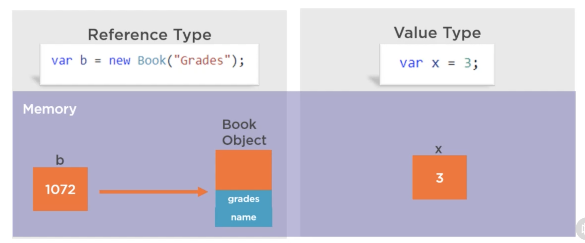
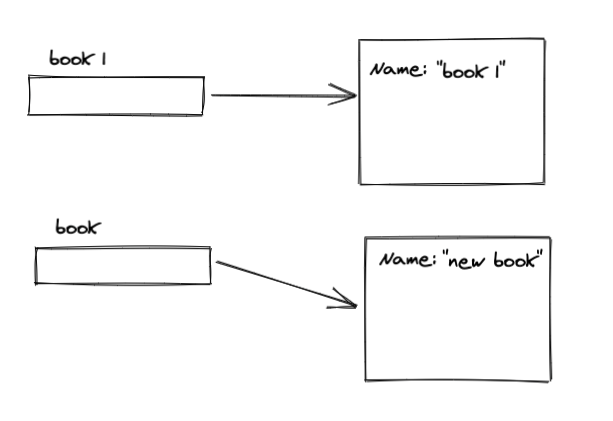
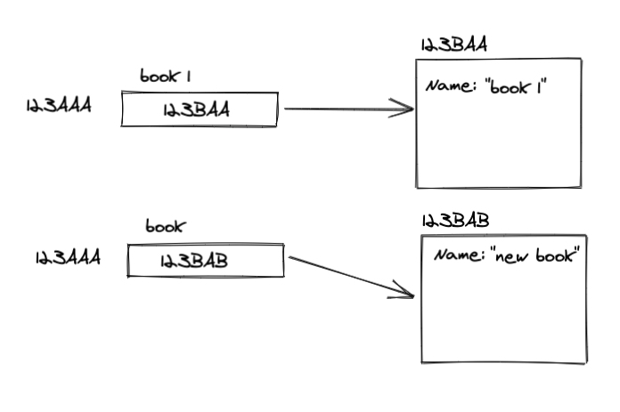
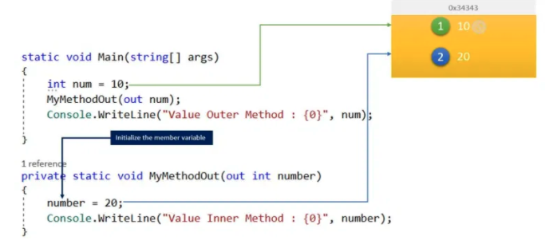
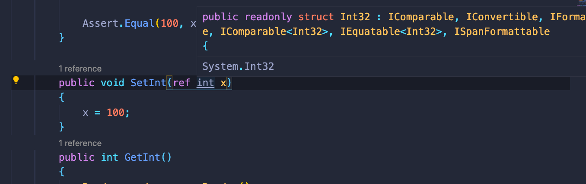
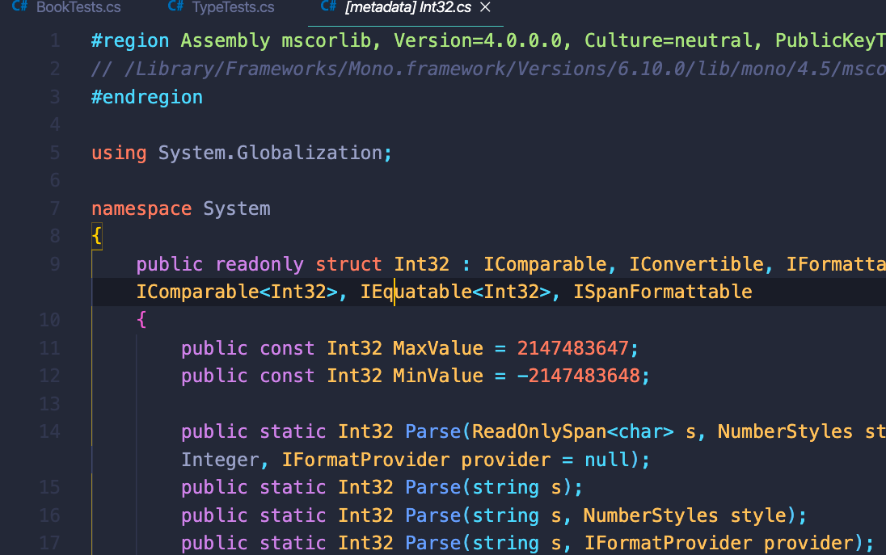
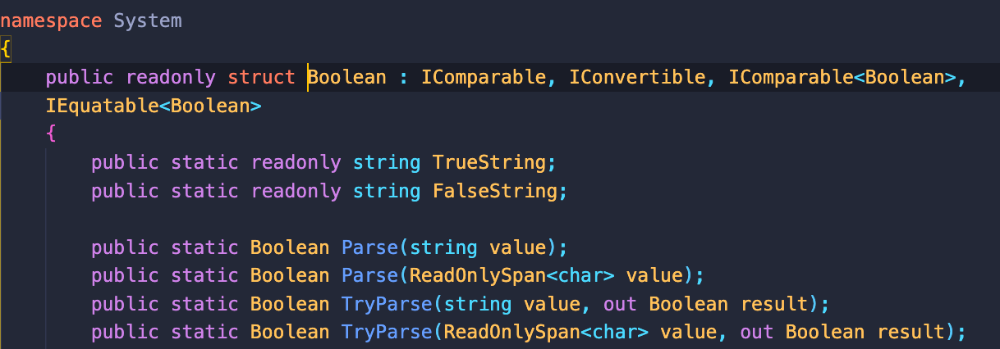
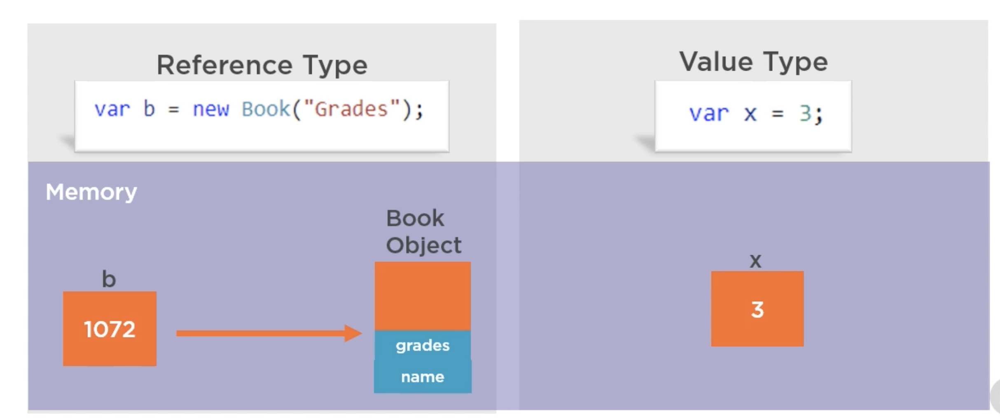

# 05 Type référence et type valeur



## Solution file

Ce fichier permet de `build` tous les projets s'y trouvant en même temps.

Ce fichier contient une trace de tous les projets concernés devant être compilés et devant tournés ensemble.

### Création d'une `solution file` : `dotnet new sln`

```bash
🦄 GradeBook.tests cd ../..

🦄 gradebook dotnet new sln
The template "Solution File" was created successfully.
🦄 gradebook ls
gradebook.sln   src             test
🦄 gradebook
```

Le fichier doit être créé à la racine des différents projets, il porte le nom du dossier `root`.

`gradebook.sln`

```

Microsoft Visual Studio Solution File, Format Version 12.00
# Visual Studio 15
VisualStudioVersion = 15.0.26124.0
MinimumVisualStudioVersion = 15.0.26124.0
Global
	GlobalSection(SolutionConfigurationPlatforms) = preSolution
		Debug|Any CPU = Debug|Any CPU
		Debug|x64 = Debug|x64
		Debug|x86 = Debug|x86
		Release|Any CPU = Release|Any CPU
		Release|x64 = Release|x64
		Release|x86 = Release|x86
	EndGlobalSection
	GlobalSection(SolutionProperties) = preSolution
		HideSolutionNode = FALSE
	EndGlobalSection
EndGlobal
```

On ajoute ensuite à ce fichier les projets :

### `dotnet sln add`

```bash
🦄 gradebook dotnet sln add src/GradeBook/GradeBook.csproj
Project `src/GradeBook/GradeBook.csproj` added to the solution.

🦄 gradebook dotnet sln add test/GradeBook.tests/GradeBook.tests.csproj
Project `test/GradeBook.tests/GradeBook.tests.csproj` added to the solution.
```

on obtient :

```

Microsoft Visual Studio Solution File, Format Version 12.00
# Visual Studio 15
VisualStudioVersion = 15.0.26124.0
MinimumVisualStudioVersion = 15.0.26124.0
Project("{2150E333-8FDC-42A3-9474-1A3956D46DE8}") = "src", "src", "{CAE9153D-D32B-4799-A4CD-E6538B24505F}"
EndProject
Project("{FAE04EC0-301F-11D3-BF4B-00C04F79EFBC}") = "GradeBook", "src\GradeBook\GradeBook.csproj", "{7C8EE15B-2470-4C1A-8EE6-8DA599A46B1F}"
EndProject
Project("{2150E333-8FDC-42A3-9474-1A3956D46DE8}") = "test", "test", "{06A0BC92-9ADF-4541-819C-EBD6D9D78B23}"
EndProject
Project("{FAE04EC0-301F-11D3-BF4B-00C04F79EFBC}") = "GradeBook.tests", "test\GradeBook.tests\GradeBook.tests.csproj", "{74D147C5-D12C-4C61-B2B1-C0C55F872693}"
EndProject
Global
	GlobalSection(SolutionConfigurationPlatforms) = preSolution
		Debug|Any CPU = Debug|Any CPU
		Debug|x64 = Debug|x64
		Debug|x86 = Debug|x86
		Release|Any CPU = Release|Any CPU
		Release|x64 = Release|x64
		Release|x86 = Release|x86
	EndGlobalSection
	GlobalSection(SolutionProperties) = preSolution
		HideSolutionNode = FALSE
	EndGlobalSection
	GlobalSection(ProjectConfigurationPlatforms) = postSolution
		{7C8EE15B-2470-4C1A-8EE6-8DA599A46B1F}.Debug|Any CPU.ActiveCfg = Debug|Any CPU
		{7C8EE15B-2470-4C1A-8EE6-8DA599A46B1F}.Debug|Any CPU.Build.0 = Debug|Any CPU
		{7C8EE15B-2470-4C1A-8EE6-8DA599A46B1F}.Debug|x64.ActiveCfg = Debug|Any CPU
		{7C8EE15B-2470-4C1A-8EE6-8DA599A46B1F}.Debug|x64.Build.0 = Debug|Any CPU
		{7C8EE15B-2470-4C1A-8EE6-8DA599A46B1F}.Debug|x86.ActiveCfg = Debug|Any CPU
		{7C8EE15B-2470-4C1A-8EE6-8DA599A46B1F}.Debug|x86.Build.0 = Debug|Any CPU
		{7C8EE15B-2470-4C1A-8EE6-8DA599A46B1F}.Release|Any CPU.ActiveCfg = Release|Any CPU
		{7C8EE15B-2470-4C1A-8EE6-8DA599A46B1F}.Release|Any CPU.Build.0 = Release|Any CPU
		{7C8EE15B-2470-4C1A-8EE6-8DA599A46B1F}.Release|x64.ActiveCfg = Release|Any CPU
		{7C8EE15B-2470-4C1A-8EE6-8DA599A46B1F}.Release|x64.Build.0 = Release|Any CPU
		{7C8EE15B-2470-4C1A-8EE6-8DA599A46B1F}.Release|x86.ActiveCfg = Release|Any CPU
		{7C8EE15B-2470-4C1A-8EE6-8DA599A46B1F}.Release|x86.Build.0 = Release|Any CPU
		{74D147C5-D12C-4C61-B2B1-C0C55F872693}.Debug|Any CPU.ActiveCfg = Debug|Any CPU
		{74D147C5-D12C-4C61-B2B1-C0C55F872693}.Debug|Any CPU.Build.0 = Debug|Any CPU
		{74D147C5-D12C-4C61-B2B1-C0C55F872693}.Debug|x64.ActiveCfg = Debug|Any CPU
		{74D147C5-D12C-4C61-B2B1-C0C55F872693}.Debug|x64.Build.0 = Debug|Any CPU
		{74D147C5-D12C-4C61-B2B1-C0C55F872693}.Debug|x86.ActiveCfg = Debug|Any CPU
		{74D147C5-D12C-4C61-B2B1-C0C55F872693}.Debug|x86.Build.0 = Debug|Any CPU
		{74D147C5-D12C-4C61-B2B1-C0C55F872693}.Release|Any CPU.ActiveCfg = Release|Any CPU
		{74D147C5-D12C-4C61-B2B1-C0C55F872693}.Release|Any CPU.Build.0 = Release|Any CPU
		{74D147C5-D12C-4C61-B2B1-C0C55F872693}.Release|x64.ActiveCfg = Release|Any CPU
		{74D147C5-D12C-4C61-B2B1-C0C55F872693}.Release|x64.Build.0 = Release|Any CPU
		{74D147C5-D12C-4C61-B2B1-C0C55F872693}.Release|x86.ActiveCfg = Release|Any CPU
		{74D147C5-D12C-4C61-B2B1-C0C55F872693}.Release|x86.Build.0 = Release|Any CPU
	EndGlobalSection
	GlobalSection(NestedProjects) = preSolution
		{7C8EE15B-2470-4C1A-8EE6-8DA599A46B1F} = {CAE9153D-D32B-4799-A4CD-E6538B24505F}
		{74D147C5-D12C-4C61-B2B1-C0C55F872693} = {06A0BC92-9ADF-4541-819C-EBD6D9D78B23}
	EndGlobalSection
EndGlobal
```

On peut maintenant depuis la racine taper `dotnet build` ou bien `dotnet test` :

```bash
🦄 gradebook dotnet build
Microsoft (R) Build Engine version 16.6.0+5ff7b0c9e for .NET Core
Copyright (C) Microsoft Corporation. All rights reserved.

  Determining projects to restore...
  All projects are up-to-date for restore.
  GradeBook -> /Users/kar/Documents/programmation/dotnet/csharp-fundamental/gradebook/src/GradeBook/bin/Debug/netcoreapp3.1/GradeBook.dll
  GradeBook.tests -> /Users/kar/Documents/programmation/dotnet/csharp-fundamental/gradebook/test/GradeBook.tests/bin/Debug/netcoreapp3.1/GradeBook.tests.dll

Build succeeded.
    0 Warning(s)
    0 Error(s)

Time Elapsed 00:00:01.74
```

```bash
🦄 gradebook dotnet test
Test run for /Users/kar/Documents/programmation/dotnet/csharp-fundamental/gradebook/test/GradeBook.tests/bin/Debug/netcoreapp3.1/GradeBook.tests.dll(.NETCoreApp,Version=v3.1)
Microsoft (R) Test Execution Command Line Tool Version 16.6.0
Copyright (c) Microsoft Corporation.  All rights reserved.

Starting test execution, please wait...

A total of 1 test files matched the specified pattern.

Test Run Successful.
Total tests: 1
     Passed: 1
 Total time: 1.2161 Seconds
```

## `private` et `public`

Par convention `C#`, on met une majuscule à une propriété ou une méthode public et une minuscule pour une méthode ou une propriété privée.

```cs
public string Name;
private string nickname;
```

#### ! Par défaut un membre d'une classe est privé.

`object` est le type de base de plus bas niveau.

## Tester la création de différents objets

`TypeTests.cs`

```cs
using System;
using Xunit;

namespace GradeBook.tests
{
    public class TypeTests
    {
        [Fact]
        public void GetBookReturnsDifferentObjects()
        {
            // arrange
            var book1 = GetBook("book 1");
            var book2 = GetBook("book 2");

            Assert.Equal("book 1", book1.Name);
            Assert.Equal("book 2", book2.Name);
        }

        Book GetBook(string name) {
            return new Book(name);
        }
    }
}

```

## Tester si deux objets on la même référence (ce sont les mêmes)

```cs
[Fact]
public void TwoVarsCanReferenceSameObjects()
{
    // arrange
    var book1 = GetBook("book 1");
    var book2 = book1;

    Assert.Same(book1, book2);
}
```

#### `Assert.Same(obj1, obj2)`

C'est la même chose que :

```cs
Assert.True(Object.ReferenceEquals(book1, book2));
```

On a aussi son contraire :

#### `Assert.NotSame(obj1, obj2)`

```cs
public void GetBookReturnsDifferentObjects()
{
    // arrange
    var book1 = GetBook("book 1");
    var book2 = GetBook("book 2");

    Assert.Equal("book 1", book1.Name);
    Assert.Equal("book 2", book2.Name);
    Assert.NotSame(book1, book2);
}
```

## Par défaut `csharp` passe les arguments par valeur

En `C#` les arguments sont passés par valeur ce qui signifie qu'une copie de la variable est passé et non une référence vers cette variable.

Si j'effectue ce test :

```cs
public void CSharpIsPassByValue()
{
    // arrange
    var book1 = GetBook("book 1");
    GetBookSetName(book1, "new name");

    Assert.Equal("new name", book1.Name);
}

private void GetBookSetName(Book book, string name)
{
    book = new Book(name);
}
```

Celui-ci va échouer car `book` et `book1` pointent vers deux objets différent :



En fait la variable `book` est créé et elle prend d'abord la valeur de la variable `book1`, puis une nouvelle valeur d'un nouvel objet.

### Passage par référence

Maintenant on ne fait pas une copie de la variable, mais on passe son adresse :

```cs
public class Book
{
    public Book(string name) {
        Name = name;
    }

    public string Name;
}

public void SetBookName(ref Book book, string name) {
    book = new Book(name);
}

Book book1 = new Book("book one");
Console.WriteLine(book1.Name);
```

```
book one
```

```cs
SetBookName(ref book1, "new super name");

Console.WriteLine(book1.Name);
```

```
new super name
```



`book1` et `book` partage la même adresse mémoire, tout changement sur `book` se répercute sur `book1`.

En fait `book` et `book1` sont deux noms pour la même variable.

C'est une volonté en `C#` de passer par défaut le paramètre par valeur afin d'éviter des effets de bord.

## Différence entre `ref` et `out`

### `ref`

```cs
int num = 7;

public void addTen(ref int n)
{
    n += 10;
    Console.WriteLine($"inner display {n}");
}

addTen(ref num);

Console.WriteLine($"outer display {num}");
```

```
inner display 17
outer display 17
```

### `out`

```cs
public void addTenOut(out int n)
{
    n += 10;
    Console.WriteLine($"inner display {n}");
}

addTenOut(out num);

Console.WriteLine($"outer display {num}");
```

```
(3,5): error CS0269: Use of unassigned out parameter 'n'
```

On doit initialiser le paramètre dans la méthode qui l'utilise.

On peut initialiser dans la méthode avec `ref` mais ce n'est pas obligatoire :

```cs
int num;

public void AddTen(ref int n)
{
    n = 7;
    n += 10;
    Console.WriteLine($"inner display {n}");
}

AddTen(ref num);

Console.WriteLine($"outer display {num}");
```

```
inner display 17
outer display 17
```

Par contre c'est obligatoire avec `out` :

```cs
public void TransformToTenOut(out int n)
{
    n = 10;  // obligatoire !!!
    Console.WriteLine($"inner display {n}");
}

TransformToTenOut(out num);

Console.WriteLine($"outer display {num}");
```

```
inner display 10
outer display 10
```



## Type valeur

Les types valeurs passent aussi par valeur :

```cs
[Fact]
public void ValueTypeAlsoPassByValue()
{
    var x = GetInt();
    SetInt(x);

    Assert.NotEqual(100, x);
}

public void SetInt(int x)
{
    x = 100;
}
public int GetInt()
{
    Random random = new Random();
    return random.Next(1, 100);
}
```

### `Random random = new Random()`

### `random.next(include, exclude)`

On peut aussi forcer le passage par référence :

```cs
[Fact]
public void ValueTypeAlsoPassByValue()
{
    var x = GetInt();
    SetInt(ref x);

    Assert.Equal(100, x);
}

public void SetInt(ref int x)
{
    x = 100;
}
public int GetInt()
{
    Random random = new Random();
    return random.Next(1, 100);
}
```

## Type valeur `struct`

`struct` est une classe de type valeur :

```cs
public struct Robot
{
    public string Name;
    public int Power;

    public Robot(string s, int nb)
    {
        Name = s;
        Power = nb;
    }
}

var rbt = new Robot("ttt56", 670);

public void BoostPower(Robot r, int pwr){
    r.Power += pwr;
    Console.WriteLine($"inside method {r.Power}");
}

BoostPower(rbt, 100);
Console.WriteLine($"outside method {rbt.Power}");
```

```
inside method 770
outside method 670
```

### On peut forcer le passage par référence :

```cs
public void BoostPowerByRef(ref Robot r, int pwr){
    r.Power += pwr;
    Console.WriteLine($"inside method {r.Power}");
}

BoostPowerByRef(ref rbt, 100);
Console.WriteLine($"outside method {rbt.Power}");
```

```
inside method 770
outside method 770
```

## Implémentation des types

Les types `C#` peuvent être des :

- `types références` -> `class`
- `types valeurs` -> `struct`

On peut le vérifier en faisant `cmd + click` sur un type dans **VSCode**.



D'ailleurs ici au survol on voit déjà que c'est implémenté avec une `struct` et donc `int` est un type valeur.



Avec `cmd + click` on accède au metadata du type.

On voit aussi que `int` est en fait le raccourci de `Int32`.

De même :

- `double` : `Double`
- `bool` : `Boolean`



## Le cas `string`

C'est un type référence qui se comporte comme un type valeur.

Les `string` en **dotnet** sont immuable, on ne peut les changer.

```cs
// on peut écrire ça :
var s = "titi au dodo";

Console.WriteLine(s[2]); // t

// mais pas ça :
s[2] = "e";
```

```
Property or indexer 'string.this[int]' cannot be assigned to -- it is read only
```

### Test `String Behave Like Value Type`

```cs
[Fact]
public void StringBehaveLikeValueType()
{
    string name = "Hukar";
    MakeUpperCase(name);

    Assert.Equal("HUKAR", name);
}

private void MakeUpperCase(string parameter)
{
    parameter.ToUpper();
}
```

#### `Failed` Ce test va échouer.

`ToUpper` retourne une copie du `string` mais ne modifie pas le `string` en lui même.

Toute les méthodes associées aux `string` renvoie une copie mais ne modifie pas le `string` d'origine.

### Test modifié

```cs
[Fact]
public void StringBehaveLikeValueType()
{
    string name = "Hukar";
    var upper = MakeUpperCase(name);

    Assert.Equal("Hukar", name);
    Assert.Equal("HUKAR", upper);
}

private string MakeUpperCase(string parameter)
{
    return parameter.ToUpper();
}
```

#### `Passed`

Les `string` sont bien passés par référence mais sont immuable.

## Garbage Collector

Il n'y a aucun moyen de détruire soit même un objet en mémoire.

C'est le rôle du `garbage collector` de détruire un objet qui n'a plus de variables le référençant.

À la sortie du scope d'une méthode, les objets qui ne sont plus référencés sont détruit par le `garbage collector`.

## résumé



Il y a deux types :

- type valeur : `struct`
- type référence : `class`

Les variables sont toujours passée par valeur.

On peut forcer le passage par référence avec les opérateurs `ref` et `out`.

Avec `out` on est obligé d'initialiser la valeur dans la méthode.
