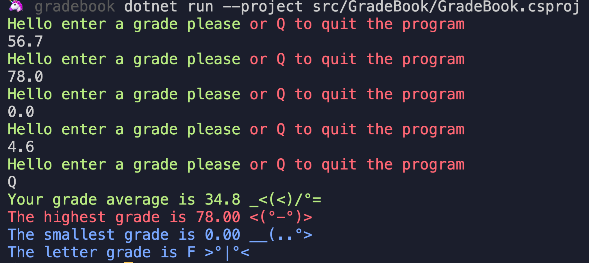
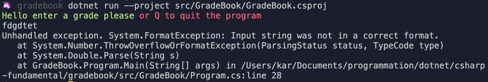
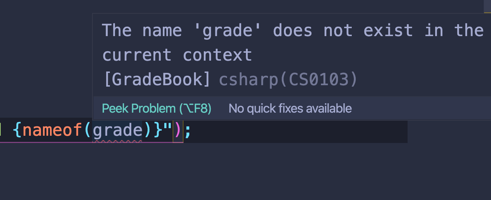
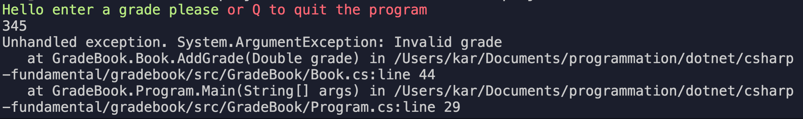
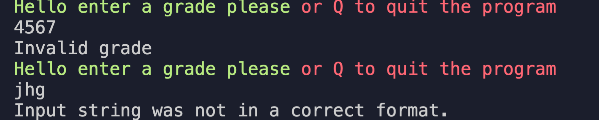
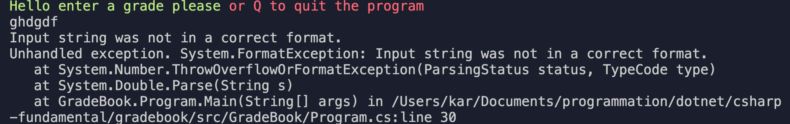

# 06 Contrôle du flux

## `if` statment

```cs
if (grade <= 100 && grade >= 0)
{
    grades.Add(grade);
}
else
{
    Console.WriteLine("Invalid value");
}
```

`||` opérateur `OU`

`&&` opérateur `ET`

## Loop statement

### `foreach in`

```cs
foreach (var grade in grades)
{
    result.High = Math.Max(result.High, grade);
    result.Low = Math.Min(result.Low, grade);
    result.Average += grade;
}
```

### `do while`

```cs
var index = 0;
do
{
    result.High = Math.Max(result.High, grades[index]);
    result.Low = Math.Min(result.Low, grades[index]);
    result.Average += grades[index];

    index++;
}
while(index < grades.Count);
```

#### ! ce code provoquera une erreur si la liste est vide.

Ne pas oublier le `;` après la condition de `while`.

### `while`

```cs
var index = 0;
            while(index < grades.Count)
            {
                result.High = Math.Max(result.High, grades[index]);
                result.Low = Math.Min(result.Low, grades[index]);
                result.Average += grades[index];

                index++;
            }
```

### `for`

```cs
for(var index = 0; index < grades.Count; index++)
{
    result.High = Math.Max(result.High, grades[index]);
    result.Low = Math.Min(result.Low, grades[index]);
    result.Average += grades[index];
}
```

## Jumping statement

### `break` et `continue`

Il faut faire attention avec las **jumping statement**, car ils peuvent rendre la logique d'une méthode difficile à comprendre.

```cs
for (var index = 0; index < grades.Count; index++)
{
    if (grades[index] == 45.89)
    {
        // break;
        continue;
    }

    result.High = Math.Max(result.High, grades[index]);
    result.Low = Math.Min(result.Low, grades[index]);
    result.Average += grades[index];
}
```

`break` va arrêter la boucle et reprendre à la ligne suivant la boucle.

`continue` permet de sauter une valeur.

Le troisième est très rarement employé : `goto <etiquette>`

```cs
for (var index = 0; index < grades.Count; index++)
{
    if (grades[index] == 45.89)
    {
        goto titi;
    }

    result.High = Math.Max(result.High, grades[index]);
    result.Low = Math.Min(result.Low, grades[index]);
    result.Average += grades[index];
}

result.Average /= grades.Count;

titi :
return result;
}
```

## `switch` statement

Un `case` doit être vide ou **obligatoirement** finir par un `break`.

```cs
var letter = 'A';

switch(letter)
{
    case 'A':
        Console.WriteLine("hello B");
    case 'B':
        Console.WriteLine("hello B");
        break;
}
```

```
Control cannot fall through from one case label ('case 'A':') to another
```

Le contrôle ne peut pas passer d'une étiquette de `case` (`case 'A' :`) à une autre.

#### Par contre ceci est juste si plusieurs `case` nécessitent le même traitement

```cs
switch(letter)
{
    case 'A':
    case 'B':
        Console.WriteLine("hello A or B");
        break;
}
```

```
hello A or B
```

### exemple complet de `switch` statement

```cs
switch(letter)
{
    case 'A':
        AddGrade(90);
        break;
    case 'B':
        AddGrade(80);
        break;
    case 'C':
        AddGrade(70);
        break;
    default:
        AddGrade(90);
        break;
}
```

#### ! Le `break` de `default` est aussi obligatoire (contrairement à d'autre langage).

## Advanced `switch` (`c# 7`)

Le `switch` peut utiliser le pattern matching depuis `c# 7` et le mot clé `when` pour spécifier une condition.

```cs
class Titi {}
var a = new Titi();

class Toto {}
var a = new Toto();

class Tata {}
var a = new Tata();

public void Test(Object o) {
    switch(o)
    {
        case Titi t :
            Console.WriteLine("titi");
            break;
        case Toto t :
            Console.WriteLine("toto");
            break;
        case Tata t :
            Console.WriteLine("tata");
            break;
    }
}

Test(a);
Test(b);
Test(c);
```

```
titi
toto
tata
```

### Utilisation avec `when`

```cs
switch(result.Average)
{
    case var d when d >= 90.0:
        result.Letter = 'A';
        break;
    case var d when d >= 80.0:
        result.Letter = 'B';
        break;
    case var d when d >= 70.0:
        result.Letter = 'C';
        break;
    case var d when d >= 60.0:
        result.Letter = 'D';
        break;
    default:
        result.Letter = 'F';
        break;
}
```

## Exemple de `while` infini

```cs
while(true)
{
    ColorConsole.Write("Hello enter a grade please".Green());
    ColorConsole.WriteLine(" or Q to quit the program".DarkRed());
    var input = Console.ReadLine();

    if(input == "Q")
    {
        break;
    }

    var grade = double.Parse(input);
    book.AddGrade(grade);
}
```

`ColorConsole` est un `nuget` ajouté.



#### `dotnet run --project src/GradeBook/GradeBook.csproj`

Si un utilisateur entre autre chose :



Le programme crash !!!

## Exception `throw`

`dotnet` fournit plusieurs type d'`exception`.

Nous allons utiliser `ArgumentException` qui est utilisé pour dire qu'un argument n'est pas valide.

L'opérateur `nameof(myvar)` retourne le nom `myvar` comme un `string`.

```cs
double dede = 7.8;

Console.WriteLine($"{nameof(dede)}");
```

```
dede
```

### `AddGrade`

```cs
public void AddGrade(double grade)
{
    if (grade <= 100 && grade >= 0)
    {
        grades.Add(grade);
    }
    else
    {
        throw new ArgumentException($"Invalid {nameof(grade)}");
    }
}
```

Si on change le nom de la variable `grade`, `nameof` doit aussi recevoir ce nouveau nom.

Cela nous force a avoir un message juste.

```cs
public void AddGrade(double grd)
        // ...
                throw new ArgumentException($"Invalid {nameof(grade)}");
```



Si maintenant on introduit une valeur invalide on lève une exception :



## Attraper une exception `try and catch`

```cs
 while (true)
 {
     ColorConsole.Write("Hello enter a grade please".Green());
     ColorConsole.WriteLine(" or Q to quit the program".DarkRed());
     var input = Console.ReadLine();

     if (input == "Q")
     {
         break;
     }

     try
     {
         var grade = double.Parse(input);
         book.AddGrade(grade);
     }
     catch (Exception ex)
     {
         Console.WriteLine(ex.Message);
     }
 }
```



Le programme continue de tourner. Les différentes **exceptions** sont attrapées.

Si on veut que le programme crash quand même on ajoute `throw` à la fin :

```cs
catch (Exception ex)
{
    Console.WriteLine(ex.Message);
    throw;
}
```



### Gérer les exception par type d'exception

On peut empiler les clauses `catch` pour gérer plusieurs type d'exception.

```cs
try
{
    var grade = double.Parse(input);
    book.AddGrade(grade);
}
catch (ArgumentException ex)
{
    Console.WriteLine(ex.Message);
}
catch (FormatException ex)
{
    Console.WriteLine(ex.Message);
    throw;
}
```

### Block `finally`

Le code du block `finally` sera exécuté quoi qu'il arrive.

```cs
try
{
    var grade = double.Parse(input);
    book.AddGrade(grade);
}
catch (ArgumentException ex)
{
    Console.WriteLine(ex.Message);
}
catch (FormatException ex)
{
    Console.WriteLine(ex.Message);
}
finally
{
    ColorConsole.WriteLine("finally for ever".Red());
}
```
