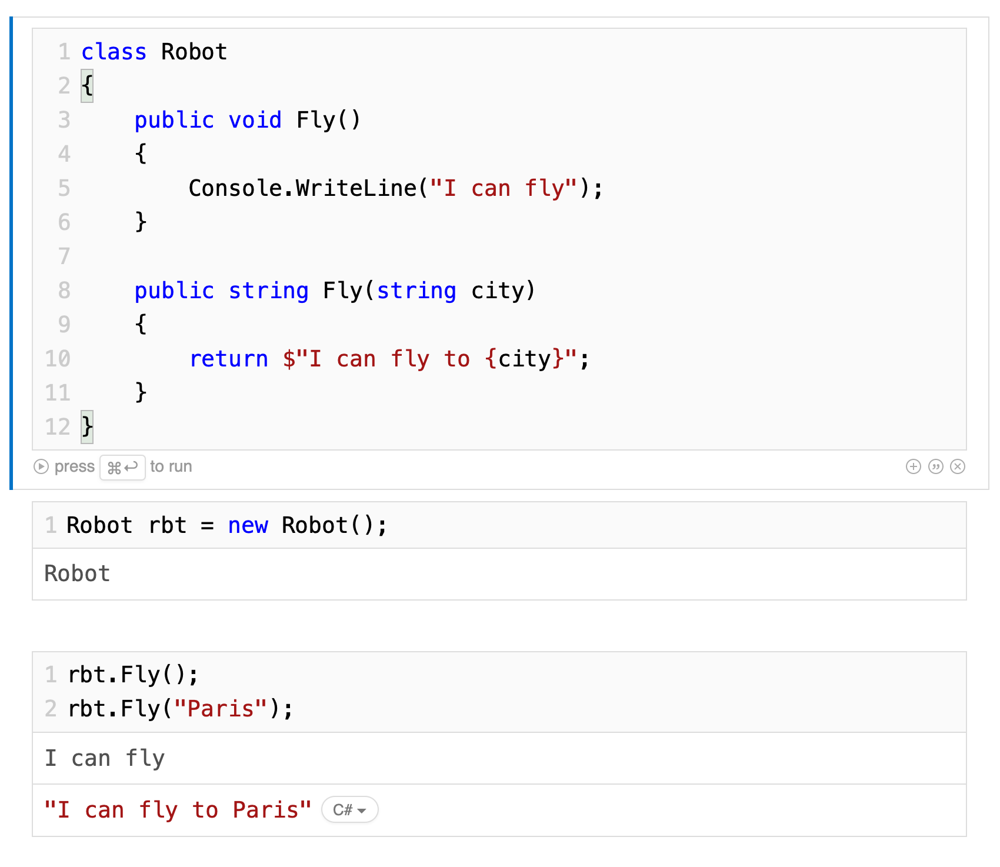
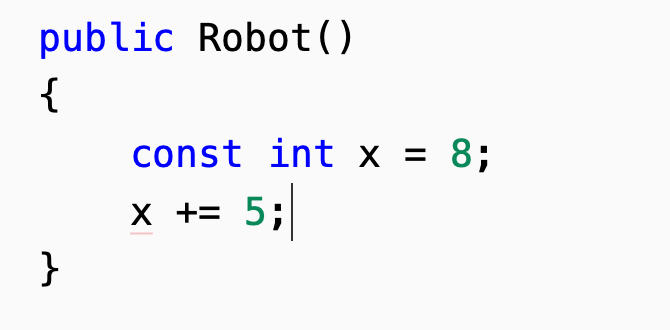

# 07 Construire ses types

## Method overloading : surcharge des méthodes

La signature d'une méthode comprend son nom ainsi que le type et le nombre de paramètre.

Le type de retour ne fait pas partie de la signature.

```cs
class Robot
{
    public void fly()
    {
        Console.WriteLine("I can fly");
    }

    public string fly()
    {
        return "I can fly";
    }
}
```

```
Type 'Robot' already defines a member called 'fly' with the same parameter types
```

### Code correct

```cs
class Robot
{
    public void Fly()
    {
        Console.WriteLine("I can fly");
    }

    public void Fly(string city)
    {
        Console.WriteLine($"I can fly to {city}");
    }
}

Robot rbt = new Robot();

rbt.Fly();
rbt.Fly("Paris");
```

```
I can fly
I can fly to Paris
```

On peut avoir un type de retour différent si la signature est différente :



Cela fonctionne.

## `property`

En `c#` on a des champs `fields` mais aussi des propriétés `property`.

On pourrait très bien implémenter l'accès à un champ comme ceci :

```cs
private string name;

public string GetName()
{
    return name;
}

public void SetName(string newname)
{
    name = newname;
}
```

### Syntaxe de `property`

```cs
public string Name
{
    get
    {
        return name.ToUpper();
    }
    set
    {
        if (!string.IsNullOrEmpty(value))
        {
            name = value;
        }
        else
        {
            name = "no-name (-_-')";
        }
    }
}

private string name;
```

Cela permet d'ajouter une logique lorsque l'on lit ou on écrit un champs.

`value` est la valeur lors d'une assignation.

`string.IsNullOrEmpty` permet de vérifier si la valeur est `null` ou vide.

La plupart du temps il n'y a pas de logique additionnel et on a :

```cs
public string Name
{
    get
    {
        return name;
    }
    set
    {
        name = value
    }
}

private string name;
```

`c#` propose une écriture raccourci de ce cas de figure `auto property` :

```cs
public string Name
{
    get; set;
}
```

### Quelle différence avec un champs `public string Name;` ?

Il y a quelque différence avec la `reflection` et la `serialization`.

On peut définir un accès différent pour `get` et pour `set` :

```cs
public string Name
{
    get;
    private set;
}
```

## Membres en `readonly`

Les membres en `readonly` ne peuvent être assigné que lors de l'initialisation et par le constructeur.

#### ! un champs string est initialisé par défaut à `null`

```cs
class Robot
{
    public Robot(string name)
    {
        Name = name;
    }

    public Robot() {}

    readonly public string Name;
}

Robot rbt = new Robot();
rbt.Name;
```

```
null
```

```cs
Robot cpo = new Robot("cpo");
cpo.Name;
```

```
"cpo"
```

On peut avoir les deux en même temps :

```cs
readonly public string Name = "no-name-robot";
```

```cs
Robot rbt = new Robot();
rbt.Name;
```

```
"no-name-robot"
```

```cs
Robot cpo = new Robot("cpo");
cpo.Name;
```

```
"cpo"
```

## Le mot clé `const`

`const` a une sémantique plus strict que `readonly`.

On ne peut assigner une constante qu'à l'initialisation :

```cs
class Robot
{
    public Robot(string name)
    {
        Name = name;
        CATEGORY = "war-robot";
    }

    public Robot()
    {

    }

    readonly public string Name = "no-name-robot";
    public const string CATEGORY = "civil-robot";
}
```

```
The left-hand side of an assignment must be a variable, property or indexer
```

Par convention les constantes sont souvent écrites en majuscule.

#### ! Un champs `const` est traité comme un membre `static` de la classe

```cs
Robot rbt = new Robot();
rbt.CATEGORY;
```

```
Member 'Robot.CATEGORY' cannot be accessed with an instance reference; qualify it with a type name instead
```

```cs
Robot.CATEGORY;
```

```
"civil-robot"
```

C'est logique car le champs ne changeant jamais sa valeur, il n'y a pas d'intérêt à ce qu'il existe pour chaque instance, une seule fois dans la classe (`static`) et plus efficace.

### `const` dans une méthode

Le mot clé `const` peut être utilisé dans une méthode :



On voit que la deuxième ligne provoque une erreur :

```
The left-hand side of an assignment must be a variable, property or indexer
```

`x` n'est plus considéré comme une variable (mais comme une constante).
