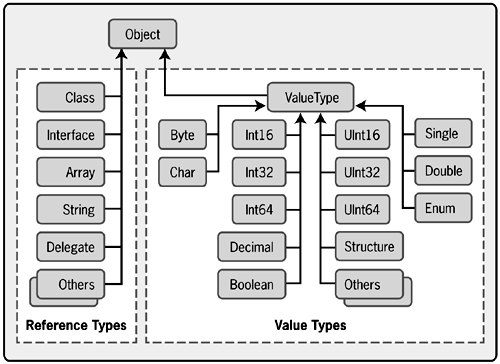
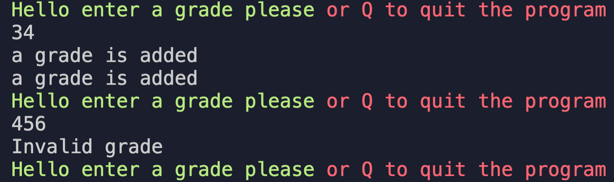
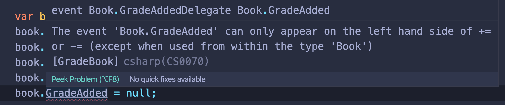

# 09 `event`

Notre application veut savoir quand une note (`grade`) a été ajouté.

À un moment de notre code, quand la note est ajouté, on veut pouvoir prévenir des traitements a exécuter.

Les `delegates` sont approprié.

#### ! on devrait déclarer les `delegates` dans un fichier séparé, car c'est un type.

Par commodité on reste dans la classe `Book`.

```cs
public class Book
    {
        public delegate void GradeAddedDelegate(object sender, EventArgs args);
```

Lorsque l'on construit un `delegate` pour définir un `event`, par convention **.net**, on donne comme paramètres :

`object sender, EventArgs args`.

Absolument tous dans **.net** hérite de `object`.



## Création d'un `event`

Un `event` est un membre de la classe.

Ce mot clé ajoute des **restrictions** et des **capacités** supplémentaire à mon champs.

```cs
public event GradeAddedDelegate GradeAdded;
```

### Utilisation de l'`event`

```cs
public void AddGrade(double grade)
{
    if (grade <= 100 && grade >= 0)
    {
        grades.Add(grade);
        if(GradeAdded != null)
        {
            GradeAdded(this, new EventArgs());
        }
    }
    else
    {
        throw new ArgumentException($"Invalid {nameof(grade)}");
    }
}
```

On commence par tester si le `delegate` à des méthodes référencées.

Ensuite on invoque notre `event` : `GradeAdded(this, new EvenetArgs())`.

### Ajouter des méthodes à la liste d'invocation

### `+=` permet de souscrire à un `event` : `subscrive`

Dans `Program.cs` on crée une méthode (elle doit être `static` pour être utilisée dans le `Main`) :

```cs
static void OnGradeAdded(object sender, EventArgs e)
{
    Console.WriteLine("a grade is added");
}
```

Sa signature doit correspondre au `delegate`.

Ensuite il suffit de l'ajouter à la liste d'invocation après l'initialisation d'un `book`.

```cs
var book = new Book("Simon's cat");
book.GradeAdded += OnGradeAdded;
```

On peut bien sûr utiliser le `Multi-Cast` :

```cs
var book = new Book("Simon's cat");
book.GradeAdded += OnGradeAdded;
book.GradeAdded += OnGradeAdded;
```

### `-=` permet de retirer une méthode de la liste d'invocation : `unsubscrive`

```cs
var book = new Book("Simon's cat");
book.GradeAdded += OnGradeAdded;
book.GradeAdded += OnGradeAdded;
book.GradeAdded -= OnGradeAdded;  // substract the method OnGradeAdded
book.GradeAdded += OnGradeAdded;
```



On voit que quand un `grade` est ajouté, notre `delegate` exécute deux fois `OnGradeAdded`.

On ne peut pas assigner `null` à un `delegate` marqué `event`.



Cela preserve du fait d'annuler à un endroit du code des `event handler` ajoutés à un autre endroit.

## exemple:

```cs
delegate void OrderAddedDelegate(object sender, EventArgs args);

class Order
{
    public void AddOrder()
    {
        if(OrderAdded != null)
        {
            OrderAdded(this, new EventArgs());
        }
    }

    public event OrderAddedDelegate OrderAdded;
}

void OnOrderAdded(object sender, EventArgs e)
{
    Console.WriteLine("Order added");
}

void LogOrderAdded(object sender, EventArgs e)
{
    Console.WriteLine("Log Order");
}

var order = new Order();
order.OrderAdded += OnOrderAdded;
order.OrderAdded += LogOrderAdded;

order.AddOrder();
```

Si on ne teste pas `OrderAdded` on risque un `NullReferenceException`.
