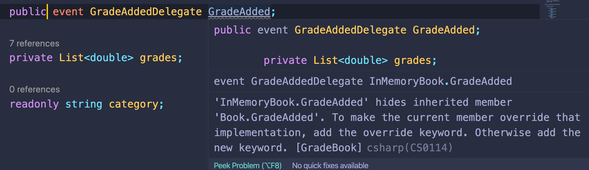

# 10 Programmation Orientée Objet

## Les trois piliers de l'`OOP`


**encapsulation** : on peut caché une les détails de l'implémentation en jouant sur la visibilité des champs et des méthodes.

**inheritance** : L'héritage permet de ré-utiliser du code.

**polymorphism** : Des objets du même type peuvent se comporter différemment.

#### ! l'encapsulation est le plus important des piliers pour un code bien _designé_.

## Inheritance : Héritage

ON veut que le nom soit utilisable par plusieurs classe en se servant de l'héritage.

On va créer une classe `NameObject` et faire hérité `Book` de cette classe.

```cs
public class NameObject
{
    public string Name
    {
        get; set;
    }
}

public class Book : NameObject
{
    public delegate void GradeAddedDelegate(object sender, EventArgs args);
```

En `c#`, l'héritage s'écrie avec `:` entre la classe dérivée et la classe de base.

## `base`

Si la classe de base force son constructeur a avoir un nom (`name`) alors la classe dérivée doit lui passer le nom :

```cs
public class NameObject
{
    public NameObject(string name)
    {
        Name = name;
    }

    public string Name
    {
        get; set;
    }
}

public class Book : NameObject
{
    public delegate void GradeAddedDelegate(object sender, EventArgs args);

    public Book(string name) : base(name)
    {
        grades = new List<double>();
        Name = name;
    }
```

`base` est une référence vers la classe de base, on utilise aussi les deux point `:`.

`base` appelle le constructeur de la classe de base et lui passe ses arguments.

## System.Object

dans `.net` toutes les classes ont une classe de base : `System.Object`.

Cette classe de base peut aussi s'écrire en minuscule `object`.

```cs
namespace System
{
    //
    // Summary:
    //     Supports all classes in the .NET class hierarchy and provides low-level services
    //     to derived classes. This is the ultimate base class of all .NET classes; it is
    //     the root of the type hierarchy.
    public class Object
    {
        //
        // Summary:
        //     Initializes a new instance of the System.Object class.
        public Object();

        //
        // Summary:
        //     Allows an object to try to free resources and perform other cleanup operations
        //     before it is reclaimed by garbage collection.
        ~Object();

        //
        // Summary:
        //     Determines whether the specified object instances are considered equal.
        //
        // Parameters:
        //   objA:
        //     The first object to compare.
        //
        //   objB:
        //     The second object to compare.
        //
        // Returns:
        //     true if the objects are considered equal; otherwise, false. If both objA and
        //     objB are null, the method returns true.
        public static bool Equals(Object? objA, Object? objB);
        //
        // Summary:
        //     Determines whether the specified System.Object instances are the same instance.
        //
        // Parameters:
        //   objA:
        //     The first object to compare.
        //
        //   objB:
        //     The second object to compare.
        //
        // Returns:
        //     true if objA is the same instance as objB or if both are null; otherwise, false.
        public static bool ReferenceEquals(Object? objA, Object? objB);
        //
        // Summary:
        //     Determines whether the specified object is equal to the current object.
        //
        // Parameters:
        //   obj:
        //     The object to compare with the current object.
        //
        // Returns:
        //     true if the specified object is equal to the current object; otherwise, false.
        public virtual bool Equals(Object? obj);
        //
        // Summary:
        //     Serves as the default hash function.
        //
        // Returns:
        //     A hash code for the current object.
        public virtual int GetHashCode();
        //
        // Summary:
        //     Gets the System.Type of the current instance.
        //
        // Returns:
        //     The exact runtime type of the current instance.
        public Type GetType();
        //
        // Summary:
        //     Returns a string that represents the current object.
        //
        // Returns:
        //     A string that represents the current object.
        public virtual string? ToString();
        //
        // Summary:
        //     Creates a shallow copy of the current System.Object.
        //
        // Returns:
        //     A shallow copy of the current System.Object.
        protected Object MemberwiseClone();
    }
}
```

## Polymorphism

### `abstract class` et `abstract method`

#### ! une méthode `abstract` ne peut exister que dans une classe `abstract`.

```cs
public abstract class BookBase
{
    public abstract void AddGrade(double grade);
}
```

#### ! en `c#` on ne peut avoir qu'un seul héritage

```cs
public class NameObject
{
    // ...
}

public abstract class BookBase : NameObject
{
    protected BookBase(string name) : base(name)
    {
    }

    public abstract void AddGrade(double grade);
}

public class Book : BookBase
{
    // ...
```

Il y a encore un problème :

 

`Book` ne doit pas implémenter un membre hérité `abstract` !

### `override` : redéfinition

Pour résoudre cette erreur on doit ajouter le mot clé `override` à la méthode :

```cs
public override void AddGrade(double grade)
{
    // ...
```

On ne peut pas redéfinir (`override`) toutes les méthodes en `c#`, seulement les méthodes `abstract` et `virtual`.

### Polymorphisme

Maintenant dans le programme principal :

```cs
private static void EnterGrades(Book book)
{
    while (true)
    {
        // ...
        var grade = double.Parse(input);
        book.AddGrade(grade);
```

Ma méthode Accepte un `Book` quelque soit sa classe dérivée, quand on appelle `book.AddGrade` à ce moment on ne sait pas exactement quelle implémentation de `AddGrade` sera exécutée. C'est ça le polymorphisme.

## `interface`

Une interface ne contient aucunes implémentation.

une classe `abstract` peut contenir une ou plusieurs implémentations.

```cs
public interface IBook
{
    void AddGrade(double grade);
    Statistics GetStatistics();
    String Name { get; }
    event GradeAddedDelegate GradeAdded;
}
```

Maintenant dans la méthode du programme `EnterGrades` je peux passer un type `IBook` au lieu de `Book` sans me préoccuper des différentes implémentations possible.

```cs
private static void EnterGrades(IBook book)
{
    while (true)
    {
        // ...
```

On ne peut hériter que d'une seule classe, par contre on peut implémenter une ou plusieurs interfaces :

```cs
public class InMemoryBook : Book, IBook
{
    // ...
```

Le compilateur va vérifier que la classe implémente bien tous ce que décrit l'interface.

### `virtual`

Un membre `abstract` est implicitement `virtual` et nécessite d'être implémenté par la classe dérivée.

Sinon, pour qu'un membre puisse être redéfini par une classe dérivée, il doit être marqué `virtual`.

```cs
public abstract class Book : NameObject, IBook
{
    protected Book(string name) : base(name)
    {
    }

    public virtual event GradeAddedDelegate GradeAdded;

    public abstract void AddGrade(double grade);

    public virtual Statistics GetStatistics()
    {
        throw new NotImplementedException();
    }
}
```

Et dans la classe dérivée on utilise le mot clé `override` : redéfini.

```cs
public override Statistics GetStatistics()
{
    // ...

public override event GradeAddedDelegate GradeAdded;
```

La redéfinition (`override`) des `event` peut sembler étrange, mais elle est obligatoire :

> ## différence entre `virtual` et `abstract`
>
> **Une méthode `abstract` ne peut pas avoir de fonctionnalité**. En gros, vous dites que toute classe enfant **DOIT** donner sa propre version de cette méthode, mais elle est trop générale pour essayer de l'implémenter dans la classe parentale.
>
> **Une méthode `virtual`**, c'est en gros dire : voici la fonctionnalité qui peut ou non être suffisante pour la classe enfant. Donc, si elle est suffisante, utilisez cette méthode, sinon, redéfinissez la (`override`) et fournissez votre propre implémentation.
>
> https://stackoverflow.com/questions/391483/what-is-the-difference-between-an-abstract-function-and-a-virtual-function

### Exemple

```cs
abstract class Animal
{
    public void Running()
    {
        Console.WriteLine("I'm running");
    }

    public virtual void Walking()
    {
        Console.WriteLine("I'm walking");
    }

    public abstract void Eating(string food);
}

class Cat : Animal
{
    public override void Eating(string food)
    {
        Console.WriteLine($"I'm eating {food}");
    }
}
```

- une méthode `abstract` ne peut appartenir qu'à une classe `abstract`.
- Une méthode `virtual` peut être redéfini (`override`) mais ce n'est pas une obligation.
- Pour définir une méthode `abstract` on utilise le mot clé `override`.

C'est plus logique qu'il n'y ait pas d'implémentation dans `Book` et que tous soit marqué `abstract` plutôt que `virtual`.

```cs
 public abstract class Book : NameObject, IBook
 {
     protected Book(string name) : base(name)
     {
     }

     public abstract event GradeAddedDelegate GradeAdded;
     public abstract void AddGrade(double grade);
     public abstract Statistics GetStatistics();
 }
```

Du coup il faut obligatoirement ajouter le mot clé `override ` devant les membres à implémenter :

```cs
public override void AddGrade(double grade)
{
    // ...

public override Statistics GetStatistics()
{
    // ...

public override event GradeAddedDelegate GradeAdded;
```

Les `event` doivent aussi être précédé par `override`.

#### ! une `abstract` méthode est une méthode `virtual` sans implémentation.

## Création d'une classe `DiskBook`

```cs
using System;

namespace GradeBook
{
    public class DiskBook : Book, IBook
    {
        public DiskBook(string name) : base(name)
        {

        }

        public override void AddGrade(double grade)
        {
            throw new NotImplementedException();
        }

        public override Statistics GetStatistics()
        {
            return new Statistics();
        }

        public override event GradeAddedDelegate GradeAdded;
    }
}
```

Cette classe doit enregistrer les `grades` dans un fichier.

### IDisposable

Cette interface dispose d'une seule méthode `Dispose`.

```cs
#region Assembly System.Runtime, Version=4.2.2.0, Culture=neutral, PublicKeyToken=b03f5f7f11d50a3a
// System.Runtime.dll
#endregion

namespace System
{
    //
    // Summary:
    //     Provides a mechanism for releasing unmanaged resources.
    // 	   Fournit un mécanisme permettant de libérer les ressources non gérées.
    public interface IDisposable
    {
        //
        // Summary:
        //     Performs application-defined tasks associated with freeing, releasing, or resetting
        //     unmanaged resources.
        //     Effectue les tâches définies par l'application associées à la libération,
        //     au déblocage ou à la réinitialisation des ressources non gérées.
        void Dispose();
    }
}
```

Cette méthode permet de forcer le nettoyage des ressources.

### Écrire dans un fichier

```cs
using System.IO;

public override void AddGrade(double grade)
{
    if (grade >= 0 && grade <= 100)
    {
        var writer = File.AppendText($"{Name}.txt");
        writer.WriteLine(grade);
        // writer.Close();
        writer.Dispose();
        if(GradeAdded != null)
        {
            GradeAdded(this, new EventArgs());
        }
    }
    else
    {
        throw new ArgumentException($"Invalid argument for {nameof(grade)}");
    }
}
```

`File.AppendText` renvoie un `StreamWriter`.

La classe `StreamWriter` implémente `IDisposable`, on peut donc invoquer `Dispose` à la place de `Close`.

## `using`

Le compilateur `c#` va créer automatiquement des blocs `try` et `finally` et automatiquement appeler `Dispose` dans le bloc `finally`.

```cs
public override void AddGrade(double grade)
        {
            if (grade >= 0 && grade <= 100)
            {

                using (var writer = File.AppendText($"{Name}.txt"))
                {
                    writer.WriteLine(grade);
                    if (GradeAdded != null)
                    {
                        GradeAdded(this, new EventArgs());
                    }
                }
            }
            else
            {
                throw new ArgumentException($"Invalid argument for {nameof(grade)}");
            }
        }
```

Ce pattern est utilisé dès qu'on utilise un fichier ou un `socket`.

## Remarque sur le code du `refactoring`

### `switch`

Au lieu d'utiliser un `break` à chaque fois, on peut utiliser un `return`.

```cs
public char Letter
{
    get
    {
        switch (Average)
        {
            case var d when d >= 90.0:
                return 'A';
            case var d when d >= 80.0:
                return 'B';
            case var d when d >= 70.0:
                return 'C';
            case var d when d >= 60.0:
                return 'D';
            case var d when d < 0:
                return 'X';
            default:
                return 'F';
        }
    }
}
```

### Opération sur les fichiers : `File`

#### Ma solution :

```cs
public override Statistics GetStatistics()
{
    var result = new Statistics();

    // for each line result.Add(double.Parse(grade))
    if (File.Exists($"{Name}.txt"))
    {
        var grades = File.ReadAllLines($"{Name}.txt");

        foreach (var grade in grades)
        {
            result.Add(double.Parse(grade));
        }
    }

    return result;
}
```

`File.exists(<file path>)` renvoie un booléen.

`FileReadAllLines(<file path>)` renvoie un tableau de `string` où chaque élément représente une ligne du fichier.

`double.Parse(<string>)` transforme `"34"` en `34.0`.

#### Solution du cours :

```cs
public override Statistics GetStatistics()
{
    var result = new Statistics();

    using(var reader = File.OpenText($"{Name}.txt"))
    {
        var line = reader.ReadLine();

        while(line != null)
        {
            var number = double.Parse(line);
            result.Add(number);
            line = reader.ReadLine();
        }
    }

    return result;
}
```

`File.OpenText(<file path>)` renvoie un StreamReader.

`reader.ReadLine()` renvoie une ligne du fichier ou null.

On utilise `using` pour être sûr que les ressources soient libérées.
