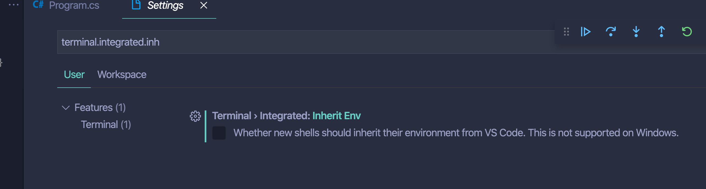

# AA Problème avec le Debugger

Quand je lance le `debugger` j'ai une erreur de build :

```bash
> Executing task: dotnet build /Users/kar/Documents/programmation/dotnet/csharp-fundamental/gradebook/src/GradeBook/GradeBook.csproj /property:GenerateFullPaths=true /consoleloggerparameters:NoSummary <

execvp(3) failed.: No such file or directory
The terminal process "dotnet 'build', '/Users/kar/Documents/programmation/dotnet/csharp-fundamental/gradebook/src/GradeBook/GradeBook.csproj', '/property:GenerateFullPaths=true', '/consoleloggerparameters:NoSummary'" failed to launch (exit code: 1).
```

En fait `VSCode` ne trouve pas la commande `dotnet`.

## Terminal Integrated Inherit

Voici le réglage qui cause le problème :



Il suffit de cocher la case dans User et dans Workspace (sinon cela ne fonctionne pas).

En gros les nouveaux `shells` doivent hériter leurs environnement de VSCode.

```bash

> Executing task: dotnet build /Users/kar/Documents/programmation/dotnet/csharp-fundamental/gradebook/src/GradeBook/GradeBook.csproj /property:GenerateFullPaths=true /consoleloggerparameters:NoSummary <

Microsoft (R) Build Engine version 16.6.0+5ff7b0c9e for .NET Core
Copyright (C) Microsoft Corporation. All rights reserved.

  Determining projects to restore...
  All projects are up-to-date for restore.
  GradeBook -> /Users/kar/Documents/programmation/dotnet/csharp-fundamental/gradebook/src/GradeBook/bin/Debug/netcoreapp3.1/GradeBook.dll
```

Le `build` se déroule alors correctement.
